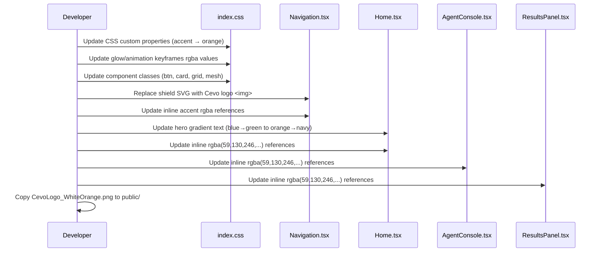

# Design Document: Cevo Theme KYC Banking

## Overview

Re-theme the KYC Banking UI from its current blue accent (`#3b82f6`) to Cevo brand colours (Primary Orange `#FF8F00`, Accent Orange `#F05A2A`) while preserving the dark background, risk/status colour semantics (green/amber/red), all animations, and the existing layout structure. Replace the shield SVG logo with the Cevo PNG wordmark and update all decorative gradients to use the Cevo AI & Agentic Systems gradient (Primary Orange → Accent Blue `#191970`).

## Main Algorithm/Workflow



## Core Interfaces/Types

```typescript
// CSS Custom Properties contract (defined in :root)
interface CevoThemeVariables {
  '--accent': '#FF8F00';           // was #3b82f6
  '--accent-dim': '#F05A2A';       // was #2563eb
  '--accent-glow': 'rgba(255, 143, 0, 0.3)'; // was rgba(59, 130, 246, 0.3)
  '--border-glow': 'rgba(255, 143, 0, 0.3)'; // was rgba(59, 130, 246, 0.3)
  // Unchanged variables
  '--risk-low': '#10b981';
  '--risk-medium': '#f59e0b';
  '--risk-high': '#ef4444';
  '--risk-critical': '#dc2626';
  '--status-compliant': '#10b981';
  '--status-non-compliant': '#ef4444';
  '--status-review': '#f59e0b';
  '--approve': '#10b981';
  '--reject': '#ef4444';
  '--escalate': '#f59e0b';
  '--bg-primary': '#0a0e17';
  '--bg-secondary': '#111827';
  '--bg-card': '#1a2332';
  '--bg-card-hover': '#1f2b3d';
  '--border': '#2a3548';
  '--text-primary': '#e2e8f0';
  '--text-secondary': '#94a3b8';
  '--text-muted': '#64748b';
}

// Cevo brand colour palette constants
interface CevoBrandPalette {
  primaryOrange: '#FF8F00';
  accentOrange: '#F05A2A';
  accentPink: '#D3145A';
  accentPurple: '#7204B9';
  accentBlue: '#191970';
}

// Cevo gradient definitions
interface CevoGradients {
  aiAgentic: 'linear-gradient(135deg, #FF8F00, #191970)';
  buttonPrimary: 'linear-gradient(135deg, #FF8F00 0%, #F05A2A 100%)';
}
```

## Key Functions with Formal Specifications

### Function 1: CSS Variable Replacement (index.css)

```typescript
function updateCSSVariables(root: CSSStyleDeclaration): void
```

**Preconditions:**
- `:root` element exists in the document
- All existing CSS custom properties are defined

**Postconditions:**
- `--accent` equals `#FF8F00`
- `--accent-dim` equals `#F05A2A`
- `--accent-glow` equals `rgba(255, 143, 0, 0.3)`
- `--border-glow` equals `rgba(255, 143, 0, 0.3)`
- All `--risk-*`, `--status-*`, `--approve`, `--reject`, `--escalate` variables remain unchanged
- All `--bg-*`, `--border`, `--text-*` variables remain unchanged

**Loop Invariants:** N/A

---

### Function 2: Inline Style Blue-to-Orange Replacement (all components)

```typescript
function replaceInlineAccentReferences(component: ReactComponent): ReactComponent
```

**Preconditions:**
- Component contains inline style objects with `rgba(59, 130, 246, ...)` values
- Component renders correctly with blue accent

**Postconditions:**
- All `rgba(59, 130, 246, X)` replaced with `rgba(255, 143, 0, X)` (same alpha)
- No `rgba(16, 185, 129, ...)` (green/status) values are modified
- No `rgba(239, 68, 68, ...)` (red/error) values are modified
- No `rgba(245, 158, 11, ...)` (amber/warning) values are modified
- Component layout and structure unchanged
- All animations still reference correct colour values

**Loop Invariants:**
- For each inline style property: if it contained blue accent RGB, it now contains orange accent RGB; otherwise unchanged

---

### Function 3: Logo Replacement (Navigation.tsx)

```typescript
function replaceLogoElement(nav: NavigationComponent): NavigationComponent
```

**Preconditions:**
- Navigation contains a `<div>` with gradient background holding an SVG shield icon
- `CevoLogo_WhiteOrange.png` exists at `/cevo-logo.png` (public folder)

**Postconditions:**
- Shield SVG `<div>` replaced with ``
- Image has appropriate height constraint (e.g. `h-8`) for nav bar
- "AVA" sub-brand text colour uses `var(--accent)` (now orange)
- Logo links to `/` (existing behaviour preserved)

**Loop Invariants:** N/A

---

### Function 4: Hero Gradient Text Update (Home.tsx)

```typescript
function updateHeroGradient(hero: HeroSection): HeroSection
```

**Preconditions:**
- "Customer" text has `background: linear-gradient(135deg, var(--accent) 0%, #10b981 100%)`
- Text uses `-webkit-background-clip: text` for gradient fill

**Postconditions:**
- Gradient becomes `linear-gradient(135deg, #FF8F00 0%, #191970 100%)` (Cevo AI gradient)
- `-webkit-background-clip: text` and `-webkit-text-fill-color: transparent` preserved
- No other text colours changed

**Loop Invariants:** N/A

---

### Function 5: Button Gradient Update (index.css)

```typescript
function updateButtonGradients(stylesheet: CSSStyleSheet): void
```

**Preconditions:**
- `.btn-primary` has `background: linear-gradient(135deg, var(--accent) 0%, var(--accent-dim) 100%)`
- `.btn-primary:hover` has `box-shadow: 0 4px 20px rgba(59, 130, 246, 0.5)`
- `.btn-secondary` has `color: var(--accent)` and `border: 1px solid var(--accent)`
- `.btn-secondary:hover` has `background: rgba(59, 130, 246, 0.08)` and `box-shadow: 0 0 20px rgba(59, 130, 246, 0.15)`

**Postconditions:**
- `.btn-primary:hover` box-shadow uses `rgba(255, 143, 0, 0.5)`
- `.btn-secondary:hover` background uses `rgba(255, 143, 0, 0.08)`
- `.btn-secondary:hover` box-shadow uses `rgba(255, 143, 0, 0.15)`
- Button layout, padding, and typography unchanged

**Loop Invariants:** N/A

---

### Function 6: Background Mesh/Grid Update (index.css)

```typescript
function updateBackgroundEffects(stylesheet: CSSStyleSheet): void
```

**Preconditions:**
- `.bg-grid` uses `rgba(59, 130, 246, 0.03)` for grid lines
- `.bg-mesh` uses `rgba(59, 130, 246, 0.08)` and `rgba(59, 130, 246, 0.04)` in radial gradients
- `.card-glow::before` uses `rgba(59, 130, 246, 0.03)` for shimmer

**Postconditions:**
- `.bg-grid` uses `rgba(255, 143, 0, 0.03)` for grid lines
- `.bg-mesh` first gradient uses `rgba(255, 143, 0, 0.08)`, third uses `rgba(255, 143, 0, 0.04)`
- `.bg-mesh` second gradient (green) unchanged at `rgba(16, 185, 129, 0.06)`
- `.card-glow::before` uses `rgba(255, 143, 0, 0.03)` for shimmer
- `.card:hover` border-color uses `rgba(255, 143, 0, 0.2)`

**Loop Invariants:** N/A

---

### Function 7: Animation Keyframe Update (index.css)

```typescript
function updateAnimationColours(stylesheet: CSSStyleSheet): void
```

**Preconditions:**
- `@keyframes glow-pulse` uses `rgba(59, 130, 246, 0.2)`, `rgba(59, 130, 246, 0.1)`, `rgba(59, 130, 246, 0.4)`, `rgba(59, 130, 246, 0.2)`

**Postconditions:**
- `@keyframes glow-pulse` uses `rgba(255, 143, 0, 0.2)`, `rgba(255, 143, 0, 0.1)`, `rgba(255, 143, 0, 0.4)`, `rgba(255, 143, 0, 0.2)`
- All other keyframe animations (fadeIn, shimmer, scan-line, orbit, wave, pulse-ring, float, pulse-dot, spin) unchanged

**Loop Invariants:** N/A

---

### Function 8: Architecture SVG Accent Update (Home.tsx)

```typescript
function updateArchitectureSVG(svg: SVGElement): SVGElement
```

**Preconditions:**
- SVG uses `fill="var(--accent)"` and `stroke="var(--accent)"` for markers and shapes
- SVG uses `fill="rgba(59,130,246,0.04)"` and `fill="rgba(59,130,246,0.06)"` for box fills
- SVG marker `#arrow-k` fill is `var(--accent)`
- SVG filter `#glow-k` provides blue glow

**Postconditions:**
- All `rgba(59,130,246,X)` fills replaced with `rgba(255,143,0,X)`
- `var(--accent)` references resolve to `#FF8F00` (via CSS variable change)
- SVG structure, positions, and text unchanged
- Agent boxes (Credit Analyst, Compliance Officer) use orange accent

**Loop Invariants:** N/A

## Algorithmic Pseudocode

### Main Theming Algorithm

```typescript
// Step-by-step transformation order
// IMPORTANT: CSS variables are changed first so var(--accent) references
// throughout all components automatically resolve to the new colour.
// Then inline hardcoded rgba values are updated per-file.

// 1. Copy logo asset
// cp theme/CevoLogo_WhiteOrange.png → applications/.../public/cevo-logo.png

// 2. Update index.css (single source of truth for theme)
//    a. Replace :root accent variables
//    b. Replace all rgba(59, 130, 246, ...) in keyframes
//    c. Replace all rgba(59, 130, 246, ...) in component classes

// 3. Update Navigation.tsx
//    a. Remove shield SVG div
//    b. Add  with h-8 class
//    c. Replace inline rgba(59, 130, 246, ...) in nav link styles

// 4. Update Home.tsx
//    a. Replace hero gradient (blue→green) with (orange→navy)
//    b. Replace all inline rgba(59, 130, 246, ...) in styles
//    c. SVG architecture diagram: replace rgba(59,130,246,...) fills

// 5. Update AgentConsole.tsx
//    a. Replace all inline rgba(59, 130, 246, ...) in styles

// 6. Update ResultsPanel.tsx
//    a. Replace all inline rgba(59, 130, 246, ...) in styles
```

## Example Usage

```typescript
// Before (index.css)
:root {
  --accent: #3b82f6;
  --accent-dim: #2563eb;
  --accent-glow: rgba(59, 130, 246, 0.3);
}

// After (index.css)
:root {
  --accent: #FF8F00;
  --accent-dim: #F05A2A;
  --accent-glow: rgba(255, 143, 0, 0.3);
}

// Before (Navigation.tsx) — Logo area
<div className="relative w-9 h-9 rounded-lg flex items-center justify-center"
     style={{ background: 'linear-gradient(135deg, var(--accent), var(--accent-dim))' }}>
  <svg className="w-5 h-5 text-white" ...>
    <path ... /> {/* Shield icon */}
  </svg>
</div>

// After (Navigation.tsx) — Logo area


// Before (Home.tsx) — Hero gradient text
<span style={{
  background: 'linear-gradient(135deg, var(--accent) 0%, #10b981 100%)',
  WebkitBackgroundClip: 'text',
  WebkitTextFillColor: 'transparent',
}}>Customer</span>

// After (Home.tsx) — Hero gradient text
<span style={{
  background: 'linear-gradient(135deg, #FF8F00 0%, #191970 100%)',
  WebkitBackgroundClip: 'text',
  WebkitTextFillColor: 'transparent',
}}>Customer</span>

// Before (AgentConsole.tsx) — Agent status card icon background
style={{ background: 'rgba(59, 130, 246, 0.1)', border: '1px solid rgba(59, 130, 246, 0.2)' }}

// After (AgentConsole.tsx) — Agent status card icon background
style={{ background: 'rgba(255, 143, 0, 0.1)', border: '1px solid rgba(255, 143, 0, 0.2)' }}

// Before (Home.tsx) — Floating orb
style={{ background: 'radial-gradient(circle, rgba(59, 130, 246, 0.06) 0%, transparent 70%)' }}

// After (Home.tsx) — Floating orb
style={{ background: 'radial-gradient(circle, rgba(255, 143, 0, 0.06) 0%, transparent 70%)' }}
```

## Correctness Properties

*A property is a characteristic or behavior that should hold true across all valid executions of a system — essentially, a formal statement about what the system should do. Properties serve as the bridge between human-readable specifications and machine-verifiable correctness guarantees.*

### Property 1: No residual blue accent references

For any file in the changed set (`index.css`, `Navigation.tsx`, `Home.tsx`, `AgentConsole.tsx`, `ResultsPanel.tsx`), after theming is applied, no occurrence of `rgba(59, 130, 246` or `#3b82f6` or `#2563eb` SHALL remain in the source text.

### Property 2: Risk/status colours preserved

For any file in the changed set, after theming is applied, all occurrences of `rgba(16, 185, 129`, `rgba(239, 68, 68`, `rgba(245, 158, 11`, `rgba(220, 38, 38`, `#10b981`, `#ef4444`, `#f59e0b`, and `#dc2626` SHALL remain unchanged from the original source.

### Property 3: CSS variable accent consistency

After theming, the computed value of `--accent` in `:root` SHALL be `#FF8F00`, `--accent-dim` SHALL be `#F05A2A`, and `--accent-glow` SHALL be `rgba(255, 143, 0, 0.3)`.

### Property 4: Logo asset availability

After theming, the file `public/cevo-logo.png` SHALL exist and the Navigation component SHALL render an `` element with `src` containing `cevo-logo.png`.

### Property 5: Layout structure preservation

For any component in the changed set, the set of Tailwind CSS utility classes for layout (`grid`, `flex`, `gap-*`, `p-*`, `m-*`, `w-*`, `h-*`, `max-w-*`, `rounded-*`) SHALL remain identical before and after theming.
