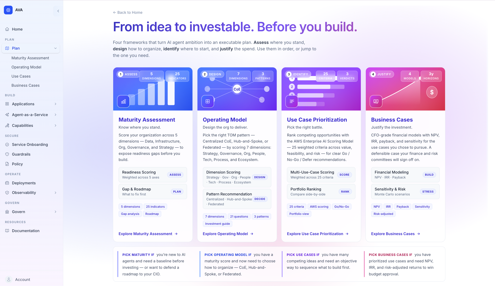
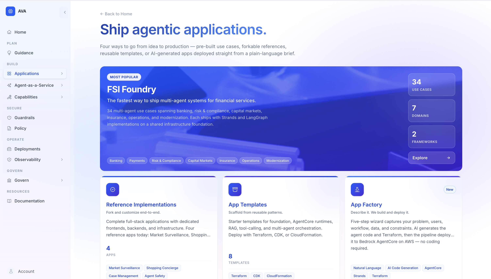
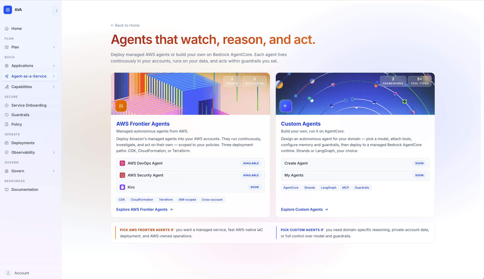
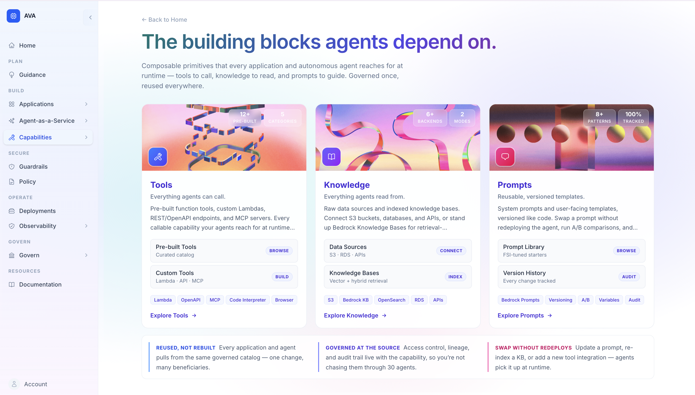
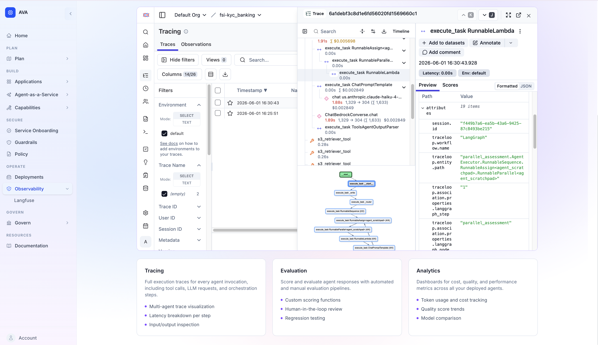
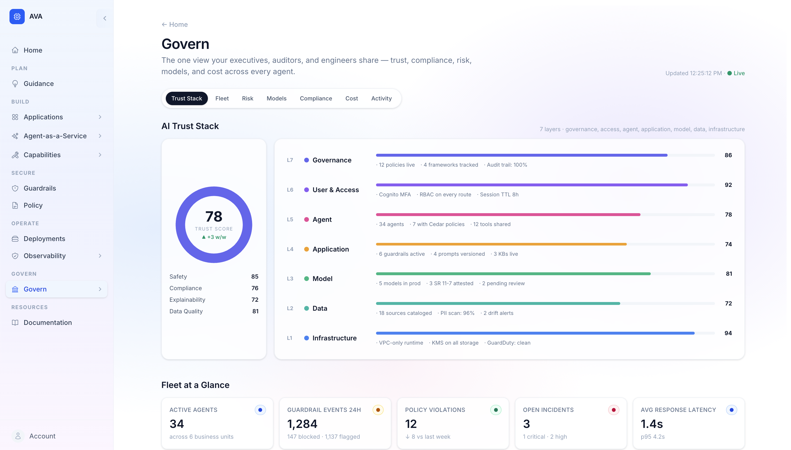

<div align="center">

# AVA - Agentic Value Accelerator

**Plan, build, operate, and secure AI agents for financial services on AWS.**

An open-source platform that unifies use cases, reference apps, apps generation from guided-prompt, managed Frontier Agents, custom agents, and reusable tools on Amazon Bedrock AgentCore.


[](LICENSE)
[](https://python.org)
[](https://aws.amazon.com/bedrock/agentcore/)
[](https://react.dev)
[](https://www.terraform.io)

<br/>


<br/>

[Getting Started](#getting-started) | [Plan](#plan) | [Build](#build) | [Secure](#secure) | [Operate](#operate) | [Govern](#govern) | [Platform](#platform) | [Architecture](#architecture) | [Documentation](#documentation) | [Contacts](#contacts)

</div>

---

## Key Features

A guided tour of what AVA gives you, grouped by pillar. Click any item to jump to its details.

**[Plan](#plan)** — turn ambition into an investable plan before you build
- [Maturity Assessment](#plan) — baseline readiness across 5 dimensions, 25+ indicators, L1–L5 rating
- [Operating Model](#plan) — pick the right TOM pattern (Centralized CoE / Hub-and-Spoke / Federated) by scoring 7 dimensions
- [Use Case Prioritization](#plan) — rank ideas with the AWS Enterprise AI Scoring Model (25 weighted criteria)
- [Business Cases](#plan) — CFO-grade DCF with NPV / IRR / payback and an 8-category risk scorecard

**[Build](#build)** — three ways to ship agentic systems on AWS, ordered most opinionated → most composable
- [FSI Foundry](#fsi-foundry) — 34 multi-agent POCs across 7 FSI domains, dual-framework (LangGraph + Strands), per-use-case React UI
- [Reference Implementations](#reference-implementations) — 4 full-stack forkable apps (Market Surveillance, Shopping Concierge, Case Management, Agent Safety)
- [App Factory](#app-factory) — describe a use case in plain language → AI generates Strands agent + Terraform → deployed to AgentCore
- [App Templates](#app-templates) — 22 deployable starter templates across 8 categories (foundation, agent scaffolds, multi-agent patterns, HITL, memory, security, API, tools)
- [Agent-as-a-Service](#agent-as-a-service) — Amazon's Frontier Agents (DevOps + Security available, Kiro coming) with one-click Terraform/CDK/CloudFormation deploy and federated AWS console launch
- [Capabilities](#capabilities-coming-soon) _(Coming Soon)_ — reusable Tools, Knowledge, and Prompts agents reach for at runtime

**[Secure](#secure)** — safety controls every deployed agent passes through
- [Guardrails](#secure) — Bedrock Guardrails (content filters, PII, denied topics, prompt attack) with FSI-tuned presets
- [Service Onboarding](#secure) — 5-gate approval workflow (Risk → Security → Compliance → Architecture → Executive) with signed approval bundles

**[Operate](#operate)** — full visibility into every agent in production
- [Dual Observability](#operate) — Langfuse v3 (application traces, prompts, evals) + AgentCore Observability (CloudWatch GenAI + X-Ray) for service-level runtime telemetry, both embedded in the Control Plane

**[Govern](#govern)** — AI GRC end-to-end, the view your executives, auditors, and engineers share
- [Command Center](#govern) — AI Platform Activity grid, Trust Stack snapshot, Compliance / Guardrails / Cost summary, Recent Activity
- [Trust Stack](#govern) — 3-layer model (Foundation → Production → Scale) with AWS service mapping and 3 Lines of Defense
- [Fleet Overview · Risk Management · Model Management](#govern) — fleet KPIs, risk register & heatmap, MRM compliance per model
- [Compliance Center](#govern) — SR 26-2, OSFI E-23, NIST AI RMF, EU AI Act, ISO 42001 — controls, evidence, gap analysis
- [Cost & FinOps · Audit & Incidents](#govern) — FinOps health + 12-month forecast; full audit trail with exportable signed evidence bundles

**[Platform](#platform)** — the Control Plane that ties everything together (this is the entry point)
- [Full Control Plane](#platform) — a unified React + FastAPI web UI to **plan, build, secure, operate, and govern** every agent in one place. Browse 34 FSI use cases, 4 reference apps, 22 starter templates, and the AaaS catalog; deploy any of them with one click; test deployed agents from a built-in console; embed Langfuse / AgentCore Observability live; manage guardrails and run the Service Onboarding workflow; jump to the federated AWS Console; and watch every event flow through the Govern Command Center — all from a single Cognito-protected app on ECS Fargate
- [Dual Deployment Paths](#deployment-paths) — Quick Deploy (S3 archive) for business users; Deploy from Git (CodeCommit) for developers who want to fork-and-customize before they deploy
- [One-Click Deployment](#platform) — every deployment runs the same CodeBuild + Step Functions + Terraform/CDK pipeline; full audit trail in DynamoDB, lifecycle events on EventBridge, drift detection on every redeploy

<table align="center">
  <tr>
    <td width="50%"></td>
    <td width="50%"></td>
  </tr>
  <tr>
    <td width="50%"></td>
    <td width="50%"></td>
  </tr>
  <tr>
    <td width="50%"></td>
    <td width="50%"></td>
  </tr>
</table>

---

## Plan

Strategic frameworks — both written guides and interactive tools in the Control Plane — to identify, justify, and prioritize agentic AI use cases before you build. Use them in order (Assess → Design → Identify → Justify) or jump to the one you need.

Four interactive frameworks, each persisted to DynamoDB and accessible from the Plan section of the platform interface.

| Framework | When to use | What it produces |
|-----------|-------------|------------------|
| **Maturity Assessment** | New to AI agents — establish a baseline before investing | Score across 5 dimensions (Data, Infrastructure, Org, Governance, Strategy) with 25+ indicators, gap analysis, and an L1–L5 maturity rating |
| **Operating Model** | Have a maturity score and need to choose how to organize delivery | Pick a Target Operating Model — Centralized CoE / Hub-and-Spoke / Federated — by scoring 7 dimensions (Strategy, Governance, Org, People, Tech, Process, Ecosystem) across 21 questions, with investment guidance per pattern |
| **Use Case Prioritization** | Have multiple competing ideas and need to sequence them | Rank use cases against the AWS Enterprise AI Scoring Model (25 weighted sub-criteria across value, feasibility, risk, readiness, alignment, and cost) with Go/Conditional/No-Go gates |
| **Business Cases** | Need executive buy-in or budget approval for a specific opportunity | CFO-grade DCF model — NPV, IRR, payback, ROI — with an 8-category risk scorecard, ramp-up curves, and Go/Review/Reject verdicts |

### Written guidance

| Resource | Description |
|----------|-------------|
| [**Use Case Discovery Guide**](plan/UseCaseGuidance.md) | 8-step framework for enterprise leaders to identify high-value agentic AI use cases — covers bounded autonomy, measurable outcomes, and governance across industries |

> More strategic planning resources coming soon — persona-specific playbooks (CEO, CIO, CTO, CFO, CRO, CDO) and industry-specific adoption guides.

---

## Platform

The AVA Control Plane is a web-based management layer for deploying and operating agent applications on AWS.

| Component | Description |
|-----------|-------------|
| [**Backend**](platform/docs/architecture/platform-architecture.md) | FastAPI API — template catalog, packaging engine, deployment orchestration, test runner |
| [**Frontend**](platform/control_plane/frontend/README.md) | React + TypeScript UI — browse use cases, deploy with one click, view logs, test agents |
| [**Infrastructure**](platform/control_plane/infrastructure/README.md) | Terraform modules — ECS, API Gateway, DynamoDB, S3, Cognito, CloudFront, CodeBuild |

### Deployment Paths

The Control Plane offers two ways to deploy any use case, backed by the same CodeBuild pipeline:

| Path | Best For | How It Works |
|------|----------|--------------|
| **Quick Deploy (S3)** | Business users, standard deployments | Backend packages the use case source from the template catalog into a ZIP, uploads to S3, and triggers Step Functions. No Git knowledge needed. |
| **Deploy from Git (CodeCommit)** | Developers, custom forks, team collaboration | User selects a pre-seeded CodeCommit repo from the UI. CodeBuild clones the repo and deploys. Push code to the repo to customize before deploying. |

Git-path repos are pre-seeded from the FSI Foundry registry by a one-time script (`scripts/seed-codecommit.sh init`). Users don't need to create repos manually.

[**Deploy the Control Plane &#8594;**](platform/docs/architecture/platform-architecture.md)

---

## Build

Three ways to build agentic systems on AWS, ordered from most opinionated to most composable. Mirrors the **Build** section in the Control Plane.

### Applications

Pre-built FSI workflows, forkable references, reusable templates, and AI-generated apps from a plain-language brief — four paths from idea to production.

#### FSI Foundry

34 multi-agent POC implementations spanning 7 FSI domains — all built on one shared foundation of infrastructure and backend code.

- **Direct Amazon Bedrock AgentCore deployment** — simple and quick
- **Two framework implementations per use case** — LangGraph/LangChain and Strands Agents SDK
- **Shared foundations** — adapters, base classes, Terraform modules, Docker configs, agent registry
- **Per-use-case frontend UI** — Each use case has a dedicated React frontend deployed via CloudFront

<details>
<summary><strong>Banking (8)</strong></summary>

| Use Case | Agents |
|----------|--------|
| [KYC Risk Assessment](applications/fsi_foundry/use_cases/kyc_banking/README.md) | Credit Analyst, Compliance Officer |
| [Customer Service](applications/fsi_foundry/use_cases/customer_service/README.md) | Inquiry Handler, Transaction Specialist, Product Advisor |
| [Customer Chatbot](applications/fsi_foundry/use_cases/customer_chatbot/README.md) | Conversation Manager, Account Agent, Transaction Agent |
| [Customer Support](applications/fsi_foundry/use_cases/customer_support/README.md) | Ticket Classifier, Resolution Agent, Escalation Agent |
| [Document Search](applications/fsi_foundry/use_cases/document_search/README.md) | Document Indexer, Search Agent |
| [AI Assistant](applications/fsi_foundry/use_cases/ai_assistant/README.md) | Task Router, Data Lookup Agent, Report Generator |
| [Corporate Sales](applications/fsi_foundry/use_cases/corporate_sales/README.md) | Lead Scorer, Opportunity Analyst, Pitch Preparer |
| [Agentic Commerce](applications/fsi_foundry/use_cases/agentic_commerce/README.md) | Offer Engine, Fulfillment Agent, Product Matcher |

</details>

<details>
<summary><strong>Payments (3)</strong></summary>

| Use Case | Agents |
|----------|--------|
| [Agentic Payments](applications/fsi_foundry/use_cases/agentic_payments/README.md) | Payment Validator, Routing Agent, Reconciliation Agent |
| [Payment Operations](applications/fsi_foundry/use_cases/payment_operations/README.md) | Exception Handler, Settlement Agent |
| [Fraud Detection](applications/fsi_foundry/use_cases/fraud_detection/README.md) | Transaction Monitor, Pattern Analyst, Alert Generator |

</details>

<details>
<summary><strong>Risk & Compliance (5)</strong></summary>

| Use Case | Agents |
|----------|--------|
| [Document Processing](applications/fsi_foundry/use_cases/document_processing/README.md) | Document Classifier, Data Extractor, Validation Agent |
| [Credit Risk Assessment](applications/fsi_foundry/use_cases/credit_risk/README.md) | Financial Analyst, Risk Scorer, Portfolio Analyst |
| [Compliance Investigation](applications/fsi_foundry/use_cases/compliance_investigation/README.md) | Evidence Gatherer, Pattern Matcher, Regulatory Mapper |
| [Adverse Media Screening](applications/fsi_foundry/use_cases/adverse_media/README.md) | Media Screener, Sentiment Analyst, Risk Signal Extractor |
| [Market Surveillance](applications/fsi_foundry/use_cases/market_surveillance/README.md) | Trade Pattern Analyst, Communication Monitor, Alert Generator |

</details>

<details>
<summary><strong>Capital Markets (9)</strong></summary>

| Use Case | Agents |
|----------|--------|
| [Investment Advisory](applications/fsi_foundry/use_cases/investment_advisory/README.md) | Portfolio Analyst, Market Researcher, Client Profiler |
| [Earnings Summarization](applications/fsi_foundry/use_cases/earnings_summarization/README.md) | Transcript Processor, Metric Extractor, Sentiment Analyst |
| [Economic Research](applications/fsi_foundry/use_cases/economic_research/README.md) | Data Aggregator, Trend Analyst, Research Writer |
| [Email Triage](applications/fsi_foundry/use_cases/email_triage/README.md) | Email Classifier, Action Extractor |
| [Trading Assistant](applications/fsi_foundry/use_cases/trading_assistant/README.md) | Market Analyst, Trade Idea Generator, Execution Planner |
| [Research Credit Memo](applications/fsi_foundry/use_cases/research_credit_memo/README.md) | Data Gatherer, Credit Analyst, Memo Writer |
| [Investment Management](applications/fsi_foundry/use_cases/investment_management/README.md) | Allocation Optimizer, Rebalancing Agent, Performance Attributor |
| [Data Analytics](applications/fsi_foundry/use_cases/data_analytics/README.md) | Data Explorer, Statistical Analyst, Insight Generator |
| [Trading Insights](applications/fsi_foundry/use_cases/trading_insights/README.md) | Signal Generator, Cross Asset Analyst, Scenario Modeler |

</details>

<details>
<summary><strong>Insurance (3)</strong></summary>

| Use Case | Agents |
|----------|--------|
| [Customer Engagement](applications/fsi_foundry/use_cases/customer_engagement/README.md) | Churn Predictor, Outreach Agent, Policy Optimizer |
| [Claims Management](applications/fsi_foundry/use_cases/claims_management/README.md) | Claims Intake Agent, Damage Assessor, Settlement Recommender |
| [Life Insurance Agent](applications/fsi_foundry/use_cases/life_insurance_agent/README.md) | Needs Analyst, Product Matcher, Underwriting Assistant |

</details>

<details>
<summary><strong>Operations (3)</strong></summary>

| Use Case | Agents |
|----------|--------|
| [Call Center Analytics](applications/fsi_foundry/use_cases/call_center_analytics/README.md) | Call Monitor, Agent Performance Analyst, Operations Insight Generator |
| [Post Call Analytics](applications/fsi_foundry/use_cases/post_call_analytics/README.md) | Transcription Processor, Sentiment Analyst, Action Extractor |
| [Call Summarization](applications/fsi_foundry/use_cases/call_summarization/README.md) | Key Point Extractor, Summary Generator |

</details>

<details>
<summary><strong>Modernization (3)</strong></summary>

| Use Case | Agents |
|----------|--------|
| [Legacy Migration](applications/fsi_foundry/use_cases/legacy_migration/README.md) | Code Analyzer, Migration Planner, Conversion Agent |
| [Code Generation](applications/fsi_foundry/use_cases/code_generation/README.md) | Requirement Analyst, Code Scaffolder, Test Generator |
| [Mainframe Migration](applications/fsi_foundry/use_cases/mainframe_migration/README.md) | Mainframe Analyzer, Business Rule Extractor, Cloud Code Generator |

</details>

[**Explore FSI Foundry &#8594;**](applications/fsi_foundry/README.md)

#### Reference Implementations

End-to-end full-stack solutions with dedicated frontends, backend APIs, and complete infrastructure.

| Implementation | Domain                | Description                                                                                                                                                                 |
|---------------|---------------|-------------------------------|
| [Market Surveillance](applications/reference_implementations/market-surveillance/README.md) | Capital Markets       | Real-time trade monitoring with 29 decision tree rules, multi-agent orchestration, and audit-ready reports                                                                  |
| [Shopping Concierge Agent](applications/reference_implementations/shopping-concierge-agent/README.md) | Agentic Payments      | AI-powered concierge with product search, cart management, payment support, and Cognito auth                                                                                |
| [Case Management](applications/reference_implementations/case-management/README.md) | Risk & Compliance     | Fraud detection and case management with pattern recognition (smurfing, mule accounts, high-velocity), conversational investigation, and optional AgentCore SAR generation  |
| [Agent Safety](applications/reference_implementations/agent-safety/README.md) | Safety & Governance   | Safety controls for Bedrock AgentCore — budget/eval/observability auto-provisioning, session interventions, kill switch, audit trail, and centralized dashboard             |

[**View Reference Implementations &#8594;**](applications/reference_implementations/README.md)

#### App Factory

Describe your use case in plain language through a five-step wizard (problem, users, workflow, data, constraints). AI generates the Strands agent code and Terraform, and the CI/CD pipeline deploys it end-to-end to Bedrock AgentCore — no coding required. Track progress on the same deployment detail page as every other use case.

[**Try App Factory &#8594;**](applications/app_factory/README.md)

#### App Templates

22 deployable starter templates across 8 categories. Browse and deploy all of them from the **App Templates** tab in the Control Plane.

<details>
<summary><strong>Foundation & Observability (2)</strong></summary>

| Template | Description |
|----------|-------------|
| [**Foundation Stack**](platform/docs/templates/foundation-stack.md) | Langfuse v3 observability platform on ECS Fargate (Aurora PostgreSQL, ClickHouse, Redis, CloudFront, VPC networking). Deploy once per account/region; every other template sends traces here. |
| [**Agent Observability — Langfuse**](platform/control_plane/templates/agent-observability/README.md) | Standalone Langfuse v2 deployment on ECS Fargate with Aurora Serverless v2 and ElastiCache Redis. |

</details>

<details>
<summary><strong>Agent Scaffolds (3)</strong></summary>

| Template | Framework | Description |
|----------|-----------|-------------|
| [**Strands Agent Scaffold**](platform/control_plane/templates/agent-scaffold-strands/README.md) | Strands Agents SDK | Production-ready agent with tools, conversation memory, and AgentCore deployment |
| [**Agent Scaffold — LangGraph**](platform/control_plane/templates/agent-scaffold-langgraph/README.md) | LangGraph / LangChain | Production-ready ReAct agent with tools, conversation memory, and AgentCore deployment |
| [**Conversational Assistant**](platform/control_plane/templates/conversational-assistant/README.md) | Strands + LangGraph | Single-agent chat app with tools, multi-turn memory, and streaming responses |

</details>

<details>
<summary><strong>Multi-Agent Patterns (7)</strong></summary>

| Template | Description |
|----------|-------------|
| [**Multi-Agent Orchestration Kit**](platform/control_plane/templates/multi-agent-kit/README.md) | Four reusable composition patterns — agent-as-tool, supervisor, pipeline, fan-out — in both Strands and LangGraph |
| [**Supervisor with Specialists**](platform/control_plane/templates/supervisor-specialists/README.md) | Supervisor classifies requests and delegates to specialist agents (researcher, writer, etc.) |
| [**Plan-and-Execute Agent**](platform/control_plane/templates/plan-execute-agent/README.md) | Decomposes complex goals into multi-step plans, executes each step with tools, evaluates results |
| [**Evaluator-Optimizer (Critique Loop)**](platform/control_plane/templates/evaluator-optimizer/README.md) | Generator/evaluator critique loop for self-improving content quality |
| [**Sequential Workflow Pipeline**](platform/control_plane/templates/workflow-pipeline/README.md) | Deterministic ordered agent pipeline for document processing — fixed-order with per-step error handling |
| [**Event-Driven Agent**](platform/control_plane/templates/event-driven-agent/README.md) | Reactive agent triggered by S3 uploads, schedules, or webhooks |
| [**Research & Report Generator**](platform/control_plane/templates/research-report-generator/README.md) | RAG-powered research agent that retrieves from a Bedrock KB and produces cited reports |

</details>

<details>
<summary><strong>Human-in-the-Loop (2)</strong></summary>

| Template | Description |
|----------|-------------|
| [**Human-in-the-Loop**](platform/control_plane/templates/human-in-the-loop/README.md) | Approval gates and feedback loops for agent execution — request-level pattern (DynamoDB) and LangGraph interrupt-based pattern |
| [**Human-Approval Workflow**](platform/control_plane/templates/human-approval-workflow/README.md) | Agent drafts actions (emails, DB changes, API calls) and pauses for human approval before execution |

</details>

<details>
<summary><strong>Compute, Memory & Knowledge (3)</strong></summary>

| Template | Description |
|----------|-------------|
| [**Agent Runtime — AgentCore**](platform/control_plane/templates/agent-runtime-agentcore/README.md) | Bedrock AgentCore runtime with invocable endpoint, IAM roles, X-Ray tracing, and CloudWatch log delivery |
| [**Agent Memory — AgentCore**](platform/control_plane/templates/agent-memory-agentcore/README.md) | Bedrock AgentCore memory store with configurable extraction strategies — semantic, episodic, summary |
| [**Knowledge Base — Bedrock**](platform/control_plane/templates/knowledge-base-bedrock/README.md) | Bedrock Knowledge Base with OpenSearch Serverless vector store and S3 source — configurable chunking |

</details>

<details>
<summary><strong>Security & Auth (2)</strong></summary>

| Template | Description |
|----------|-------------|
| [**Agent Guardrails — Bedrock**](platform/control_plane/templates/agent-guardrails/README.md) | Bedrock Guardrails for content filtering, PII protection, denied topics, profanity blocking — per-category filter strengths |
| [**Auth — Cognito**](platform/control_plane/templates/auth-cognito/README.md) | Cognito User Pool with web + service app clients, resource server with custom scopes, hosted UI |

</details>

<details>
<summary><strong>API & Tools (3)</strong></summary>

| Template | Description |
|----------|-------------|
| [**Agent API Gateway**](platform/control_plane/templates/agent-api-gateway/README.md) | API Gateway for agent backends — HTTP API (request/response + SSE) or WebSocket API (bidirectional streaming) |
| [**Structured Output**](platform/control_plane/templates/structured-output/README.md) | Reliable JSON / structured output from LLMs — parsing, validation, retry logic |
| [**Agent Test Harness**](platform/control_plane/templates/agent-test-harness/README.md) | Pytest framework with LLM-as-judge evaluation, latency benchmarks, cost tracking, mock fixtures |

</details>

[**Browse all templates &#8594;**](platform/docs/templates/README.md)

---

### Agent-as-a-Service

Managed autonomous agents you deploy into your own AWS account — either Amazon's Frontier Agents or your own Custom Agents built on Bedrock AgentCore.

#### Frontier Agents

| Agent | Domain | Deployment | Status |
|-------|--------|------------|--------|
| [AWS DevOps Agent](https://docs.aws.amazon.com/devopsagent/latest/userguide/about-aws-devops-agent.html) | Incident Response & SRE | [Terraform](platform/control_plane/aaas/frontier_agents/devops/iac/terraform/README.md) &#124; [CDK](platform/control_plane/aaas/frontier_agents/devops/iac/cdk/README.md) &#124; [CloudFormation](platform/control_plane/aaas/frontier_agents/devops/iac/cloudformation/README.md) | Available |
| [AWS Security Agent](https://docs.aws.amazon.com/securityagent/latest/userguide/what-is.html) | Application Security (design review, code review, on-demand pentest) | [Terraform](platform/control_plane/aaas/frontier_agents/security/iac/terraform/README.md) &#124; [CDK](platform/control_plane/aaas/frontier_agents/security/iac/cdk/README.md) &#124; [CloudFormation](platform/control_plane/aaas/frontier_agents/security/iac/cloudformation/README.md) | Available |
| [Kiro](https://kiro.dev) | Developer Productivity | Local IDE (not IaC-deployed) | Coming Soon |

One-click deployment from the Control Plane UI provisions the agent's Agent Space, operator role, and primary-account association in your account. After deploy, hit **Launch in Console** to federate (STS `AssumeRole` + sigv4 sign-in URL) directly into the agent's AWS Console with the right operator role — no manual role-switching, no copy-paste credentials.

[**Browse Frontier Agents &#8594;**](platform/control_plane/aaas/frontier_agents.json)

#### Custom Agents (Coming Soon)

Build your own autonomous agent on Bedrock AgentCore — choose a model, attach tools, configure memory and guardrails, and deploy to a managed runtime.

---

### Capabilities <sub><i>(Coming Soon)</i></sub>

Composable building blocks agents reach for at runtime — governed once, reused across every application and autonomous agent. Three primitives:

| Capability | What it is | Examples |
|------------|------------|----------|
| **Tools** | Everything agents *call* | MCP Gateway, Code Interpreter, Web Browser, API Connector, Notifications, custom Lambda/OpenAPI tools |
| **Knowledge** | Everything agents *read from* | S3 data sources, RDS/JDBC connections, Bedrock Knowledge Bases (vector + hybrid retrieval), document stores, streaming feeds |
| **Prompts** | Reusable, versioned templates | System prompts, response templates, evaluation rubrics, guardrail clauses — backed by Amazon Bedrock Prompt Management |

Each primitive is registered once with access control, lineage, and audit trail, then attached to agents at deploy time. Update a prompt or re-index a knowledge base without redeploying the agent.

---

## Secure

Safety controls every deployed agent passes through — built on Amazon Bedrock Guardrails and extended with platform-level policy management and an executive-grade approval workflow.

| Component | Description | Status |
|-----------|-------------|--------|
| **Guardrails** | Content filters (hate, insults, sexual, violence, misconduct, prompt attack), PII detection and redaction, denied topics, word filters, and contextual grounding. Manage templates from the Control Plane; attach one or more to any agent at deploy time. FSI-tuned presets provided (FSI Standard, Market Surveillance, Customer Service). | **Available** |
| **Service Onboarding** | Guided 5-gate approval workflow for any new AI service — Risk → Security → Compliance → Architecture → Executive. Powered by a Claude Code plugin that ingests a service brief, runs each phase as an autonomous reviewer, and produces a signed approval report with an evidence bundle ready for audit. Step Functions orchestrates phase progression with full audit trail in DynamoDB. | **Available** |
| **Policy** | Governance frameworks and compliance policy management — map controls to frameworks, track exceptions and waivers. | Coming Soon |

---

## Operate

Two complementary observability stacks — every deployed agent emits to both, and you can drill into either from the **Observability** page in the Control Plane.

- **Observability with AgentCore Observability** (service-level) — captures `InvokeAgentRuntime` spans, payload metadata, session/request IDs, cold-starts, init failures, and IAM denials. Surfaced via Amazon CloudWatch GenAI Observability and X-Ray Transaction Search. AWS-managed; APPLICATION_LOGS log delivery + X-Ray trace destinations are wired into every AgentCore runtime stack at deploy time. **Pick this for SRE / incident response and to confirm the runtime actually received the request.**
- **Observability with Langfuse** (application-level) — captures traces, sessions, generations; prompt management; eval datasets and scores; cost-per-trace breakdown. Each FSI Foundry use case auto-provisions its own Langfuse project at deploy time so traces are isolated per-use-case. Self-hosted on ECS Fargate (Aurora PostgreSQL + ClickHouse + Redis), fronted by CloudFront, and embedded as an iframe in **Observability → Langfuse** with auto-login. **Pick this for prompt iteration, evals, and cost analysis.**

Together, the two cover the full lifecycle: AgentCore Observability shows whether the runtime received and dispatched the request; Langfuse shows what the agent's reasoning and tool calls actually did.

[**View Observability &#8594;**](platform/control_plane/templates/agent-observability/README.md)

---

## Govern

The AI GRC pillar your executives, auditors, and engineers share — one command-center view plus eight deeper workspaces. All pages live under `/govern/*` in the Control Plane and share a unified indigo→violet→pink palette.

| Workspace | What it shows |
|-----------|---------------|
| **Command Center** | AI Platform Activity tile grid (Plan / Build · Apps / Build · AaaS / Build · Capabilities / Secure / Operate / Compliance / Incidents) on a deep-blue hero panel; "Governance Across AVA Platform" module map; 3-Layer Trust Stack coverage; Compliance · Guardrails · Cost summary row; Recent Activity feed; Quick Actions to Audit Log and Risk Register |
| **Trust Stack** | Deep dive into the 3-layer model — Foundation → Production → Scale — with per-layer KPIs, AWS service mapping (how each AWS service solves a specific governance challenge), Key Controls, AWS Frontier Agents, and 3 Lines of Defense activities. Click a layer to expand |
| **Fleet Overview** | Fleet-wide KPIs (trust score, guardrails active, deployments, use cases, guardrail events 24h); 30-day trust + guardrail + violation trend; agent × risk heatmap; top risky use cases; live guardrail & incident feed |
| **Risk Management** | Risk dashboard with heatmap, control effectiveness, and 30-day risk trend; risk register with inherent/residual scores and owners; assessment runs; control implementation tracking. Aligned to NIST AI RMF and SR 26-2 |
| **Model Management** | Model registry with risk tier, eval score, attestation status, owner; 4-framework MRM compliance progress (SR 26-2, OSFI E-23, NIST AI RMF, EU AI Act); per-model 360 view with evals, approvals, evidence, risk profile, and drift signals |
| **Compliance Center** | Interactive checklists for SR 26-2, OSFI E-23, NIST AI RMF, EU AI Act, ISO 42001 — control status, evidence collection, gap analysis, exportable compliance reports for auditors |
| **Cost & FinOps** | FinOps health score, spend velocity, cost by model, 30-day cost vs budget, BU budgets, 12-month forecast with three growth scenarios, unit economics, chargeback statement, commitment/Provisioned Throughput planner, and optimization recommendations |
| **Audit & Incidents** | Searchable timeline of guardrail events, incidents, approvals, deployments, and config changes — per-event evidence drawer with trace links, CloudTrail records, and exportable signed bundles. Live data via AWS CloudTrail + Amazon EventBridge |

Real-data sources are wired today for guardrails, deployments, use cases, agents, and frontier agents (via the governance aggregator); compliance frameworks, cost data, and risk register surfaces are demo data while the Bedrock/Cost Explorer/EventBridge integrations are being filled in.

---

## Architecture

| Area | Document | Description |
|------|----------|-------------|
| **Platform** | [**Platform Architecture**](platform/docs/architecture/platform-architecture.md) | Full system design with Mermaid diagrams — frontend, backend, CI/CD pipeline, infrastructure modules, per-use-case UI deployment flow |
| **Platform** | [CI/CD Pipeline](platform/docs/architecture/cicd-pipeline.md) | Dual-source CodeBuild buildspec — Git clone / S3 unzip, Docker build, Terraform apply, UI build, S3 sync, CloudFront invalidation |
| **Platform** | [Infrastructure Scripts](platform/control_plane/infrastructure/scripts/README.md) | Reference for every shell and Python script used to deploy, tear down, and seed the Control Plane (deploy-full, destroy, import-existing, seed-codecommit) |
| **FSI Foundry** | [Architecture & Deployment](applications/fsi_foundry/docs/foundations/README.md) | [Architecture Patterns](applications/fsi_foundry/docs/foundations/architecture/architecture_patterns.md) &#124; [AgentCore Design](applications/fsi_foundry/docs/foundations/architecture/architecture_agentcore.md) &#124; [Deployment Guide](applications/fsi_foundry/docs/foundations/deployment/deployment_patterns.md) |
| **Reference** | [Market Surveillance](platform/docs/architecture/market-surveillance-architecture.md) | Multi-agent surveillance architecture — [Diagram](applications/reference_implementations/market-surveillance/docs/diagram/architecture.png) |
| **Reference** | [Shopping Concierge](applications/reference_implementations/shopping-concierge-agent/docs/AGENT_CAPABILITIES_SHOPPING.md) | [Agent Capabilities](applications/reference_implementations/shopping-concierge-agent/docs/AGENT_CAPABILITIES_SHOPPING.md) &#124; [Deployment](applications/reference_implementations/shopping-concierge-agent/docs/DEPLOYMENT.md) &#124; [Data Flow](applications/reference_implementations/shopping-concierge-agent/docs/shopping_data_flow.png) |
| **Reference** | [Case Management](applications/reference_implementations/case-management/README.md) | Fraud detection + investigation — [Architecture Diagram](applications/reference_implementations/case-management/architecture/architecture.drawio.png) |
| **Reference** | [Agent Safety](applications/reference_implementations/agent-safety/README.md) | Agent safety controls — [Signals Contract](applications/reference_implementations/agent-safety/SIGNALS_CONTRACT.md) |
| **AaaS** | AWS DevOps Agent | Same-account deploy of Amazon's managed DevOps Agent — Agent Space, operator role, primary-account association, optional sample Lambda for Part 2 cross-account monitoring. Available in three IaC flavors: [Terraform](platform/control_plane/aaas/frontier_agents/devops/iac/terraform/README.md) &#124; [CDK](platform/control_plane/aaas/frontier_agents/devops/iac/cdk/README.md) &#124; [CloudFormation](platform/control_plane/aaas/frontier_agents/devops/iac/cloudformation/README.md) |
| **AaaS** | AWS Security Agent | Same-account deploy of Amazon's managed Security Agent — design review, code review, on-demand pentest. Three IaC flavors: [Terraform](platform/control_plane/aaas/frontier_agents/security/iac/terraform/README.md) &#124; [CDK](platform/control_plane/aaas/frontier_agents/security/iac/cdk/README.md) &#124; [CloudFormation](platform/control_plane/aaas/frontier_agents/security/iac/cloudformation/README.md) |
| **AaaS** | Federated Console Launch | STS `AssumeRole` + sigv4 sign-in URL flow that lets operators jump from AVA into the deployed agent's AWS Console with the right operator role — no manual role-switching. Implemented in `backend/src/api/routes/frontier_agents.py` |
| **AaaS** | [Frontier Agents Registry](platform/control_plane/aaas/frontier_agents.json) | Catalog entry that drives the deploy UI — agent metadata, supported IaC types, parameters |
| **Secure** | Service Onboarding | 5-gate Claude Code-plugin approval workflow (Risk → Security → Compliance → Architecture → Executive) orchestrated by the Step Functions state machine in the `service_approval` Terraform module, with state and signed approval bundles persisted to DynamoDB + S3 |
| **Observability** | [Foundation Stack (Langfuse v3)](platform/docs/templates/foundation-stack.md) | Langfuse v3 + OpenTelemetry on ECS Fargate (bundled with required networking). Deploy once per account/region; every use case auto-provisions its own Langfuse project against this foundation |
| **Observability** | AgentCore Observability | CloudWatch GenAI Observability + X-Ray Transaction Search. APPLICATION_LOGS log delivery + X-Ray trace destinations are wired into every AgentCore runtime stack at deploy time. One-time per-account prereq: enable X-Ray Transaction Search via `null_resource` in the Control Plane Terraform |
| **Govern** | Governance Aggregator | `frontend/src/components/govern/useGovernanceAggregator.ts` pulls live data from guardrails, deployments, use cases, agents, and frontier agents into a single `summary` consumed by the 8 Govern workspaces |
| **Evaluation** | Evaluation *(coming soon)* | Agent performance testing and quality benchmarks |

---

## Project Structure

```
ava/
│
├── plan/                                        # --- Strategy Layer ---
│   └── UseCaseGuidance.md                       # 8-step discovery framework for leaders
│
├── platform/                                    # --- Platform Layer ---
│   ├── docs/                                    # Architecture + template documentation
│   └── control_plane/
│       ├── frontend/                            # Control Plane Web UI (React 19 + TypeScript + Vite)
│       │   └── src/
│       │       ├── components/                  # React pages — Home, PlanLanding, BuildLanding,
│       │       │   ├── plan/                    #   maturity / operating_model / prioritization /
│       │       │   ├── maturity/                #   business_cases — interactive Plan workspaces
│       │       │   ├── operating_model/
│       │       │   ├── prioritization/
│       │       │   ├── business_cases/
│       │       │   ├── ApplicationsLanding/     #   FSI Foundry, Ref Impls, App Factory, Templates
│       │       │   ├── AaaSLanding/             #   Frontier Agents (DevOps + Security) + Custom
│       │       │   ├── capabilities/            #   Tools, Knowledge, Prompts (coming soon)
│       │       │   ├── service-onboarding/      #   5-gate approval workflow UI
│       │       │   ├── guardrails/              #   Bedrock Guardrails template manager
│       │       │   ├── govern/                  #   Command Center, Trust Stack, Fleet, Risk,
│       │       │   │                            #   Models, Compliance, FinOps, Audit & Incidents
│       │       │   ├── DeploymentList.tsx       #   /deployments — chip filters + status sort
│       │       │   ├── DeploymentDetail.tsx
│       │       │   └── Observability.tsx        #   Langfuse + AgentCore Observability iframe
│       │       ├── api/                         # API client (Axios) + auth interceptor
│       │       ├── auth/                        # Cognito authentication
│       │       ├── contexts/                    # React contexts (UserContext, AuthContext)
│       │       └── types/                       # TypeScript type definitions
│       │
│       ├── backend/                             # Control Plane API (FastAPI on ECS Fargate)
│       │   └── src/
│       │       ├── api/routes/                  # REST endpoints —
│       │       │                                #   deployments, templates, applications,
│       │       │                                #   codecommit, app_factory, frontier_agents
│       │       │                                #   (federated console + IaC catalog),
│       │       │                                #   service_approval, guardrails, langfuse,
│       │       │                                #   maturity, operating_model, prioritization,
│       │       │                                #   business_cases, projects, users, bootstrap
│       │       ├── services/                    # Business logic — pipeline, packaging,
│       │       │                                #   langfuse_provisioning (per-use-case projects)
│       │       ├── models/                      # Pydantic models
│       │       └── core/                        # Config, auth (Cognito JWT validation), middleware
│       │
│       ├── infrastructure/                      # Terraform — Control Plane AWS Resources
│       │   ├── modules/
│       │   │   ├── ecs/                         # ECS Fargate cluster + service
│       │   │   ├── codebuild/                   # CI/CD pipeline (dual-source buildspec.yml)
│       │   │   ├── codecommit/                  # Pre-seeded repos for "Deploy from Git" path
│       │   │   ├── step_functions/              # Deployment orchestrator (source-agnostic)
│       │   │   ├── frontier_agents_pipeline/    # Dedicated Terraform-only pipeline for AaaS
│       │   │   ├── service_approval/            # Service Onboarding (5-gate workflow + SF state machine)
│       │   │   ├── agent_registry/              # AgentCore agent registry metadata
│       │   │   ├── eventbridge/                 # Lifecycle events + Git push / PR-merge triggers
│       │   │   ├── cloudfront/                  # CDN for frontend
│       │   │   ├── cognito/                     # User pools + auth (+ optional demo user seeding)
│       │   │   ├── dynamodb/                    # Deployment state + App Factory + Plan + service-approval
│       │   │   ├── ecr/                         # Container registry
│       │   │   ├── s3/                          # Frontend hosting + artifact storage
│       │   │   ├── api_gateway/                 # HTTP API for backend
│       │   │   ├── networking/                  # VPC, subnets, security groups
│       │   │   ├── state_backend/               # Terraform remote state (S3 + DynamoDB lock)
│       │   │   └── observability/               # CloudWatch + X-Ray Transaction Search prereqs
│       │   ├── service_approval_runner/         # Container image for the service-approval phases
│       │   └── scripts/                         # deploy-full.sh, destroy.sh, seed-codecommit.sh,
│       │                                        #   setup-dockerhub-auth.sh
│       │
│       ├── templates/                           # 22 Starter Templates (deployed via UI)
│       │   ├── foundation-stack/                # Langfuse v3 + OpenTelemetry + networking
│       │   ├── agent-observability/             # Standalone Langfuse v2 stack
│       │   ├── agent-scaffold-strands/          # Strands on Bedrock AgentCore
│       │   ├── agent-scaffold-langgraph/        # LangGraph on Bedrock AgentCore
│       │   ├── conversational-assistant/        # Single-agent chat with tools + memory + streaming
│       │   ├── multi-agent-kit/                 # 4 multi-agent composition patterns
│       │   ├── supervisor-specialists/          # Supervisor → specialist agents
│       │   ├── plan-execute-agent/              # Plan → execute → evaluate
│       │   ├── evaluator-optimizer/             # Generator/evaluator critique loop
│       │   ├── workflow-pipeline/               # Sequential agent pipeline
│       │   ├── event-driven-agent/              # S3 / schedule / webhook triggers
│       │   ├── research-report-generator/       # RAG-powered cited reports
│       │   ├── human-in-the-loop/               # Approval gates + LangGraph interrupts
│       │   ├── human-approval-workflow/         # Draft → approve → execute
│       │   ├── agent-runtime-agentcore/         # AgentCore runtime + IAM + tracing
│       │   ├── agent-memory-agentcore/          # AgentCore memory store
│       │   ├── knowledge-base-bedrock/          # Bedrock KB + OpenSearch Serverless
│       │   ├── agent-guardrails/                # Bedrock Guardrails template
│       │   ├── auth-cognito/                    # Cognito User Pool + hosted UI
│       │   ├── agent-api-gateway/               # HTTP / WebSocket API for agent backends
│       │   ├── structured-output/               # Reliable JSON / structured LLM output
│       │   └── agent-test-harness/              # Pytest + LLM-as-judge evals
│       │
│       └── aaas/                                # Agent-as-a-Service product domain
│           ├── frontier_agents.json             # Catalog registry (drives /aaas/aws-agents UI + deploy API)
│           └── frontier_agents/
│               ├── devops/iac/{terraform,cdk,cloudformation}/    # AWS DevOps Agent
│               └── security/iac/{terraform,cdk,cloudformation}/  # AWS Security Agent
│
├── applications/                                # --- Application Layer ---
│   │
│   ├── fsi_foundry/                             # FSI Foundry — 34 Multi-Agent Use Cases
│   │   ├── foundations/                         # Shared code used by ALL use cases
│   │   │   ├── src/                             # Python base classes and utilities
│   │   │   │   ├── base/                        # BaseAgent, BaseOrchestrator, BaseModel
│   │   │   │   ├── adapters/                    # Framework adapters (Strands, LangGraph)
│   │   │   │   ├── tools/                       # Shared agent tools
│   │   │   │   └── utils/                       # Logging, config, helpers
│   │   │   ├── iac/                             # Terraform modules for use case infra
│   │   │   │   ├── agentcore/                   # Bedrock AgentCore runtime + UI (S3, CloudFront, Lambda, API GW)
│   │   │   │   ├── shared/                      # Shared networking, IAM, ECR
│   │   │   │   └── cognito/                     # Per-use-case auth (optional)
│   │   │   └── docker/                          # Dockerfiles for agent containers
│   │   │
│   │   ├── use_cases/                           # 34 use case implementations
│   │   │   └── {use_case_name}/                 # e.g. kyc_banking, fraud_detection
│   │   │       └── src/
│   │   │           ├── strands/                 # Strands SDK implementation
│   │   │           │   ├── orchestrator.py      # Agent orchestration logic
│   │   │           │   ├── models.py            # Pydantic request/response models
│   │   │           │   └── agents/              # Individual agent definitions
│   │   │           └── langchain_langgraph/     # LangGraph implementation
│   │   │               ├── orchestrator.py
│   │   │               └── agents/
│   │   │
│   │   ├── ui/                                  # Per-use-case React frontends
│   │   │   └── {use_case_name}/                 # e.g. fraud_detection, agentic_payments
│   │   │       ├── src/components/              # AgentConsole, ResultsPanel, Home, Navigation
│   │   │       └── public/runtime-config.json   # API endpoint + input schema config
│   │   │
│   │   ├── data/
│   │   │   ├── registry/offerings.json          # Use case catalog (agents, fields, test entities)
│   │   │   └── samples/                         # Sample data for each use case
│   │   │
│   │   └── scripts/                             # Deployment and testing scripts
│   │       ├── main/deploy.sh                   # Interactive deployment wizard
│   │       ├── deploy/                          # Per-pattern deploy scripts
│   │       ├── use_cases/                       # Per-use-case test scripts
│   │       └── cleanup/                         # Resource teardown scripts
│   │
│   ├── reference_implementations/               # Full-Stack Reference Apps
│   │   ├── market-surveillance/                 # Capital Markets surveillance (Strands + Terraform)
│   │   │   ├── agent-backend/                   # Strands multi-agent backend
│   │   │   ├── trade-alerts-app/                # Next.js frontend
│   │   │   ├── infrastructure/                  # Terraform (multi-module)
│   │   │   └── seeding_scripts/                 # Data seeding and DB setup
│   │   │
│   │   ├── shopping-concierge-agent/            # Agentic payments concierge (Strands + MCP + CDK)
│   │   │   ├── concierge_agent/                 # Strands agent + MCP tools
│   │   │   ├── web-ui/                          # React frontend
│   │   │   ├── amplify/                         # Amplify backend (Cognito, AppSync, DynamoDB)
│   │   │   └── infrastructure/                  # CDK stacks (Agent, MCP, Frontend)
│   │   │
│   │   ├── case-management/                     # Fraud detection + investigation (Strands + Bash/CDK)
│   │   │   ├── agent/                           # Fraud Analyst + SAR Report agents
│   │   │   ├── frontend/                        # React case management UI
│   │   │   └── infrastructure/                  # DynamoDB, CloudFront + OAC, AgentCore SAR stack
│   │   │
│   │   └── agent-safety/                        # Human-in-the-loop safety toolkit
│   │       ├── cost-controls/                   # Auto budgets + anomaly alarms per agent
│   │       ├── hil-interventions/               # Kill switch (IAM deny) + per-session controls
│   │       └── dashboard/                       # Unified cost, eval, and observability signals
│   │
│   └── app_factory/                             # AI-generated use cases
│       ├── builder.py                           # Prompt → code generation logic
│       ├── prompts/                             # System prompts used by builder
│       ├── ui-template/                         # React UI scaffold for generated apps
│       ├── deploy.sh                            # CodeBuild entrypoint for generated bundles
│       └── scripts/                             # Supporting generation + packaging scripts
│                                                # Wizard → AI code + Terraform → deployed to AgentCore
│
└── internal/                                    # Internal docs, design notes, release planning
```

---

## Getting Started

### Prerequisites

- AWS Account with [Bedrock model access](https://docs.aws.amazon.com/bedrock/latest/userguide/model-access.html) (Claude models enabled)
- AWS CLI >= 2.28.9
- Terraform >= 1.0
- Python >= 3.11
- Node.js >= 22
- Docker with buildx support

### Quick Start

```bash
# Clone the repository
git clone https://github.com/aws-samples/ava
cd ava

# Copy environment config
cp .env.example .env
# Edit .env with your AWS credentials and region
```

**Choose your path:**

The Control Plane is the recommended entry point — once deployed, it can CI/CD-deploy every application including FSI Foundry use cases, reference implementations, templates, and app factory from its UI. The Foundry and reference implementation scripts remain available for standalone plug-and-play use if you'd rather skip the Control Plane.

**Recommended — deploy the Control Plane, then use its UI for everything:**

| Step                               | Command | Required? |
|------------------------------------|---------|-----------|
| 1. Deploy the Control Plane        | `cd platform/control_plane/infrastructure/scripts && ./deploy-full.sh` | Required |
| 2. Seed CodeCommit (enables the "Deploy from Git" path in the UI) | `cd platform/control_plane/infrastructure/scripts && ./seed-codecommit.sh init` | Optional — only for the Git deploy path |
| 3. Docker Hub auth (avoids docker.io rate limits when deploying the Langfuse Foundation Stack) | `cd platform/control_plane/infrastructure/scripts && ./setup-dockerhub-auth.sh` | Optional — only if you'll deploy the Langfuse Foundation Stack. [Instructions](platform/control_plane/infrastructure/scripts/README.md#setup-dockerhub-authsh) |

After step 1, sign in to the Control Plane UI to deploy any FSI Foundry use case, reference implementation, app template, or AaaS frontier agent — no further CLI work needed. Recommended next steps once you're in:

1. Deploy the **Foundation Stack** template once per account/region — it brings up Langfuse v3 so all other deployments emit traces to a single place
2. Deploy a **FSI Foundry** use case (e.g. `kyc_banking`) to see the Strands + LangGraph dual implementation, and confirm Observability is wired
3. Deploy a **Frontier Agent** (DevOps or Security) and click **Launch in Console** to verify federated sign-in
4. Open **/govern/command-center** for the platform-wide GRC view, and **/secure/service-onboarding** to try the 5-gate approval workflow on your own service brief

**Alternative — deploy standalone (without the Control Plane):**

| Goal | Command |
|------|---------|
| Deploy a single FSI Foundry use case from the CLI | `cd applications/fsi_foundry && ./scripts/main/deploy.sh` |
| Deploy a reference implementation from the CLI    | See [applications/reference_implementations/](applications/reference_implementations/README.md) |

> **⚠️ Model Access:** AWS accounts that have not used a legacy model in the last 30 days will receive an error when calling that model, resulting in **"Error: No Response"** in the frontends. Check the Model Catalog to select the right model.

[**Detailed Deployment Guide &#8594;**](applications/fsi_foundry/docs/foundations/deployment/)

---

## Documentation

### Plan

| Resource | Description |
|----------|-------------|
| [Use Case Discovery Guide](plan/UseCaseGuidance.md) | 8-step framework for enterprise leaders to identify high-value agentic AI use cases — bounded autonomy, measurable outcomes, governance |

### Platform

| Resource | Description |
|----------|-------------|
| [Control Plane](platform/docs/architecture/platform-architecture.md) | Deploy and manage agent applications from the web UI |
| [Infrastructure](platform/control_plane/infrastructure/README.md) | Terraform modules and deployment architecture |
| [Infrastructure Scripts](platform/control_plane/infrastructure/scripts/README.md) | `deploy-full.sh`, `destroy.sh`, `import-existing.sh`, `seed-codecommit.sh`, `setup-dockerhub-auth.sh` — usage, modes, troubleshooting |
| [App Templates](platform/docs/templates/README.md) | All 22 starter templates browsable from the UI — usage, parameters, customization |

### Applications

| Resource | Description |
|----------|-------------|
| [FSI Foundry](applications/fsi_foundry/README.md) | Architecture, foundations, and use case documentation |
| [Reference Implementations](applications/reference_implementations/README.md) | End-to-end full-stack solutions (Market Surveillance, Shopping Concierge, Case Management, Agent Safety) |
| [App Factory](applications/app_factory/README.md) | Natural-language wizard → AI-generated agent code + Terraform → deployed to AgentCore |
| [Deployment Guide](applications/fsi_foundry/docs/foundations/deployment/deployment_patterns.md) | Step-by-step deployment instructions |

### Agent-as-a-Service

| Resource | Description |
|----------|-------------|
| [Frontier Agents Registry](platform/control_plane/aaas/frontier_agents.json) | Catalog of managed AWS Frontier Agents — metadata, supported IaC flavors, deploy parameters |
| AWS DevOps Agent — IaC modules | Agent Space, operator role, primary-account association; optional Part 2 cross-account add-on. Choose your flavor: [Terraform](platform/control_plane/aaas/frontier_agents/devops/iac/terraform/README.md) &#124; [CDK](platform/control_plane/aaas/frontier_agents/devops/iac/cdk/README.md) &#124; [CloudFormation](platform/control_plane/aaas/frontier_agents/devops/iac/cloudformation/README.md) |
| AWS Security Agent — IaC modules | Same-account deploy of the Security Agent (design review, code review, on-demand pentest). Choose your flavor: [Terraform](platform/control_plane/aaas/frontier_agents/security/iac/terraform/README.md) &#124; [CDK](platform/control_plane/aaas/frontier_agents/security/iac/cdk/README.md) &#124; [CloudFormation](platform/control_plane/aaas/frontier_agents/security/iac/cloudformation/README.md) |
| [AWS DevOps Agent (AWS docs)](https://docs.aws.amazon.com/devopsagent/latest/userguide/about-aws-devops-agent.html) | Official service documentation — integrations, Agent Spaces, IAM, web app |
| [AWS Security Agent (AWS docs)](https://docs.aws.amazon.com/securityagent/latest/userguide/what-is.html) | Official service documentation — design review, code review, on-demand pentest |
| [Kiro](https://kiro.dev) | Amazon's agentic IDE — spec-driven development, steering files, hooks |

### Secure & Operate

| Resource | Description |
|----------|-------------|
| [Bedrock Guardrails template](platform/control_plane/templates/agent-guardrails/README.md) | Content filters, PII protection, denied topics, profanity blocking; per-category filter strengths |
| Service Onboarding | 5-gate Claude Code-plugin approval workflow (Risk → Security → Compliance → Architecture → Executive). Implementation lives in the `service_approval` Terraform module + `backend/src/api/routes/service_approval.py` + `frontend/src/components/service-onboarding/` |
| [Foundation Stack (Langfuse v3)](platform/docs/templates/foundation-stack.md) | Langfuse v3 + OpenTelemetry on ECS Fargate. Auto-provisions a Langfuse project per use case at deploy time |
| AgentCore Observability | Wired into every AgentCore runtime stack via `applications/fsi_foundry/foundations/iac/agentcore/runtime/main.tf` — CloudWatch APPLICATION_LOGS log delivery + X-Ray Transaction Search trace destinations. One-time per-account prereq enables X-Ray Transaction Search |

### Govern

| Resource | Description |
|----------|-------------|
| Govern Workspaces | All 8 GRC pages live under `frontend/src/components/govern/` — Command Center, Trust Stack, Fleet Overview, Risk Management, Model Management, Compliance Center, Cost & FinOps, Audit & Incidents. The shared `useGovernanceAggregator.ts` hook merges live data from guardrails, deployments, use cases, agents, and frontier agents into the `summary` object every workspace consumes |
| Iconography | `frontend/src/components/govern/icons.tsx` — Heroicon outline set (clipboard-list, shield-check, document-check, cube, cpu-chip, puzzle-piece, etc.) used across the Govern module to keep icons consistent and emoji-free |
| ModuleGuide | `frontend/src/components/govern/ModuleGuide.tsx` — collapsible "Getting Started with…" / "How to Use…" panel used on the landing and on every Govern submodule. Indigo→violet→pink palette aligned with the Govern landing |

---

## Contributors

<table>
<colgroup>
<col style="width: 50%" />
<col style="width: 50%" />
</colgroup>
<thead><tr><th>Contributor</th><th>Contributions</th></tr></thead>
<tbody>
<tr><td><a href="https://www.linkedin.com/in/vivian-bui-413a561b6/">Vivian Bui</a></td><td>Control Plane platform, Frontier Agents, FSI Foundry foundations, 34 use case agentic design and service implementations, CI/CD pipeline, testing panel, deployment automation</td></tr>
<tr><td><a href="https://www.linkedin.com/in/ethanalmeida/">Ethan Almeida</a></td><td>App Factory, Strands AgentCore integration, deployment scripts</td></tr>
<tr><td><a href="https://www.linkedin.com/in/adarshparakh/">Adarsh Parakh</a></td><td>FSI Foundry 34 frontend UIs, guidance design, workflow-driven orchestration pattern, Guardrails &amp; Policy (coming soon)</td></tr>
<tr><td><a href="https://www.linkedin.com/in/daniela-vargas-msda/">Daniela Vargas</a></td><td>Langfuse observability, AgentCore Observability, Shopping Concierge Agent reference implementation</td></tr>
<tr><td>
&#8226; <a href="https://www.linkedin.com/in/prasanthponnoth/">Prasanth Ponnoth</a><br/>
&#8226; <a href="https://www.linkedin.com/in/milanbavadiya/">Milan Bavadiya</a><br/>
&#8226; <a href="https://www.linkedin.com/in/rhia-bipin-roy-b306ba191/">Rhia Bipin Roy</a><br/>
&#8226; <a href="https://www.linkedin.com/in/soniamahankali/">Sonia Mahankali</a>
</td><td>Agent Safety reference implementation</td></tr>
<tr><td>
&#8226; <a href="https://www.linkedin.com/in/dialloalseny/">Alseny Diallo</a><br/>
&#8226; <a href="https://www.linkedin.com/in/mark-paguay-5a06a6193/">Mark Paguay</a>
</td><td>Market Surveillance reference implementation</td></tr>
<tr><td><a href="https://www.linkedin.com/in/hemal-gadhiya/">Hemal Gadhiya</a></td><td>App Templates, Role-based access control (coming soon)</td></tr>
<tr><td><a href="https://www.linkedin.com/in/sudhir-kalidindi-669a732/">Sudhir Kalidindi</a></td><td>Case Management reference implementation</td></tr>
<tr><td><a href="https://www.linkedin.com/in/bikash-behera/">Bikash Behera</a></td><td>Plan section design and implementation, Service Onboarding integration</td></tr>
<tr><td><a href="https://www.linkedin.com/in/pramanicks/">Sushil Pramanick</a></td><td>Plan section design, AI use case discovery methodology, framework guidance</td></tr>
<tr><td><a href="https://www.linkedin.com/in/aditipendharkar/">Aditi Pendharkar</a></td><td>Service Onboarding review workflow, Claude Code plugin design</td></tr>
<tr><td><a href="https://www.linkedin.com/in/gsorrels/">Gregg Sorrels</a></td><td>Govern section design, AI Trust Stack model, MRM framework alignment</td></tr>
</tbody>
</table>

## Contacts

| Role                                   | Name                                                            |
|----------------------------------------|-----------------------------------------------------------------|
| Product & Strategy Lead                | [Bikash Behera](https://www.linkedin.com/in/bikash-behera/)     |
| Platform Architect                     | [Jorge Castans](https://www.linkedin.com/in/jorgecastans/)      |
| Project Lead                           | [Vivian Bui](https://www.linkedin.com/in/vivian-bui-413a561b6/) |

---

## Security

See [SECURITY.md](SECURITY.md) for reporting security issues.

## License

This project is licensed under the Apache License 2.0 — see [LICENSE](LICENSE) for details.

---

<div align="center">
<sub>Made with ❤️ by FSI PACE at AWS</sub>
</div>
