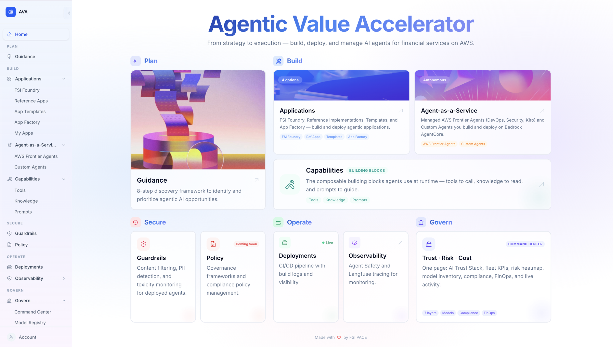

<div align="center">

# AVA - Agentic Value Accelerator

**Plan, build, operate, and secure AI agents for financial services on AWS.**

An open-source platform with 34 multi-agent use cases, a full control plane, and CI/CD pipelines — ready to deploy on AWS with Amazon Bedrock AgentCore.

[](LICENSE)
[](https://python.org)
[](https://aws.amazon.com/bedrock/agentcore/)
[](https://react.dev)
[](https://www.terraform.io)

<br/>



<br/>

[Getting Started](#getting-started) | [Plan](#plan) | [Platform](#platform) | [Applications](#applications) | [Architecture](#architecture) | [Documentation](#documentation)

</div>

---

## Key Features

- **Full Control Plane** — Web UI + API for deploying, managing, and testing agent applications
- **34 FSI Use Cases** — Banking, insurance, capital markets, operations, risk & compliance, and modernization
- **CI/CD Pipeline** — Automated build, deploy, and validation via CodeBuild with Terraform/CDK
- **Dual Framework Support** — Every use case implemented in both LangGraph/LangChain and Strands Agents SDK
- **App Factory** — Declarative markdown blueprints for AI coding assistants to generate complete apps
- **One-Click Deployment** — Deploy any use case from the control plane UI with infrastructure provisioned automatically
- **Built for AWS** — Bedrock AgentCore, ECS, Lambda, DynamoDB, CloudFront, Cognito, S3, and more

<div align="center">
<video src="https://github.com/user-attachments/assets/4d55eba1-dd90-4a92-930d-ad4b220141aa" width="90%" controls></video>
</div>

---

## Plan

Strategic guidance and frameworks to facilitate AI transformation across enterprise leadership personas. These documents help business, technology, and risk leaders identify, evaluate, and prioritize agentic AI use cases that deliver measurable value.

| Resource | Description |
|----------|-------------|
| [**Use Case Discovery Guide**](plan/UseCaseGuidance.md) | 8-step framework for enterprise leaders to identify high-value agentic AI use cases — covers bounded autonomy, measurable outcomes, and governance across industries |

> More strategic planning resources coming soon — persona-specific playbooks (CEO, CIO, CTO, CFO, CRO, CDO), ROI frameworks, and industry-specific adoption guides.

---

## Platform

The AVA Control Plane is a web-based management layer for deploying and operating agent applications on AWS.

| Component | Description |
|-----------|-------------|
| [**Backend**](platform/docs/architecture/platform-architecture.md) | FastAPI API — template catalog, packaging engine, deployment orchestration, test runner |
| [**Frontend**](platform/control_plane/frontend/README.md) | React + TypeScript UI — browse use cases, deploy with one click, view logs, test agents |
| [**Infrastructure**](platform/control_plane/infrastructure/README.md) | Terraform modules — ECS, API Gateway, DynamoDB, S3, Cognito, CloudFront, CodeBuild |
| [**Templates**](platform/docs/templates/README.md) | 8 deployable starter templates — foundations, agent runtimes, and patterns |

### Starter Templates

| Template | Pattern | Description |
|----------|---------|-------------|
| Observability Stack | Foundation | Langfuse observability server + OpenTelemetry collector for agent tracing and monitoring |
| Foundation Stack | Foundation | Combined networking (VPC, subnets, security groups) and observability — deploy once per account/region |
| Networking Base | Foundation | VPC, subnets, and security groups for agent deployments |
| Strands AgentCore | Managed Runtime | Strands agent on Bedrock AgentCore with Langfuse observability |
| LangGraph AgentCore | Managed Runtime | LangGraph agent on Bedrock AgentCore with Langfuse observability |
| Tool-Calling Agent | Single Agent | Agent with dynamic tool invocation, registration, and error handling |
| RAG Application | Retrieval | Retrieval-augmented generation with vector search and knowledge base |
| Multi-Agent Orchestration | Multi-Agent | Orchestrator pattern with specialized sub-agents collaborating on complex tasks |

[**Deploy the Control Plane &#8594;**](platform/docs/architecture/platform-architecture.md)

---

## Applications

### FSI Foundry

34 multi-agent POC implementations spanning 6 FSI domains — all built on one shared foundation of infrastructure and backend code.

- **Direct Amazon Bedrock AgentCore deployment** — simple and quick
- **Two framework implementations per use case** — LangGraph/LangChain and Strands Agents SDK
- **Shared foundations** — adapters, base classes, Terraform modules, Docker configs, agent registry
- **Per-use-case frontend UI** — Each use case has a dedicated React frontend deployed via CloudFront

<details>
<summary><strong>Banking (10)</strong></summary>

| Use Case | Agents |
|----------|--------|
| [KYC Risk Assessment](applications/fsi_foundry/use_cases/kyc_banking/README.md) | Credit Analyst, Compliance Officer |
| [Agentic Payments](applications/fsi_foundry/use_cases/agentic_payments/README.md) | Payment Validator, Routing Agent, Reconciliation Agent |
| [Customer Service](applications/fsi_foundry/use_cases/customer_service/README.md) | Inquiry Handler, Transaction Specialist, Product Advisor |
| [Customer Chatbot](applications/fsi_foundry/use_cases/customer_chatbot/README.md) | Conversation Manager, Account Agent, Transaction Agent |
| [Customer Support](applications/fsi_foundry/use_cases/customer_support/README.md) | Ticket Classifier, Resolution Agent, Escalation Agent |
| [Document Search](applications/fsi_foundry/use_cases/document_search/README.md) | Document Indexer, Search Agent |
| [AI Assistant](applications/fsi_foundry/use_cases/ai_assistant/README.md) | Task Router, Data Lookup Agent, Report Generator |
| [Corporate Sales](applications/fsi_foundry/use_cases/corporate_sales/README.md) | Lead Scorer, Opportunity Analyst, Pitch Preparer |
| [Payment Operations](applications/fsi_foundry/use_cases/payment_operations/README.md) | Exception Handler, Settlement Agent |
| [Agentic Commerce](applications/fsi_foundry/use_cases/agentic_commerce/README.md) | Offer Engine, Fulfillment Agent, Product Matcher |

</details>

<details>
<summary><strong>Risk & Compliance (6)</strong></summary>

| Use Case | Agents |
|----------|--------|
| [Fraud Detection](applications/fsi_foundry/use_cases/fraud_detection/README.md) | Transaction Monitor, Pattern Analyst, Alert Generator |
| [Document Processing](applications/fsi_foundry/use_cases/document_processing/README.md) | Document Classifier, Data Extractor, Validation Agent |
| [Credit Risk Assessment](applications/fsi_foundry/use_cases/credit_risk/README.md) | Financial Analyst, Risk Scorer, Portfolio Analyst |
| [Compliance Investigation](applications/fsi_foundry/use_cases/compliance_investigation/README.md) | Evidence Gatherer, Pattern Matcher, Regulatory Mapper |
| [Adverse Media Screening](applications/fsi_foundry/use_cases/adverse_media/README.md) | Media Screener, Sentiment Analyst, Risk Signal Extractor |
| [Market Surveillance](applications/fsi_foundry/use_cases/market_surveillance/README.md) | Trade Pattern Analyst, Communication Monitor, Alert Generator |

</details>

<details>
<summary><strong>Capital Markets (9)</strong></summary>

| Use Case | Agents |
|----------|--------|
| [Investment Advisory](applications/fsi_foundry/use_cases/investment_advisory/README.md) | Portfolio Analyst, Market Researcher, Client Profiler |
| [Earnings Summarization](applications/fsi_foundry/use_cases/earnings_summarization/README.md) | Transcript Processor, Metric Extractor, Sentiment Analyst |
| [Economic Research](applications/fsi_foundry/use_cases/economic_research/README.md) | Data Aggregator, Trend Analyst, Research Writer |
| [Email Triage](applications/fsi_foundry/use_cases/email_triage/README.md) | Email Classifier, Action Extractor |
| [Trading Assistant](applications/fsi_foundry/use_cases/trading_assistant/README.md) | Market Analyst, Trade Idea Generator, Execution Planner |
| [Research Credit Memo](applications/fsi_foundry/use_cases/research_credit_memo/README.md) | Data Gatherer, Credit Analyst, Memo Writer |
| [Investment Management](applications/fsi_foundry/use_cases/investment_management/README.md) | Allocation Optimizer, Rebalancing Agent, Performance Attributor |
| [Data Analytics](applications/fsi_foundry/use_cases/data_analytics/README.md) | Data Explorer, Statistical Analyst, Insight Generator |
| [Trading Insights](applications/fsi_foundry/use_cases/trading_insights/README.md) | Signal Generator, Cross Asset Analyst, Scenario Modeler |

</details>

<details>
<summary><strong>Insurance (3)</strong></summary>

| Use Case | Agents |
|----------|--------|
| [Customer Engagement](applications/fsi_foundry/use_cases/customer_engagement/README.md) | Churn Predictor, Outreach Agent, Policy Optimizer |
| [Claims Management](applications/fsi_foundry/use_cases/claims_management/README.md) | Claims Intake Agent, Damage Assessor, Settlement Recommender |
| [Life Insurance Agent](applications/fsi_foundry/use_cases/life_insurance_agent/README.md) | Needs Analyst, Product Matcher, Underwriting Assistant |

</details>

<details>
<summary><strong>Operations (3)</strong></summary>

| Use Case | Agents |
|----------|--------|
| [Call Center Analytics](applications/fsi_foundry/use_cases/call_center_analytics/README.md) | Call Monitor, Agent Performance Analyst, Operations Insight Generator |
| [Post Call Analytics](applications/fsi_foundry/use_cases/post_call_analytics/README.md) | Transcription Processor, Sentiment Analyst, Action Extractor |
| [Call Summarization](applications/fsi_foundry/use_cases/call_summarization/README.md) | Key Point Extractor, Summary Generator |

</details>

<details>
<summary><strong>Modernization (3)</strong></summary>

| Use Case | Agents |
|----------|--------|
| [Legacy Migration](applications/fsi_foundry/use_cases/legacy_migration/README.md) | Code Analyzer, Migration Planner, Conversion Agent |
| [Code Generation](applications/fsi_foundry/use_cases/code_generation/README.md) | Requirement Analyst, Code Scaffolder, Test Generator |
| [Mainframe Migration](applications/fsi_foundry/use_cases/mainframe_migration/README.md) | Mainframe Analyzer, Business Rule Extractor, Cloud Code Generator |

</details>

[**Explore FSI Foundry &#8594;**](applications/fsi_foundry/README.md)

### App Factory (Coming Soon)

Declarative markdown blueprints that describe complete agentic applications end-to-end. Feed them to AI coding assistants to generate fully functional apps with agent logic, infrastructure, deployment pipelines, and tests.

[**Try App Factory &#8594;**](applications/app_factory/README.md)

---

## Architecture

| Area | Document | Description |
|------|----------|-------------|
| **Platform** | [**Platform Architecture**](platform/docs/architecture/platform-architecture.md) | Full system design with Mermaid diagrams — frontend, backend, CI/CD pipeline, infrastructure modules, per-use-case UI deployment flow |
| **Platform** | [CI/CD Pipeline](platform/docs/architecture/cicd-pipeline.md) | CodeBuild buildspec with multi-stage deployment — Docker build, Terraform apply, UI build, S3 sync, CloudFront invalidation |
| **FSI Foundry** | [Architecture & Deployment](applications/fsi_foundry/docs/foundations/README.md) | [Architecture Patterns](applications/fsi_foundry/docs/foundations/architecture/architecture_patterns.md) &#124; [AgentCore Design](applications/fsi_foundry/docs/foundations/architecture/architecture_agentcore.md) &#124; [Deployment Guide](applications/fsi_foundry/docs/foundations/deployment/deployment_patterns.md) |
| **Observability** | Observability *(coming soon)* | Agent tracing, metrics, dashboards, and alerting |
| **Evaluation** | Evaluation *(coming soon)* | Agent performance testing and quality benchmarks |

---

## Project Structure

```
ava/
│
├── platform/                                    # --- Platform Layer ---
│   └── control_plane/
│       ├── frontend/                            # Control Plane Web UI
│       │   └── src/
│       │       ├── components/                  # React components (DeploymentDetail, TemplateCatalog, etc.)
│       │       ├── api/                         # API client (Axios)
│       │       ├── auth/                        # Cognito authentication
│       │       ├── contexts/                    # React contexts (UserContext, AuthContext)
│       │       └── types/                       # TypeScript type definitions
│       │
│       ├── backend/                             # Control Plane API (FastAPI on ECS Fargate)
│       │   └── src/
│       │       ├── api/routes/                  # REST endpoints (deployments, templates, applications)
│       │       ├── services/                    # Business logic (pipeline, packaging, deployment)
│       │       ├── models/                      # SQLAlchemy / Pydantic models
│       │       └── core/                        # Config, auth, middleware
│       │
│       ├── infrastructure/                      # Terraform — Control Plane AWS Resources
│       │   ├── modules/
│       │   │   ├── ecs/                         # ECS Fargate cluster + service
│       │   │   ├── codebuild/                   # CI/CD pipeline (buildspec.yml)
│       │   │   ├── cloudfront/                  # CDN for frontend
│       │   │   ├── cognito/                     # User pools + auth
│       │   │   ├── dynamodb/                    # Deployment state tables
│       │   │   ├── ecr/                         # Container registry
│       │   │   ├── s3/                          # Frontend hosting + artifact storage
│       │   │   ├── api_gateway/                 # HTTP API for backend
│       │   │   ├── networking/                  # VPC, subnets, security groups
│       │   │   ├── state_backend/               # Terraform remote state (S3 + DynamoDB lock)
│       │   │   └── observability/               # CloudWatch logs + alarms
│       │   └── deploy-full.sh                   # One-command full deployment script
│       │
│       └── templates/                           # 8 Starter Templates (deployed via UI)
│           ├── observability-stack/             # Langfuse + OpenTelemetry for agent tracing
│           ├── foundation-stack/               # Networking + observability combined
│           ├── networking-base/                # VPC, subnets, security groups
│           ├── strands-agentcore/              # Strands on Bedrock AgentCore
│           ├── langraph-agentcore/             # LangGraph on Bedrock AgentCore
│           ├── tool-calling-agent/             # Single agent with tool invocation
│           ├── rag-application/                # RAG with knowledge base
│           └── multi-agent-orchestration/      # Orchestrator pattern
│
├── applications/                                # --- Application Layer ---
│   │
│   ├── fsi_foundry/                             # FSI Foundry — 34 Multi-Agent Use Cases
│   │   ├── foundations/                          # Shared code used by ALL use cases
│   │   │   ├── src/                             # Python base classes and utilities
│   │   │   │   ├── base/                        # BaseAgent, BaseOrchestrator, BaseModel
│   │   │   │   ├── adapters/                    # Framework adapters (Strands, LangGraph)
│   │   │   │   ├── tools/                       # Shared agent tools
│   │   │   │   └── utils/                       # Logging, config, helpers
│   │   │   ├── iac/                             # Terraform modules for use case infra
│   │   │   │   ├── agentcore/                   # Bedrock AgentCore runtime + UI (S3, CloudFront, Lambda, API GW)
│   │   │   │   ├── shared/                      # Shared networking, IAM, ECR
│   │   │   │   └── cognito/                     # Per-use-case auth (optional)
│   │   │   └── docker/                          # Dockerfiles for agent containers
│   │   │
│   │   ├── use_cases/                           # 34 use case implementations
│   │   │   └── {use_case_name}/                 # e.g. kyc_banking, fraud_detection
│   │   │       └── src/
│   │   │           ├── strands/                 # Strands SDK implementation
│   │   │           │   ├── orchestrator.py      # Agent orchestration logic
│   │   │           │   ├── models.py            # Pydantic request/response models
│   │   │           │   └── agents/              # Individual agent definitions
│   │   │           └── langchain_langgraph/     # LangGraph implementation
│   │   │               ├── orchestrator.py
│   │   │               └── agents/
│   │   │
│   │   ├── ui/                                  # Per-use-case React frontends
│   │   │   └── {use_case_name}/                 # e.g. fraud_detection, agentic_payments
│   │   │       ├── src/components/              # AgentConsole, ResultsPanel, Home, Navigation
│   │   │       └── public/runtime-config.json   # API endpoint + input schema config
│   │   │
│   │   ├── data/
│   │   │   ├── registry/offerings.json          # Use case catalog (agents, fields, test entities)
│   │   │   └── samples/                         # Sample data for each use case
│   │   │
│   │   └── scripts/                             # Deployment and testing scripts
│   │       ├── main/deploy.sh                   # Interactive deployment wizard
│   │       ├── deploy/                          # Per-pattern deploy scripts
│   │       ├── use_cases/                       # Per-use-case test scripts
│   │       └── cleanup/                         # Resource teardown scripts
└── └── app_factory/                             # Blueprint-Driven App Generation
                                              # Markdown specs → AI coding assistant → complete app

```

---

## Getting Started

### Prerequisites

- AWS Account with [Bedrock model access](https://docs.aws.amazon.com/bedrock/latest/userguide/model-access.html) (Claude models enabled)
- AWS CLI >= 2.28.9
- Terraform >= 1.0
- Python >= 3.11
- Node.js >= 22
- Docker with buildx support

### Quick Start

```bash
# Clone the repository
git clone https://github.com/aws-samples/ava
cd ava

# Copy environment config
cp .env.example .env
# Edit .env with your AWS credentials and region
```

**Choose your path:**

| Goal | Command |
|------|---------|
| Deploy the Control Plane | `cd platform/control_plane/infrastructure && ./deploy-full.sh` |
| Deploy an FSI Foundry use case | `cd applications/fsi_foundry && ./scripts/main/deploy.sh` |

> **⚠️ Model Access:** AWS accounts that have not used a legacy model in the last 30 days will receive an error when calling that model, resulting in **"Error: No Response"** in the frontends. Check the Model Catalog to select the right model. 

[**Detailed Deployment Guide &#8594;**](applications/fsi_foundry/docs/foundations/deployment/)

---

## Documentation

### Platform

| Resource | Description |
|----------|-------------|
| [Control Plane](platform/docs/architecture/platform-architecture.md) | Deploy and manage agent applications from the web UI |
| [Infrastructure](platform/control_plane/infrastructure/README.md) | Terraform modules and deployment architecture |

### Applications

| Resource | Description |
|----------|-------------|
| [FSI Foundry](applications/fsi_foundry/README.md) | Architecture, foundations, and use case documentation |
| [App Factory](applications/app_factory/README.md) | Blueprint-driven application generation |
| [Deployment Guide](applications/fsi_foundry/docs/foundations/deployment/deployment_patterns.md) | Step-by-step deployment instructions |

---

## Contributors

| Contributor&nbsp;&nbsp;&nbsp;&nbsp;&nbsp;&nbsp;&nbsp;&nbsp;&nbsp;&nbsp;&nbsp;&nbsp;&nbsp;&nbsp;&nbsp;&nbsp;&nbsp;&nbsp;&nbsp;&nbsp;&nbsp;&nbsp;&nbsp;&nbsp;&nbsp;&nbsp;&nbsp;&nbsp;&nbsp;&nbsp;&nbsp;&nbsp;&nbsp;&nbsp;&nbsp;&nbsp;&nbsp;&nbsp;&nbsp;&nbsp;&nbsp;&nbsp;&nbsp;&nbsp;&nbsp;&nbsp;&nbsp;&nbsp;&nbsp;&nbsp;&nbsp;&nbsp;&nbsp;&nbsp;&nbsp;&nbsp; | Contributions |
|-------------|---------------|
| [Vivian Bui](https://www.linkedin.com/in/vivian-bui-413a561b6/) | Control Plane platform, FSI Foundry foundations, 34 use case agentic design and service implementations, CI/CD pipeline, testing panel, deployment automation |
| [Ethan Almeida](https://www.linkedin.com/in/ethanalmeida/) | App Factory form, Strands AgentCore integration, deployment scripts |
| [Adarsh Parakh](https://www.linkedin.com/in/adarshparakh/) | FSI Foundry 34 frontend UIs, guidance design, workflow-driven orchestration pattern |
| [Daniela Vargas](https://www.linkedin.com/in/daniela-vargas-msda/) | Langfuse observability integration |
| &#8226;&nbsp;[Prasanth Ponnoth](https://www.linkedin.com/in/prasanthponnoth/) <br/> &#8226;&nbsp;[Milan Bavadiya](https://www.linkedin.com/in/milanbavadiya/) <br/> &#8226;&nbsp;[Rhia Bipin Roy](https://www.linkedin.com/in/rhia-bipin-roy-b306ba191/) <br/> &#8226;&nbsp;[Sonia Mahankali](https://www.linkedin.com/in/soniamahankali/) | Agent Safety framework |

## Contacts

| Role                                   | Name                                                            |
|----------------------------------------|-----------------------------------------------------------------|
| Product & Strategy Lead                | [Bikash Behera](https://www.linkedin.com/in/bikash-behera/)     |
| Platform Architect                     | [Jorge Castans](https://www.linkedin.com/in/jorgecastans/)      |
| Project Lead                           | [Vivian Bui](https://www.linkedin.com/in/vivian-bui-413a561b6/) |

---

## Security

See [SECURITY.md](SECURITY.md) for reporting security issues.

## License

This project is licensed under the Apache License 2.0 — see [LICENSE](LICENSE) for details.

---

<div align="center">
<sub>Made with ❤️ by the FSI PACE Prototyping Team at AWS</sub>
</div>
