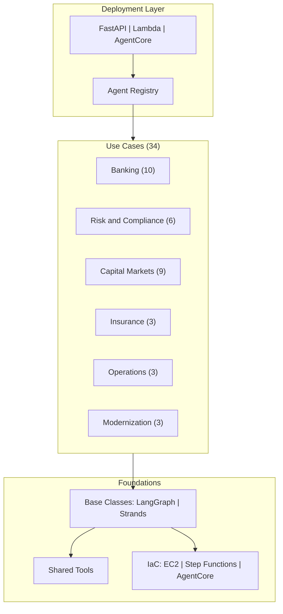

# FSI Foundry

A collection of multi-agent POC implementations for financial services — 34 use cases across 6 domains, all built on one shared foundation of infrastructure and backend code.

---

## Overview

FSI Foundry provides two things:

1. **Shared foundations** — reusable deployment adapters, framework base classes, Terraform modules, and Docker configurations that work across all use cases
2. **Use case implementations** — FSI-specific multi-agent applications, each implemented in two frameworks (LangGraph/LangChain and Strands) and deployable to three patterns (EC2/ALB, Step Functions, AgentCore)



---

## Use Cases

34 use cases across 6 FSI domains. Each use case includes LangGraph/LangChain and Strands implementations with sample data.

<details>
<summary>Banking (10)</summary>

| Use Case | Agents |
|----------|--------|
| [KYC Risk Assessment](use_cases/kyc_banking/) | Credit Analyst, Compliance Officer |
| [Agentic Payments](use_cases/agentic_payments/) | Payment Validator, Routing Agent, Reconciliation Agent |
| [Customer Service](use_cases/customer_service/) | Inquiry Handler, Transaction Specialist, Product Advisor |
| [Customer Chatbot](use_cases/customer_chatbot/) | Conversation Manager, Account Agent, Transaction Agent |
| [Customer Support](use_cases/customer_support/) | Ticket Classifier, Resolution Agent, Escalation Agent |
| [Document Search](use_cases/document_search/) | Document Indexer, Search Agent |
| [AI Assistant](use_cases/ai_assistant/) | Task Router, Data Lookup Agent, Report Generator |
| [Corporate Sales](use_cases/corporate_sales/) | Lead Scorer, Opportunity Analyst, Pitch Preparer |
| [Payment Operations](use_cases/payment_operations/) | Exception Handler, Settlement Agent |
| [Agentic Commerce](use_cases/agentic_commerce/) | Offer Engine, Fulfillment Agent, Product Matcher |

</details>

<details>
<summary>Risk and Compliance (6)</summary>

| Use Case | Agents |
|----------|--------|
| [Fraud Detection](use_cases/fraud_detection/) | Transaction Monitor, Pattern Analyst, Alert Generator |
| [Document Processing](use_cases/document_processing/) | Document Classifier, Data Extractor, Validation Agent |
| [Credit Risk Assessment](use_cases/credit_risk/) | Financial Analyst, Risk Scorer, Portfolio Analyst |
| [Compliance Investigation](use_cases/compliance_investigation/) | Evidence Gatherer, Pattern Matcher, Regulatory Mapper |
| [Adverse Media Screening](use_cases/adverse_media/) | Media Screener, Sentiment Analyst, Risk Signal Extractor |
| [Market Surveillance](use_cases/market_surveillance/) | Trade Pattern Analyst, Communication Monitor, Surveillance Alert Generator |

</details>

<details>
<summary>Capital Markets (9)</summary>

| Use Case | Agents |
|----------|--------|
| [Investment Advisory](use_cases/investment_advisory/) | Portfolio Analyst, Market Researcher, Client Profiler |
| [Earnings Summarization](use_cases/earnings_summarization/) | Transcript Processor, Metric Extractor, Sentiment Analyst |
| [Economic Research](use_cases/economic_research/) | Data Aggregator, Trend Analyst, Research Writer |
| [Email Triage](use_cases/email_triage/) | Email Classifier, Action Extractor |
| [Trading Assistant](use_cases/trading_assistant/) | Market Analyst, Trade Idea Generator, Execution Planner |
| [Research Credit Memo](use_cases/research_credit_memo/) | Data Gatherer, Credit Analyst, Memo Writer |
| [Investment Management](use_cases/investment_management/) | Allocation Optimizer, Rebalancing Agent, Performance Attributor |
| [Data Analytics](use_cases/data_analytics/) | Data Explorer, Statistical Analyst, Insight Generator |
| [Trading Insights](use_cases/trading_insights/) | Signal Generator, Cross Asset Analyst, Scenario Modeler |

</details>

<details>
<summary>Insurance (3)</summary>

| Use Case | Agents |
|----------|--------|
| [Customer Engagement](use_cases/customer_engagement/) | Churn Predictor, Outreach Agent, Policy Optimizer |
| [Claims Management](use_cases/claims_management/) | Claims Intake Agent, Damage Assessor, Settlement Recommender |
| [Life Insurance Agent](use_cases/life_insurance_agent/) | Needs Analyst, Product Matcher, Underwriting Assistant |

</details>

<details>
<summary>Operations (3)</summary>

| Use Case | Agents |
|----------|--------|
| [Call Center Analytics](use_cases/call_center_analytics/) | Call Monitor, Agent Performance Analyst, Operations Insight Generator |
| [Post Call Analytics](use_cases/post_call_analytics/) | Transcription Processor, Sentiment Analyst, Action Extractor |
| Call Summarization | Key Point Extractor, Summary Generator |

</details>

<details>
<summary>Modernization (3)</summary>

| Use Case | Agents |
|----------|--------|
| Legacy Migration | Code Analyzer, Migration Planner, Conversion Agent |
| Code Generation | Requirement Analyst, Code Scaffolder, Test Generator |
| Mainframe Migration | Mainframe Analyzer, Business Rule Extractor, Cloud Code Generator |

</details>

[Full use case registry](docs/use_cases/use_case_registry.md)

---

## Deployment Patterns

Deploy the same code to any of three patterns without changes.

| Pattern | Infrastructure | Best For |
|---------|---------------|----------|
| EC2 + ALB | Traditional compute | Development, debugging |
| Step Functions | Serverless orchestration | Event-driven workflows |
| AgentCore | Bedrock AgentCore Runtime | Scalable deployments |

[Pattern comparison](docs/foundations/architecture/architecture_patterns.md)

---

## Framework Support

Each use case is implemented in two frameworks:

| Framework | Description |
|-----------|-------------|
| LangChain + LangGraph | State-based workflow orchestration |
| Strands | AWS Strands Agents SDK |

Custom frameworks are supported via the base classes in `foundations/src/base/`.

---

## Quick Start

### Prerequisites

- AWS Account with Bedrock access (Claude models enabled)
- AWS CLI >= 2.28.9
- Terraform >= 1.0
- Python >= 3.11
- Docker with buildx support

### Deploy a Use Case

```bash
# Interactive deployment (recommended)
./scripts/main/deploy.sh

# Direct deployment
export USE_CASE_ID="agentic_payments"
export FRAMEWORK="langchain_langgraph"
./scripts/deploy/full/deploy_agentcore.sh

# Test
./scripts/main/test.sh
```

### Multi-Use-Case Deployment

Deploy multiple use cases to the same AWS account with complete isolation via Terraform workspaces:

```bash
# Deploy KYC with LangGraph
USE_CASE_ID=kyc_banking FRAMEWORK=langchain_langgraph \
  ./scripts/deploy/full/deploy_agentcore.sh

# Deploy Payments with Strands (same account, separate resources)
USE_CASE_ID=agentic_payments FRAMEWORK=strands \
  ./scripts/deploy/full/deploy_agentcore.sh
```

---

## Foundations

Reusable components shared across all use cases.

### Deployment Adapters

| Adapter | File | Pattern |
|---------|------|---------|
| FastAPI | `foundations/src/adapters/fastapi_adapter.py` | EC2, local development |
| Lambda | `foundations/src/adapters/lambda_adapter.py` | Step Functions |
| AgentCore | `foundations/src/adapters/agentcore_adapter.py` | Bedrock AgentCore Runtime |

### Agent Registry

Central registration for all use cases. Each use case registers itself on import:

```python
from base.registry import register_agent, RegisteredAgent

register_agent("my_use_case", RegisteredAgent(
    entry_point=run_agent,
    request_model=MyRequest,
    response_model=MyResponse,
))
```

### Base Classes

Framework-specific base classes for building agents and orchestrators:

- `foundations/src/base/langgraph/` — LangGraph state-based orchestration
- `foundations/src/base/langchain/` — LangChain agent composition
- `foundations/src/base/strands/` — Strands SDK integration

### Infrastructure as Code

Terraform modules for all deployment patterns:

- `foundations/iac/shared/` — Per-use-case resources (S3, IAM)
- `foundations/iac/shared_networking/` — Shared VPC across use cases
- `foundations/iac/ec2/` — EC2 + ALB
- `foundations/iac/step_functions/` — Step Functions + Lambda
- `foundations/iac/agentcore/` — AgentCore Runtime

---

## Configuration

### Environment Variables

```bash
# Required
USE_CASE_ID=agentic_payments     # Which use case to deploy
FRAMEWORK=langchain_langgraph     # Which framework implementation
AWS_REGION=us-east-1              # Target AWS region

# Optional
DEPLOYMENT_MODE=agentcore         # fastapi | agentcore | lambda
APP_ENV=production                # development | production
LOG_LEVEL=INFO                    # DEBUG | INFO | WARNING | ERROR
BEDROCK_MODEL_ID=...              # Override default Claude model
```

### Use Case IDs

Use underscores (not hyphens) for Python compatibility. The foundations automatically convert to hyphens for AWS resource names.

---

## Adding a Use Case

1. Create use case directory: `use_cases/my_use_case/src/langchain_langgraph/`
2. Implement agents and orchestrator
3. Register with the agent registry in `__init__.py`
4. Add sample data to `data/samples/my_use_case/`
5. Update the registry in `data/registry/offerings.json`

[Detailed guide](docs/foundations/development/adding_applications.md)

---

## Documentation

| Resource | Description |
|----------|-------------|
| [Architecture Overview](docs/foundations/architecture/) | How FSI Foundry works |
| [Deployment Guide](docs/foundations/deployment/) | Step-by-step deployment |
| [EC2 Deployment](docs/foundations/deployment/deployment_ec2.md) | EC2 + ALB pattern |
| [Step Functions Deployment](docs/foundations/deployment/deployment_step_functions.md) | Serverless orchestration |
| [AgentCore Deployment](docs/foundations/deployment/deployment_agentcore.md) | Bedrock AgentCore |
| [Security](docs/foundations/security/) | Threat model, AI security, AWS service security |
| [Adding Use Cases](docs/foundations/development/adding_applications.md) | Build your own |
| [Local Development](docs/foundations/development/local_development.md) | Development setup |
| [Testing](docs/foundations/testing/) | Testing strategies |
| [Cleanup](docs/foundations/cleanup/) | Resource teardown |

---

## Troubleshooting

| Issue | Solution |
|-------|----------|
| VPC limit reached | Use shared VPC — see [setup guide](foundations/iac/shared_networking/) |
| AgentCore not available in region | Use us-east-1, us-east-2, or us-west-2 |
| Docker image build fails | Ensure Docker buildx is installed and use correct architecture |
| Terraform workspace conflicts | Each use case + framework combination needs a unique workspace |

---

## Security

FSI Foundry implements defense-in-depth security:

- IAM least privilege — minimal permissions per resource
- Encryption at rest — S3, CloudWatch Logs
- Network isolation — VPC, security groups
- No hardcoded credentials — IAM roles only
- Input validation — Pydantic models for all inputs

[Security architecture](docs/foundations/security/)

---

## License

Apache License 2.0 — see [LICENSE](../../LICENSE) for details.
