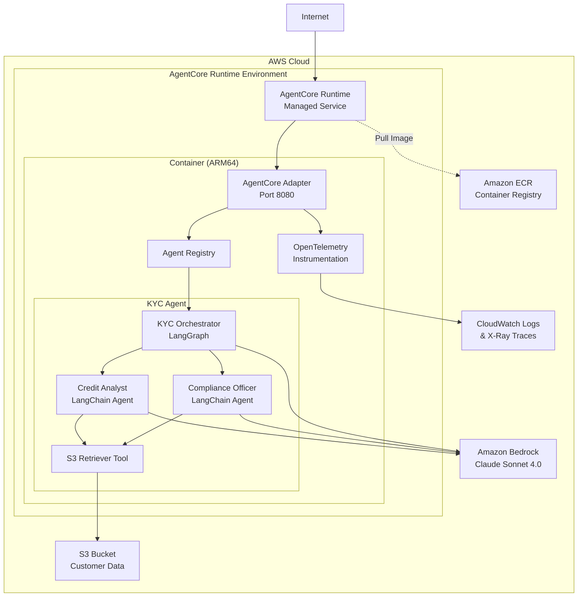
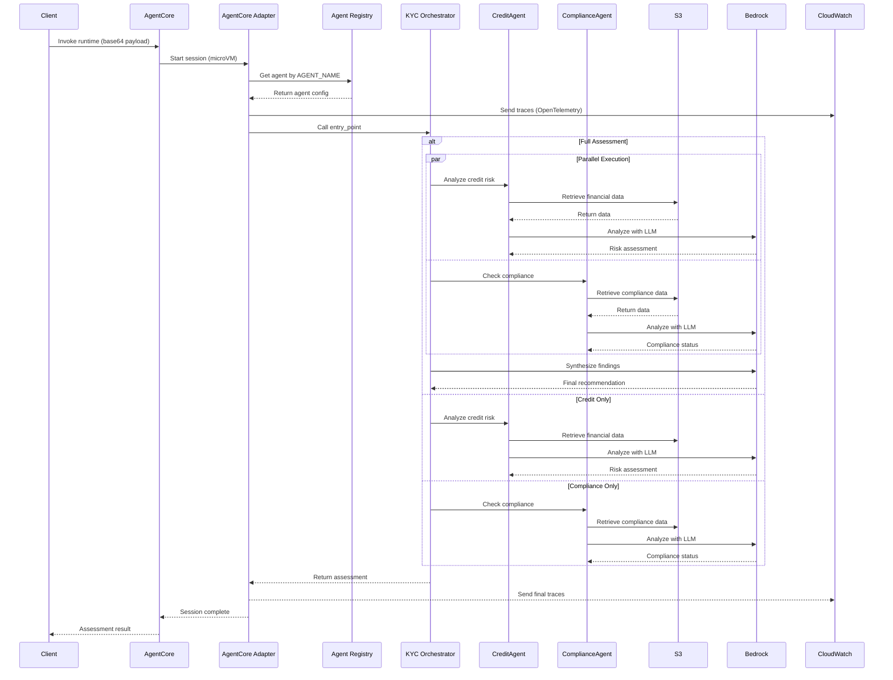
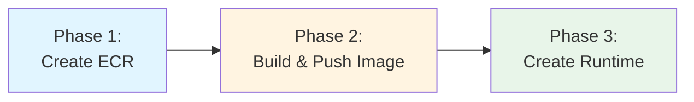

# AgentCore Architecture

## Overview

The AgentCore pattern provides an AWS-native serverless approach specifically designed for hosting AI agents. This pattern uses the AgentCore adapter to deploy any registered agent to Amazon Bedrock AgentCore Runtime. This pattern is ideal for scalable deployments, offering built-in observability, session isolation, and consumption-based pricing.

## Architecture Diagram



## Component Details

### AgentCore Runtime

**Managed Service Features**
- Serverless compute (fully managed by AWS)
- Session isolation in dedicated microVMs
- Auto-scaling based on demand
- Built-in observability with CloudWatch and X-Ray
- Up to 8-hour execution time
- Consumption-based pricing

**Runtime Configuration**
- Architecture: ARM64 (Graviton)
- Network mode: PUBLIC or VPC
- Session timeout: Configurable (default: 1 hour, max: 8 hours)
- Environment variables: Injected at runtime
- IAM role: Attached for AWS service access

### Container Layer

**ECR Repository**
- Private container registry
- Image scanning enabled
- Lifecycle policy: Keep last 5 images
- ARM64 architecture required

**Container Image**
- Base: Python 3.11 on ARM64
- OpenTelemetry instrumentation for tracing
- Non-root user (UID 1000) for security
- Port 8080 exposed for AgentCore
- Environment: `DEPLOYMENT_MODE=agentcore`

**Application Structure**
```
/app
├── main.py                     # Entry point (auto-detects mode)
├── adapters/
│   └── agentcore_adapter.py    # AgentCore adapter
├── core/
│   ├── registry.py             # Agent registry
│   └── orchestration/
│       └── patterns.py         # Shared patterns
├── agents/
│   └── kyc/                    # KYC agent
│       ├── orchestrator.py     # KYC orchestrator
│       ├── credit_analyst.py   # Credit risk agent
│       ├── compliance_officer.py # Compliance agent
│       └── models.py           # KYC data models
├── tools/
│   └── s3_retriever.py         # S3 data retrieval
├── utils/
│   └── logging.py              # Logging utilities
└── config/
    └── settings.py             # Configuration
```

### Application Layer

**AgentCore Adapter**
- Generic adapter that works with any registered agent
- Retrieves agent configuration from registry by `AGENT_NAME`
- Handles request/response translation for AgentCore protocol
- Async request handling

**Agent Registry**
- Central registry for agent discovery
- Agents register with: name, entry_point, request_model, response_model
- Environment variable `AGENT_NAME` selects which agent to run

**KYC Agent (Example)**
- **Orchestrator**: LangGraph-based workflow orchestration using shared patterns
- **Credit Analyst**: Financial risk assessment agent
- **Compliance Officer**: KYC/AML compliance checks agent
- Both specialist agents use LangChain AgentExecutor with Claude Sonnet 4.0

**S3 Retriever Tool**
- LangChain tool interface
- Retrieves customer data from S3
- Parses JSON documents

### Data Layer

**S3 Bucket**
- Encrypted at rest (AES256)
- Versioning enabled
- Private access only
- Sample customer data pre-loaded

**Amazon Bedrock**
- Model: Claude Sonnet 4.0 (inference profile)
- Max tokens: 600 (optimized for performance)
- Cross-region access enabled

## Request Flow



## Deployment Sequence

The deployment follows a specific 3-phase sequence to handle dependencies:



**Why this sequence?**
- CloudFormation stack requires the Docker image to exist in ECR
- Image can't be pushed until ECR repository is created
- Automated by deployment script

## Performance Characteristics

| Operation | Duration | Notes |
|-----------|----------|-------|
| First invocation | 10-30 seconds | Cold start (container initialization) |
| Subsequent invocations | < 5 seconds | Warm container |
| Credit-only assessment | ~15 seconds | Single agent execution |
| Compliance-only assessment | ~16 seconds | Single agent execution |
| Full assessment | ~55 seconds | Parallel execution |
| Load test (5 concurrent) | ~85 seconds | Includes cold starts |

**Session Management**
- Sessions are isolated in dedicated microVMs
- Warm sessions reused for subsequent requests
- Automatic cleanup after timeout
- No cross-session data leakage

## Scaling Considerations

**Automatic Scaling**
- AgentCore scales automatically based on demand
- No configuration required
- Handles traffic spikes seamlessly

**Concurrency**
- Multiple concurrent sessions supported
- Each session isolated in separate microVM
- No shared state between sessions

**Performance Optimization**
- Keep container image small (< 500 MB)
- Use ARM64 for better performance
- Implement connection pooling for S3/Bedrock
- Optimize dependencies (remove unused packages)

## Security Features

**Runtime Security**
- Session isolation in microVMs
- Non-root container user (UID 1000)
- IAM role with minimal permissions
- No SSH or direct access

**Network Security**
- PUBLIC mode: Internet-accessible endpoint
- VPC mode: Private network access (optional)
- Security groups for VPC mode

**Data Security**
- S3 encryption at rest
- Bedrock API over HTTPS
- No hardcoded credentials
- Environment variables for configuration

**Observability**
- CloudWatch Logs for application logs
- X-Ray traces for distributed tracing
- OpenTelemetry automatic instrumentation
- Session-level metrics

## Cost Considerations

**Consumption-Based Pricing**
- Pay only for actual compute time
- No costs when idle
- Charged per second of execution
- Includes memory and CPU usage

**Example Monthly Cost (1000 assessments)**
- AgentCore compute: ~$15-25
- Bedrock inference: ~$20-50
- S3 storage: < $1
- CloudWatch: ~$5
- **Total: ~$40-80/month**

**Cost Optimization**
- No fixed costs (true serverless)
- ARM64 architecture for better price/performance
- Implement caching to reduce Bedrock calls
- Optimize container image size
- Use session reuse for warm starts


## Next Steps

Ready to deploy this pattern? See the [AgentCore Deployment Guide](../deployment/deployment_agentcore.md) for step-by-step instructions.

## Related Documentation

- [FSI Foundry Architecture Overview](architecture_patterns.md) - High-level system design
