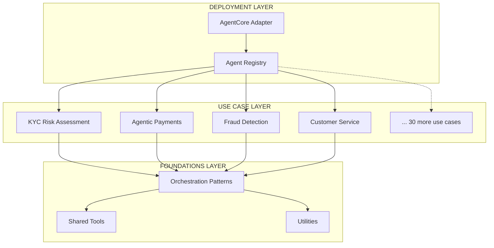
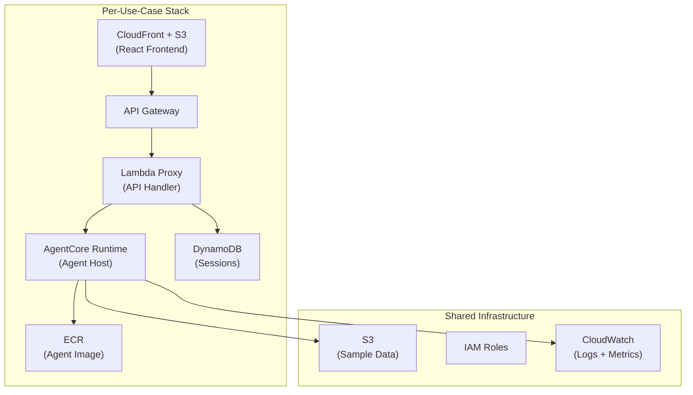

# Architecture

FSI Foundry deploys multi-agent AI systems on AWS using **Amazon Bedrock AgentCore** — a fully managed runtime for hosting, scaling, and observing AI agents.

## Platform Architecture Overview

FSI Foundry follows a clean architecture with clear separation between foundations and use case layers:

**Key Components:**

- **Deployment Layer**: AgentCore adapter that handles protocol translation between Bedrock AgentCore Runtime and the agent registry
- **Agent Registry**: Central registry where use cases register their agents
- **Use Case Layer**: 34 FSI-specific use cases, each with orchestrators and specialist agents
- **Foundations Layer**: Shared orchestration patterns, tools, and utilities

---

## AgentCore Architecture

**AWS-native serverless agent hosting**

Leverages the AgentCore adapter with Amazon Bedrock AgentCore Runtime for fully managed agent deployment with built-in observability, auto-scaling, and AWS service integration.

**Key Characteristics:**
- AgentCore adapter for AWS-native deployment
- Fully managed by AWS — no servers to provision
- Built-in observability and tracing
- Automatic scaling based on demand
- Native AWS service integration
- Dual framework support — Strands Agents SDK and LangGraph/LangChain

**[→ View Detailed AgentCore Architecture](architecture_agentcore.md)**

---

## Per-Use-Case Deployment

Each use case is deployed as an isolated stack with its own infrastructure:

**Features:**
- **Workspace-based state isolation**: Each use case/framework combination gets its own Terraform workspace
- **Resource naming isolation**: All resources include the use case ID and framework short name
- **Framework isolation**: Deploy the same use case with different frameworks (Strands and LangGraph) simultaneously
- **Independent lifecycle**: Deploy, update, and destroy use cases independently

---

## Next Steps

- [AgentCore Architecture Details](architecture_agentcore.md) — Deep dive into AgentCore runtime design
- [Deployment Guide](../deployment/deployment_agentcore.md) — Step-by-step deployment instructions
