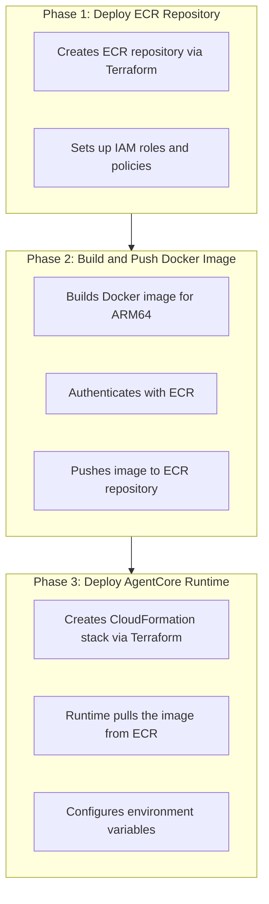

# AgentCore Runtime Deployment Guide

This guide covers deploying FSI Foundry using **Amazon Bedrock AgentCore Runtime** with the **AgentCore Adapter** for fully managed serverless agent hosting.

## Overview

Pattern 3 uses AWS Bedrock AgentCore Runtime with the AgentCore Adapter, providing:
- **Fully managed** - No infrastructure to manage
- **Auto-scaling** - Handles traffic spikes automatically
- **Session isolation** - Each invocation runs in isolated environment
- **Built-in observability** - CloudWatch integration for monitoring
- **Consumption-based pricing** - Pay only for what you use
- **AWS-native** - Deep integration with AWS services

**Recommended for scalable deployments.**

## Architecture

For detailed architecture diagrams and component descriptions, see [Architecture: AgentCore](../architecture/architecture_agentcore.md).

## Prerequisites

- **AWS CLI >= 2.28.9** (Required for AgentCore commands)
- Terraform >= 1.0
- Docker with buildx support (for ARM64 builds)
- Python >= 3.11
- Amazon Bedrock access with Claude models enabled
- AWS account with permissions for:
  - Bedrock AgentCore
  - ECR
  - CloudFormation
  - S3
  - IAM
  - CloudWatch Logs

### Supported Regions

**Important:** Amazon Bedrock AgentCore Runtime is not available in all AWS regions. Deployments will fail in unsupported regions with the error:
```
Template format error: Unrecognized resource types: [AWS::BedrockAgentCore::Runtime]
```

**Verified working regions:**
- `us-east-1` (N. Virginia)
- `us-east-2` (Ohio)
- `us-west-2` (Oregon)

**Known unsupported regions:**
- `us-west-1` (N. California)

Check the [AWS Regional Services List](https://aws.amazon.com/about-aws/global-infrastructure/regional-product-services/) for the latest availability.

### Important: AgentCore Runtime Naming

AgentCore runtime names must follow a specific pattern: `[a-zA-Z][a-zA-Z0-9_]{0,47}`

- **Allowed:** Letters, numbers, and underscores only
- **Not allowed:** Hyphens, spaces, or special characters
- **Example:** `ava_kyc` (valid) vs `ava-kyc` (invalid)

The default configuration uses underscores in the runtime name to comply with this requirement.

### Verify AWS CLI Version

AgentCore requires AWS CLI 2.28.9 or higher:

```bash
# Check version
aws --version

# Should show 2.28.9 or higher
# Example: aws-cli/2.33.11 Python/3.13.11 Darwin/25.2.0 exe/arm64

# Test AgentCore commands are available
aws bedrock-agentcore help
aws bedrock-agentcore-control help
```

**If your version is too old:**
- [AWS CLI Installation Guide](https://docs.aws.amazon.com/cli/latest/userguide/getting-started-install.html)

## Quick Start

All steps are fully automated:

```bash
# Deploy everything (infrastructure + application)
./applications/fsi_foundry/scripts/deploy/full/deploy_agentcore.sh

# Run tests
./applications/fsi_foundry/scripts/use_cases/kyc_banking/test/test_agentcore.sh
```

That's it! The deployment script handles the proper sequence automatically.

## Understanding the Deployment Sequence

AgentCore deployment requires a specific sequence to avoid the "chicken-and-egg" problem:



**Why this sequence matters:**
- CloudFormation stack requires the Docker image to exist in ECR
- ECR must exist before we can push the image
- The deployment script ensures proper ordering

## Detailed Deployment Steps

### Option 1: Full Deployment (Automated - Recommended)

```bash
./applications/fsi_foundry/scripts/deploy/full/deploy_agentcore.sh
```

The script automatically handles all three phases:

1. **Deploy Infrastructure** (ECR, IAM, S3)
   - Creates ECR repository
   - Sets up IAM roles and policies
   - Creates S3 buckets

2. **Build and Push Docker Image**
   - Builds for ARM64 (required by AgentCore)
   - Authenticates with ECR
   - Tags and pushes image

3. **Deploy Runtime**
   - Creates CloudFormation stack
   - Configures AgentCore runtime
   - Sets up CloudWatch logging

### Option 2: Modular Deployment (Manual Control)

For more control or when adding additional modules:

```bash
# Get AWS account ID
ACCOUNT_ID=$(aws sts get-caller-identity --query Account --output text)
REGION="us-east-1"

# Phase 1: Deploy infrastructure
cd platform/iac/agentcore/infra
terraform init
terraform apply \
  -var="account_id=${ACCOUNT_ID}" \
  -var="aws_region=${REGION}" \
  -auto-approve

# Phase 2: Build and push image
cd ../../../..
./applications/fsi_foundry/scripts/deploy/app/deploy_agentcore.sh

# Phase 3: Deploy runtime
cd platform/iac/agentcore/runtime
terraform init
terraform apply \
  -var="aws_region=${REGION}" \
  -auto-approve
```

**Important Notes:**
- AgentCore requires **ARM64** architecture (not AMD64)
- Use `docker buildx` for ARM64 builds
- Image must exist in ECR before runtime deployment
- Infrastructure must be deployed before building image

### Step 3: Test the Deployment

Run the comprehensive test suite:

```bash
./applications/fsi_foundry/scripts/use_cases/kyc_banking/test/test_agentcore.sh
```

**Test Coverage:**
- CloudFormation stack status verification
- Full risk assessment (credit + compliance)
- Credit-only assessment
- Compliance-only assessment
- Invalid customer ID handling
- Load test (5 concurrent requests)

**Expected Output:**
```
========================================
AgentCore Runtime Test Script
========================================
Region: us-east-1

Step 1: Checking CloudFormation stack status...
Stack Status: CREATE_COMPLETE

Step 2: Getting runtime details...
Runtime ID: financial_risk_assessment-TPpUvS93gA
Runtime ARN: arn:aws:bedrock-agentcore:us-east-1:123456789012:runtime/...
Runtime Name: financial_risk_assessment

========================================
Test 1: Full Risk Assessment (CUST001)
========================================
✓ Full assessment PASSED

========================================
Test 2: Credit Only Assessment (CUST002)
========================================
✓ Credit only assessment PASSED

========================================
Test 3: Compliance Only Assessment (CUST003)
========================================
✓ Compliance only assessment PASSED

========================================
Test 4: Invalid Customer ID
========================================
✓ Invalid customer handling PASSED

========================================
Test 5: Load Test (5 concurrent)
========================================
✓ Load test PASSED (85s < 150s)

========================================
Test Summary
========================================
Tests Passed: 5
Tests Failed: 0

Success Rate: 100%

All tests passed! 🎉
```

## Manual Testing

### Get Runtime Details

```bash
# Get runtime ARN from CloudFormation
RUNTIME_ARN=$(aws cloudformation describe-stacks \
  --stack-name ava-agentcore_runtime \
  --region us-east-1 \
  --query 'Stacks[0].Outputs[?OutputKey==`AgentRuntimeArn`].OutputValue' \
  --output text)

echo "Runtime ARN: ${RUNTIME_ARN}"
```

### Invoke Agent (Full Assessment)

```bash
# Prepare payload (must be base64 encoded)
PAYLOAD=$(echo -n '{"customer_id": "CUST001", "assessment_type": "full"}' | base64)

# Invoke the agent
aws bedrock-agentcore invoke-agent-runtime \
  --agent-runtime-arn ${RUNTIME_ARN} \
  --payload "${PAYLOAD}" \
  --region us-east-1 \
  /tmp/response.json

# View response
cat /tmp/response.json | jq '.'
```

### Invoke Agent (Credit Only)

```bash
PAYLOAD=$(echo -n '{"customer_id": "CUST002", "assessment_type": "credit_only"}' | base64)

aws bedrock-agentcore invoke-agent-runtime \
  --agent-runtime-arn ${RUNTIME_ARN} \
  --payload "${PAYLOAD}" \
  --region us-east-1 \
  /tmp/response.json

cat /tmp/response.json | jq '.'
```

### Invoke Agent (Compliance Only)

```bash
PAYLOAD=$(echo -n '{"customer_id": "CUST003", "assessment_type": "compliance_only"}' | base64)

aws bedrock-agentcore invoke-agent-runtime \
  --agent-runtime-arn ${RUNTIME_ARN} \
  --payload "${PAYLOAD}" \
  --region us-east-1 \
  /tmp/response.json

cat /tmp/response.json | jq '.'
```

## Monitoring and Debugging

### View CloudWatch Logs

```bash
# Tail logs in real-time
aws logs tail /aws/bedrock-agentcore/ava --follow --region us-east-1

# View recent logs
aws logs tail /aws/bedrock-agentcore/ava --since 1h --region us-east-1

# Filter for errors
aws logs tail /aws/bedrock-agentcore/ava --filter-pattern "ERROR" --region us-east-1
```

### Check Runtime Status

```bash
# Get runtime details
aws cloudformation describe-stacks \
  --stack-name ava-agentcore_runtime \
  --region us-east-1 \
  --query 'Stacks[0].{Status:StackStatus,Outputs:Outputs}'

# Check runtime health
aws bedrock-agentcore-control describe-agent-runtime \
  --agent-runtime-arn ${RUNTIME_ARN} \
  --region us-east-1
```

### Verify ECR Image

```bash
# List images in ECR
aws ecr describe-images \
  --repository-name ava-agentcore \
  --region us-east-1

# Get image details
aws ecr describe-images \
  --repository-name ava-agentcore \
  --image-ids imageTag=latest \
  --region us-east-1
```

## Performance Characteristics

With Claude Sonnet 4.0 and `max_tokens: 600`:

- **First invocation (cold start)**: 10-30 seconds
- **Subsequent invocations**: 
  - Credit-only: ~15 seconds
  - Compliance-only: ~16 seconds
  - Full assessment: ~55 seconds
- **Load test (5 concurrent)**: ~85 seconds

**Cold Start Notes:**
- First invocation initializes the container
- Subsequent invocations are much faster
- AgentCore manages container lifecycle automatically

## Configuration

### Update Bedrock Model

To use Claude Sonnet 4.5 instead of 4.0:

1. **Update Terraform variables** (`platform/iac/agentcore/runtime/variables.tf`):
```hcl
variable "bedrock_model_id" {
  default = "us.anthropic.claude-sonnet-4-5-20250929-v1:0"
}
```

2. **Update application settings** (`platform/src/config/settings.py`):
```python
bedrock_model_id: str = "us.anthropic.claude-sonnet-4-5-20250929-v1:0"
```

3. **Rebuild and redeploy:**
```bash
./applications/fsi_foundry/scripts/deploy/full/deploy_agentcore.sh
```

### Adjust Runtime Configuration

Edit `platform/iac/agentcore/runtime/agentcore_runtime.yaml`:

```yaml
# Increase memory
memory: 2048  # Default: 1024

# Add environment variables
environment:
  LOG_LEVEL: DEBUG
  MAX_TOKENS: "1000"

# Configure timeout
timeout: 300  # Default: 180
```

Then redeploy:
```bash
cd platform/iac/agentcore/runtime
terraform apply
```

## Troubleshooting

### AWS CLI Version Too Old

**Symptom:** `bedrock-agentcore` command not found

**Solution:**
```bash
# Check version
aws --version

# Upgrade AWS CLI
# macOS: brew upgrade awscli
# Linux: https://docs.aws.amazon.com/cli/latest/userguide/getting-started-install.html
```

### Container Not Starting

**Symptom:** Runtime shows unhealthy status

**Debug steps:**
```bash
# Check CloudWatch logs
aws logs tail /aws/bedrock-agentcore/ava --follow --region us-east-1

# Verify ECR image exists
aws ecr describe-images \
  --repository-name ava-agentcore \
  --region us-east-1

# Check CloudFormation stack events
aws cloudformation describe-stack-events \
  --stack-name ava-agentcore_runtime \
  --region us-east-1 \
  --max-items 10
```

### Invocation Fails

**Symptom:** `invoke-agent-runtime` returns error

**Possible causes:**
1. Runtime not fully initialized (wait 1-2 minutes)
2. IAM permissions missing
3. Invalid payload format

**Debug:**
```bash
# Verify runtime status
aws cloudformation describe-stacks \
  --stack-name ava-agentcore_runtime \
  --region us-east-1 \
  --query 'Stacks[0].StackStatus'

# Check IAM role
aws cloudformation describe-stack-resources \
  --stack-name ava-agentcore_runtime \
  --region us-east-1 \
  --logical-resource-id AgentRuntimeRole

# Test with simple payload
PAYLOAD=$(echo -n '{"customer_id": "TEST"}' | base64)
aws bedrock-agentcore invoke-agent-runtime \
  --agent-runtime-arn ${RUNTIME_ARN} \
  --payload "${PAYLOAD}" \
  --region us-east-1 \
  /tmp/test.json
```

### Docker buildx Not Available

**Symptom:** `docker buildx` command fails

**Solution:**
```bash
# Enable buildx
docker buildx create --use

# Or update Docker Desktop to latest version
# macOS: brew upgrade --cask docker
```

### ECR Authentication Failed

**Symptom:** Cannot push image to ECR

**Solution:**
```bash
# Re-authenticate
ACCOUNT_ID=$(aws sts get-caller-identity --query Account --output text)
aws ecr get-login-password --region us-east-1 | \
  docker login --username AWS --password-stdin ${ACCOUNT_ID}.dkr.ecr.us-east-1.amazonaws.com

# Verify credentials
aws ecr describe-repositories --region us-east-1
```

### S3 Access Denied

**Symptom:** Agent can't read customer data from S3

**Solution:**
```bash
# Check IAM role permissions
aws cloudformation describe-stack-resources \
  --stack-name ava-agentcore_runtime \
  --region us-east-1 \
  --logical-resource-id AgentRuntimeRole

# Verify S3 bucket exists
aws s3 ls s3://YOUR-BUCKET-NAME/customers/

# Test S3 access with runtime role
aws sts assume-role \
  --role-arn $(aws cloudformation describe-stacks \
    --stack-name ava-agentcore_runtime \
    --region us-east-1 \
    --query 'Stacks[0].Outputs[?OutputKey==`AgentRuntimeRoleArn`].OutputValue' \
    --output text) \
  --role-session-name test
```

## Updating the Application

After making code changes:

```bash
# Rebuild and redeploy (automatically handles all phases)
./applications/fsi_foundry/scripts/deploy/app/deploy_agentcore.sh

# Test changes
./applications/fsi_foundry/scripts/use_cases/kyc_banking/test/test_agentcore.sh
```

The script will:
1. Rebuild Docker image with your changes
2. Push new image to ECR
3. Update CloudFormation stack (triggers runtime restart)

## Multi-Region Deployment

To deploy to a different region (e.g., us-west-2):

```bash
# Create region-specific tfvars
cat > platform/iac/agentcore/terraform.tfvars.us-west-2 << EOF
aws_region = "us-west-2"
bedrock_model_id = "us.anthropic.claude-sonnet-4-20250514-v1:0"
EOF

# Deploy with region override
export AWS_REGION=us-west-2
cd platform/iac/agentcore
terraform init
terraform apply -var-file="terraform.tfvars.us-west-2" \
  -var="account_id=$(aws sts get-caller-identity --query Account --output text)"

# Build and push image to us-west-2
cd ../../..
./applications/fsi_foundry/scripts/deploy/app/deploy_agentcore.sh
```

## Cleanup

To remove all resources:

```bash
# Use the cleanup script
./applications/fsi_foundry/scripts/use_cases/kyc_banking/cleanup/cleanup_agentcore.sh

# Or manually:
cd platform/iac/agentcore/runtime
terraform destroy

cd ../infra
terraform destroy -var="account_id=$(aws sts get-caller-identity --query Account --output text)"
```

**What gets deleted:**
- CloudFormation stack (AgentCore runtime)
- ECR repository and container images
- IAM roles and policies
- CloudWatch Log Groups
- S3 bucket for code (if empty)

**Note:** The shared S3 data bucket won't be deleted if other patterns are still using it.

## Cost Optimization

### AgentCore Costs
- **Invocations**: Pay per invocation
- **Duration**: Pay for execution time
- **Memory**: Pay for allocated memory
- **Typical cost**: ~$0.002-0.005 per assessment

### ECR Costs
- **Storage**: $0.10 per GB/month
- **Data transfer**: $0.09 per GB (out to internet)
- **Typical cost**: ~$0.50/month for image storage

### Bedrock Costs
- **Input tokens**: $0.003 per 1K tokens (Sonnet 4.0)
- **Output tokens**: $0.015 per 1K tokens
- **Typical cost**: ~$0.05-0.10 per assessment

**Total cost per assessment**: ~$0.052-0.105

### Optimization Tips
- Use smaller models for simple tasks
- Reduce `max_tokens` where possible
- Implement caching for repeated requests
- Use batch processing for multiple assessments
- Monitor CloudWatch metrics to identify bottlenecks

## Next Steps

- **[Testing Guide](../testing/testing.md)** - Comprehensive testing procedures for all patterns
- **[Cleanup Guide](../cleanup/cleanup.md)** - Remove deployed resources to avoid ongoing charges
- **[Architecture Details](../architecture/architecture_agentcore.md)** - Deep dive into the architecture
- **[Deployment Guide](deployment_patterns.md)** - Overview and multi-use-case deployment

## Additional Resources

- [AWS Bedrock AgentCore Documentation](https://docs.aws.amazon.com/bedrock/latest/userguide/agentcore.html)
- [AgentCore Best Practices](https://docs.aws.amazon.com/bedrock/latest/userguide/agentcore-best-practices.html)
- [LangGraph Documentation](https://langchain-ai.github.io/langgraph/)
- [Docker Multi-Platform Builds](https://docs.docker.com/build/building/multi-platform/)
