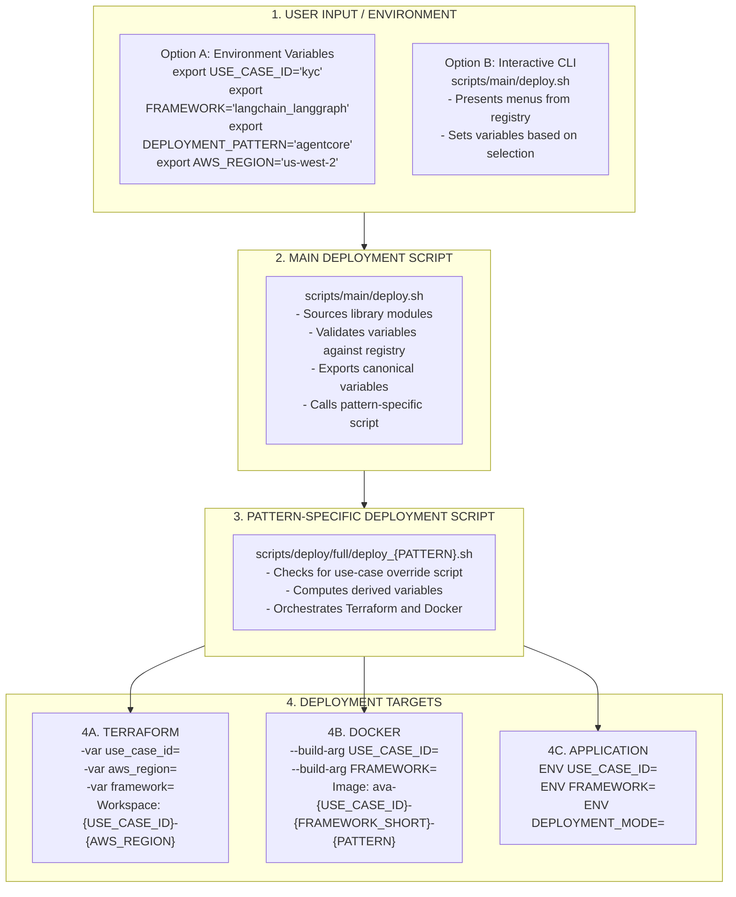

# Global Variables

This document describes the canonical variable names used throughout the FSI Foundry for consistent configuration across all scripts, Terraform modules, and Docker builds.

## Canonical Variable Names

The following are the **canonical** variable names that MUST be used throughout the FSI Foundry:

| Variable | Description | Required | Example Values |
|----------|-------------|----------|----------------|
| `USE_CASE_ID` | Use case identifier from the registry | Yes | `kyc`, `fraud_detection`, `aml` |
| `FRAMEWORK` | AI framework identifier from the registry | Yes | `langchain_langgraph`, `strands`, `crewai` |
| `DEPLOYMENT_PATTERN` | Deployment pattern identifier | Yes | `agentcore` |
| `AWS_REGION` | Target AWS region for deployment | Yes | `us-west-2`, `us-east-1`, `eu-west-1` |
| `AWS_PROFILE` | AWS CLI profile name | No | `default`, `production`, `dev` |

### Variable Descriptions

#### `USE_CASE_ID`
The unique identifier for a business use case (e.g., KYC, fraud detection). This value must match an entry in the registry (`applications/fsi_foundry/data/registry/offerings.json`). It is used for:
- Terraform workspace naming
- Docker image naming
- Resource naming in AWS
- Application code path resolution

#### `FRAMEWORK`
The AI framework used to implement the use case. Must be one of the supported frameworks in the registry. Used for:
- Selecting the correct application code path
- Docker image naming (via `FRAMEWORK_SHORT`)
- Setting runtime environment variables

#### `DEPLOYMENT_PATTERN`
The infrastructure pattern for deploying the agent. Determines which Terraform modules are used. Options:
- `agentcore` - AWS AgentCore Runtime (serverless)

#### `AWS_REGION`
The AWS region where resources will be deployed. Used for:
- Terraform workspace naming
- AWS CLI and SDK configuration
- Resource location

#### `AWS_PROFILE` (Optional)
The AWS CLI profile to use for authentication. If not set, the default profile or environment credentials are used.

---

## Deprecated Variable Names

> ⚠️ **Important**: The following variable names are **deprecated** and should NOT be used. If you encounter them in the codebase, they should be updated to the canonical names.

| Deprecated Name | Canonical Name | Notes |
|-----------------|----------------|-------|
| `USE_CASE` | `USE_CASE_ID` | Add `_ID` suffix for clarity |
| `USECASE` | `USE_CASE_ID` | Use underscores and `_ID` suffix |
| `FRAMEWORK_ID` | `FRAMEWORK` | Remove `_ID` suffix |
| `PATTERN` | `DEPLOYMENT_PATTERN` | Use full descriptive name |
| `PATTERN_ID` | `DEPLOYMENT_PATTERN` | Use full descriptive name |
| `DEPLOY_PATTERN` | `DEPLOYMENT_PATTERN` | Use canonical name |
| `REGION` | `AWS_REGION` | Add `AWS_` prefix |
| `PROFILE` | `AWS_PROFILE` | Add `AWS_` prefix |

### Migration Guide

If you have scripts using deprecated variable names, update them as follows:

```bash
# Before (deprecated)
export USE_CASE="kyc"
export FRAMEWORK_ID="langchain_langgraph"
export PATTERN="agentcore"
export REGION="us-west-2"

# After (canonical)
export USE_CASE_ID="kyc"
export FRAMEWORK="langchain_langgraph"
export DEPLOYMENT_PATTERN="agentcore"
export AWS_REGION="us-west-2"
```

### Consistency Validation

Run the variable naming consistency checker to find deprecated variable names:

```bash
./scripts/validate/check_variable_naming.sh
```

This script scans all `.sh`, `.tf`, and `Dockerfile` files and reports any usage of deprecated variable names.

---

## Validation Requirements

### Required Variables by Operation

Different operations require different sets of variables:

| Operation | Required Variables |
|-----------|-------------------|
| Full Deployment | `USE_CASE_ID`, `FRAMEWORK`, `DEPLOYMENT_PATTERN`, `AWS_REGION` |
| App-Only Deployment | `USE_CASE_ID`, `FRAMEWORK`, `DEPLOYMENT_PATTERN`, `AWS_REGION` |
| Cleanup | `USE_CASE_ID`, `DEPLOYMENT_PATTERN`, `AWS_REGION` |
| Testing | `USE_CASE_ID`, `FRAMEWORK`, `DEPLOYMENT_PATTERN`, `AWS_REGION` |
| Docker Build Only | `USE_CASE_ID`, `FRAMEWORK`, `DEPLOYMENT_PATTERN` |

### Validation Functions

The `applications/fsi_foundry/scripts/lib/variables.sh` module provides validation functions:

#### `validate_required_vars()`

Validates that all required variables are set and non-empty:

```bash
source "$PROJECT_ROOT/applications/fsi_foundry/scripts/lib/variables.sh"

if ! validate_required_vars; then
    echo "Missing required variables"
    exit 1
fi
```

**Behavior:**
- Checks `USE_CASE_ID`, `FRAMEWORK`, `DEPLOYMENT_PATTERN`, and `AWS_REGION`
- Returns exit code 0 if all variables are set
- Returns exit code 1 and prints error message listing ALL missing variables

**Error Messages:**

```
Error: Missing required variables: USE_CASE_ID FRAMEWORK
```

The function reports ALL missing variables at once (not one at a time) to allow users to fix all issues in a single iteration.

### Registry Validation

Variables are also validated against the registry to ensure valid combinations:

```bash
source "$PROJECT_ROOT/applications/fsi_foundry/scripts/lib/registry.sh"

# Validate use case exists in registry
validate_use_case_exists "$USE_CASE_ID"

# Validate framework is supported for this use case
validate_framework_supported "$USE_CASE_ID" "$FRAMEWORK"

# Validate deployment pattern is supported for this use case
validate_pattern_supported "$USE_CASE_ID" "$DEPLOYMENT_PATTERN"
```

**Error Messages:**

| Condition | Error Message |
|-----------|---------------|
| Use case not found | `Error: Use case 'xyz' not found in registry` |
| Framework not supported | `Error: Framework 'crewai' is not supported for use case 'kyc'` |
| Pattern not supported | `Error: Deployment pattern 'lambda' is not supported for use case 'kyc'` |

---

## Variable Flow Through System

Understanding how variables flow through the deployment pipeline is essential for debugging and customization.

### Flow Diagram



### How Variables Are Set

#### Method 1: Environment Variables (Recommended for CI/CD)

```bash
# Set variables before running deployment
export USE_CASE_ID="kyc"
export FRAMEWORK="langchain_langgraph"
export DEPLOYMENT_PATTERN="agentcore"
export AWS_REGION="us-west-2"
export AWS_PROFILE="production"  # Optional

# Run deployment
./applications/fsi_foundry/scripts/deploy/full/deploy_agentcore.sh
```

#### Method 2: Inline with Command

```bash
USE_CASE_ID=kyc FRAMEWORK=langchain_langgraph DEPLOYMENT_PATTERN=agentcore \
  AWS_REGION=us-west-2 ./applications/fsi_foundry/scripts/deploy/full/deploy_agentcore.sh
```

#### Method 3: Interactive CLI (Recommended for Development)

```bash
./applications/fsi_foundry/scripts/main/deploy.sh
# Follow the interactive menu to select use case, framework, and region
```

### How Variables Are Validated

1. **Presence Check**: `validate_required_vars()` ensures all required variables are set
2. **Registry Check**: Variables are validated against `applications/fsi_foundry/data/registry/offerings.json`
3. **Combination Check**: Framework and pattern must be supported for the selected use case

### How Variables Are Exported

The `export_global_vars()` function ensures variables are available to child processes:

```bash
export_global_vars() {
    export USE_CASE_ID
    export FRAMEWORK
    export DEPLOYMENT_PATTERN
    export AWS_REGION
    export AWS_PROFILE
    export WORKSPACE_NAME="${USE_CASE_ID}-${AWS_REGION}"
    export FRAMEWORK_SHORT=$(get_framework_short "$FRAMEWORK")
}
```

### How Variables Are Used in Terraform

Variables are passed to Terraform via `-var` flags:

```bash
terraform apply \
    -var="use_case_id=$USE_CASE_ID" \
    -var="aws_region=$AWS_REGION" \
    -var="framework=$FRAMEWORK" \
    -auto-approve
```

Or via `TF_VAR_` environment variables:

```bash
export TF_VAR_use_case_id="$USE_CASE_ID"
export TF_VAR_aws_region="$AWS_REGION"
export TF_VAR_framework="$FRAMEWORK"
terraform apply -auto-approve
```

### How Variables Are Used in AgentCore

For AgentCore deployment, the `FRAMEWORK` variable is used during deployment to configure the runtime environment:

```hcl
# In applications/fsi_foundry/foundations/iac/agentcore/main.tf
resource "aws_bedrockagent_agent" "agent" {
  # ...
  agent_resource_role_arn = aws_iam_role.agent_role.arn
  
  # Framework information passed via tags and configuration
  tags = {
    UseCase   = var.use_case_id
    Framework = var.framework
  }
}
```

At runtime, the application uses environment variables to load the correct agent implementation:

```python
# In applications/fsi_foundry/foundations/src/main.py
import importlib
_use_case_name = settings.agent_name  # From AGENT_NAME
_framework = settings.framework       # From FRAMEWORK
importlib.import_module(f"use_cases.{_use_case_name}")
```

### How Variables Are Used in Docker

Variables are passed as build arguments:

```bash
docker build \
    --build-arg USE_CASE_ID="$USE_CASE_ID" \
    --build-arg FRAMEWORK="$FRAMEWORK" \
    -t "$IMAGE_NAME" \
    -f "$DOCKERFILE_PATH" .
```

And set as runtime environment variables in the Dockerfile:

```dockerfile
ARG USE_CASE_ID
ARG FRAMEWORK

ENV USE_CASE_ID=${USE_CASE_ID}
ENV FRAMEWORK=${FRAMEWORK}
ENV DEPLOYMENT_MODE=${DEPLOYMENT_PATTERN}
```

---

## Usage Examples

### Setting Variables for Deployment

#### Full Deployment with Environment Variables

```bash
# Set all required variables
export USE_CASE_ID="kyc"
export FRAMEWORK="langchain_langgraph"
export DEPLOYMENT_PATTERN="agentcore"
export AWS_REGION="us-west-2"

# Optional: Set AWS profile
export AWS_PROFILE="production"

# Run full deployment
./applications/fsi_foundry/scripts/deploy/full/deploy_agentcore.sh
```

#### App-Only Deployment (Update Application Without Infrastructure Changes)

```bash
export USE_CASE_ID="kyc"
export FRAMEWORK="langchain_langgraph"
export DEPLOYMENT_PATTERN="agentcore"
export AWS_REGION="us-west-2"

# Deploy only the application (infrastructure must already exist)
./applications/fsi_foundry/scripts/deploy/app/deploy_agentcore.sh
```

#### Deploying Multiple Use Cases to Same Region

```bash
# Deploy KYC to us-west-2
export USE_CASE_ID="kyc"
export FRAMEWORK="langchain_langgraph"
export DEPLOYMENT_PATTERN="agentcore"
export AWS_REGION="us-west-2"
./applications/fsi_foundry/scripts/deploy/full/deploy_agentcore.sh

# Deploy Fraud Detection to same region (separate state)
export USE_CASE_ID="fraud_detection"
export FRAMEWORK="langchain_langgraph"
export DEPLOYMENT_PATTERN="agentcore"
export AWS_REGION="us-west-2"
./applications/fsi_foundry/scripts/deploy/full/deploy_agentcore.sh
```

#### Deploying Same Use Case to Multiple Regions

```bash
# Deploy KYC to us-west-2
export USE_CASE_ID="kyc"
export FRAMEWORK="langchain_langgraph"
export DEPLOYMENT_PATTERN="agentcore"
export AWS_REGION="us-west-2"
./applications/fsi_foundry/scripts/deploy/full/deploy_agentcore.sh

# Deploy KYC to us-east-1 (separate state)
export AWS_REGION="us-east-1"
./applications/fsi_foundry/scripts/deploy/full/deploy_agentcore.sh
```

### Using Variables in Custom Scripts

```bash
#!/bin/bash
# my_custom_script.sh

# Source the library modules
SCRIPT_DIR="$(cd "$(dirname "${BASH_SOURCE[0]}")" && pwd)"
PROJECT_ROOT="$(cd "$SCRIPT_DIR/../.." && pwd)"

source "$PROJECT_ROOT/applications/fsi_foundry/scripts/lib/common.sh"
source "$PROJECT_ROOT/applications/fsi_foundry/scripts/lib/variables.sh"
source "$PROJECT_ROOT/applications/fsi_foundry/scripts/lib/registry.sh"

# Validate all required variables are set
if ! validate_required_vars; then
    echo "Please set required variables before running this script"
    exit 1
fi

# Export for child processes
export_global_vars

# Use variables in your script
echo "Deploying $USE_CASE_ID with $FRAMEWORK to $AWS_REGION"
echo "Workspace: $WORKSPACE_NAME"
echo "Framework short name: $FRAMEWORK_SHORT"

# Validate against registry
if ! validate_use_case_exists "$USE_CASE_ID"; then
    exit 1
fi

if ! validate_framework_supported "$USE_CASE_ID" "$FRAMEWORK"; then
    exit 1
fi

# Your custom logic here...
```

### Accessing Variables in Override Scripts

Override scripts in `applications/{USE_CASE_ID}/scripts/` receive all variables from the parent script:

```bash
#!/bin/bash
# applications/fsi_foundry/use_cases/kyc_banking/scripts/deploy_agentcore.sh (override script)

# Variables are already set by the calling script
echo "Custom KYC deployment for $USE_CASE_ID"
echo "Region: $AWS_REGION"
echo "Framework: $FRAMEWORK"

# Source additional libraries if needed
source "$PROJECT_ROOT/applications/fsi_foundry/scripts/lib/terraform.sh"

# Custom deployment logic for KYC
# ...
```

### Using Variables in Terraform

Terraform modules receive variables via the deployment scripts:

```hcl
# applications/fsi_foundry/foundations/iac/agentcore/variables.tf

variable "use_case_id" {
  description = "Use case identifier (e.g., kyc, fraud_detection)"
  type        = string
}

variable "aws_region" {
  description = "AWS region for deployment"
  type        = string
}

variable "framework" {
  description = "AI framework identifier"
  type        = string
  default     = "langchain_langgraph"
}
```

Using variables in resource definitions:

```hcl
# applications/fsi_foundry/foundations/iac/agentcore/main.tf

locals {
  # Include use_case_id in resource prefix for isolation
  resource_prefix = "${var.project_name}-${var.use_case_id}"
}

resource "aws_instance" "app" {
  # ... instance configuration ...

  tags = {
    Name        = "${local.resource_prefix}-instance"
    UseCase     = var.use_case_id
    Framework   = var.framework
    Environment = terraform.workspace
  }
}

resource "aws_ecr_repository" "app" {
  name = "${local.resource_prefix}-${var.framework_short}"

  tags = {
    UseCase = var.use_case_id
  }
}
```

### Using Variables in Dockerfiles

Dockerfiles receive variables as build arguments:

```dockerfile
# applications/fsi_foundry/foundations/docker/Dockerfile.agentcore

# Build arguments
ARG USE_CASE_ID
ARG FRAMEWORK

# Validate build arguments
RUN if [ -z "$USE_CASE_ID" ]; then echo "USE_CASE_ID is required" && exit 1; fi
RUN if [ -z "$FRAMEWORK" ]; then echo "FRAMEWORK is required" && exit 1; fi

# Copy platform code
COPY applications/fsi_foundry/foundations/src /app/platform

# Copy use-case-specific application code
COPY applications/${USE_CASE_ID}/src/${FRAMEWORK} /app/use_cases/${USE_CASE_ID}/

# Set runtime environment variables
ENV USE_CASE_ID=${USE_CASE_ID}
ENV FRAMEWORK=${FRAMEWORK}
ENV DEPLOYMENT_MODE=agentcore

# Application entry point
CMD ["python", "main.py"]
```

---

## Derived Variables

Some variables are automatically computed from the canonical variables. These derived variables are used internally by the deployment scripts.

| Derived Variable | Source | Formula | Example |
|------------------|--------|---------|---------|
| `WORKSPACE_NAME` | `USE_CASE_ID` + `AWS_REGION` | `${USE_CASE_ID}-${AWS_REGION}` | `kyc-us-west-2` |
| `FRAMEWORK_SHORT` | `FRAMEWORK` | Lookup from registry | `langgraph` |
| `RESOURCE_PREFIX` | `PROJECT_NAME` + `USE_CASE_ID` | `${PROJECT_NAME}-${USE_CASE_ID}` | `ava-kyc` |
| `AGENT_NAME` | `USE_CASE_ID` + `FRAMEWORK_SHORT` | `ava-${USE_CASE_ID}-${FRAMEWORK_SHORT}` | `ava-kyc-langgraph` |
| `STATE_PATH` | Multiple | `applications/fsi_foundry/foundations/iac/${DEPLOYMENT_PATTERN}/terraform.tfstate.d/${WORKSPACE_NAME}/` | `applications/fsi_foundry/foundations/iac/agentcore/terraform.tfstate.d/kyc-us-west-2/` |
| `S3_STATE_KEY` | Multiple | `${USE_CASE_ID}/${DEPLOYMENT_PATTERN}/${AWS_REGION}/terraform.tfstate` | `kyc/agentcore/us-west-2/terraform.tfstate` |

### Framework Short Names

The `FRAMEWORK_SHORT` variable is derived from the `FRAMEWORK` using a mapping defined in the registry:

| Framework ID | Short Name | Used In |
|--------------|------------|---------|
| `langchain_langgraph` | `langgraph` | Agent names, resource naming |
| `strands` | `strands` | Agent names, resource naming |
| `crewai` | `crewai` | Agent names, resource naming |
| `llamaindex` | `llamaindex` | Agent names, resource naming |

### Computing Derived Variables

```bash
# In scripts/lib/variables.sh

# Compute workspace name
WORKSPACE_NAME="${USE_CASE_ID}-${AWS_REGION}"

# Get framework short name from registry
FRAMEWORK_SHORT=$(get_framework_short "$FRAMEWORK")

# Compute agent name
AGENT_NAME="ava-${USE_CASE_ID}-${FRAMEWORK_SHORT}"
```

---

## Library Functions

The `applications/fsi_foundry/scripts/lib/variables.sh` module provides these functions for working with global variables:

### `validate_required_vars()`

Validates that all required variables are set and non-empty.

**Usage:**
```bash
source "$PROJECT_ROOT/applications/fsi_foundry/scripts/lib/variables.sh"

if ! validate_required_vars; then
    echo "Missing required variables"
    exit 1
fi
```

**Returns:**
- Exit code `0` if all required variables are set
- Exit code `1` if any variables are missing (prints error message)

**Example Output (on failure):**
```
Error: Missing required variables: USE_CASE_ID DEPLOYMENT_PATTERN
```

### `export_global_vars()`

Exports all canonical and derived variables for child processes.

**Usage:**
```bash
source "$PROJECT_ROOT/applications/fsi_foundry/scripts/lib/variables.sh"

export_global_vars
# Now child scripts can access USE_CASE_ID, FRAMEWORK, WORKSPACE_NAME, etc.
```

**Variables Exported:**
- `USE_CASE_ID`
- `FRAMEWORK`
- `DEPLOYMENT_PATTERN`
- `AWS_REGION`
- `AWS_PROFILE`
- `WORKSPACE_NAME` (derived)
- `FRAMEWORK_SHORT` (derived)

### `get_framework_short()`

Gets the short name for a framework from the registry.

**Usage:**
```bash
source "$PROJECT_ROOT/applications/fsi_foundry/scripts/lib/variables.sh"

short=$(get_framework_short "langchain_langgraph")
echo "$short"  # Output: langgraph
```

**Parameters:**
- `$1` - Framework ID (e.g., "langchain_langgraph")

**Returns:**
- The short name from the registry (e.g., "langgraph")
- Falls back to the input if not found in registry

### `show_deployment_summary()`

Displays a formatted summary of current variable values.

**Usage:**
```bash
source "$PROJECT_ROOT/applications/fsi_foundry/scripts/lib/variables.sh"

show_deployment_summary
```

**Example Output:**
```
╔══════════════════════════════════════════════════════════════╗
║                    Deployment Configuration                   ║
╠══════════════════════════════════════════════════════════════╣
║  Use Case:           kyc                                      ║
║  Framework:          langchain_langgraph (langgraph)          ║
║  Deployment Pattern: agentcore                                      ║
║  AWS Region:         us-west-2                                ║
║  AWS Profile:        default                                  ║
║  Workspace:          kyc-us-west-2                            ║
╚══════════════════════════════════════════════════════════════╝
```

### `get_workspace_name()`

Computes the Terraform workspace name from use case and region.

**Usage:**
```bash
source "$PROJECT_ROOT/applications/fsi_foundry/scripts/lib/terraform.sh"

workspace=$(get_workspace_name "$USE_CASE_ID" "$AWS_REGION")
echo "$workspace"  # Output: kyc-us-west-2
```

### `get_image_name()`

Computes the Docker image name following the naming convention.

**Usage:**
```bash
source "$PROJECT_ROOT/applications/fsi_foundry/scripts/lib/docker.sh"

image=$(get_image_name "$USE_CASE_ID" "$FRAMEWORK" "$DEPLOYMENT_PATTERN")
echo "$image"  # Output: ava-kyc-langgraph-agentcore
```

---

## Consistency Validation

### Running the Consistency Checker

Run the variable naming consistency checker to find deprecated variable names in the codebase:

```bash
./scripts/validate/check_variable_naming.sh
```

### What It Checks

The script scans all `.sh`, `.tf`, and `Dockerfile` files for:

| Deprecated Pattern | Should Be | Files Checked |
|-------------------|-----------|---------------|
| `USE_CASE` (without `_ID`) | `USE_CASE_ID` | `.sh`, `.tf`, `Dockerfile` |
| `USECASE` | `USE_CASE_ID` | `.sh`, `.tf`, `Dockerfile` |
| `FRAMEWORK_ID` | `FRAMEWORK` | `.sh`, `.tf`, `Dockerfile` |
| `PATTERN_ID` | `DEPLOYMENT_PATTERN` | `.sh`, `.tf`, `Dockerfile` |
| `PATTERN` (alone) | `DEPLOYMENT_PATTERN` | `.sh`, `.tf`, `Dockerfile` |
| `REGION` (without `AWS_`) | `AWS_REGION` | `.sh`, `.tf`, `Dockerfile` |
| `PROFILE` (without `AWS_`) | `AWS_PROFILE` | `.sh`, `.tf`, `Dockerfile` |

### Example Output

```
Checking variable naming consistency...

Scanning shell scripts (.sh)...
  ✓ scripts/lib/variables.sh - OK
  ✓ scripts/deploy/full/deploy_agentcore.sh - OK
  ✗ scripts/legacy/old_deploy.sh - Found deprecated: USE_CASE (line 15)

Scanning Terraform files (.tf)...
  ✓ foundations/iac/agentcore/variables.tf - OK
  ✓ foundations/iac/agentcore/main.tf - OK

Scanning Dockerfiles...
  ✓ platform/docker/Dockerfile.agentcore - OK

Summary:
  Files checked: 45
  Files with issues: 1
  Total issues: 1

Run with --fix to automatically update deprecated variable names.
```

### Automatic Fixing

To automatically fix deprecated variable names:

```bash
./scripts/validate/check_variable_naming.sh --fix
```

> ⚠️ **Warning**: Always review changes after running with `--fix` and test thoroughly.

---

## Best Practices

### 1. Always Validate Before Operations

```bash
# At the start of any script that uses global variables
source "$PROJECT_ROOT/applications/fsi_foundry/scripts/lib/variables.sh"

if ! validate_required_vars; then
    exit 1
fi
```

### 2. Use Library Functions

Don't compute derived variables manually. Use the library functions:

```bash
# Good
WORKSPACE_NAME=$(get_workspace_name "$USE_CASE_ID" "$AWS_REGION")

# Avoid
WORKSPACE_NAME="${USE_CASE_ID}-${AWS_REGION}"  # Duplicates logic
```

### 3. Export Before Calling Child Scripts

```bash
export_global_vars
./child_script.sh  # Will have access to all variables
```

### 4. Use Canonical Names Consistently

Always use the canonical variable names, even in comments and documentation:

```bash
# Good
echo "Deploying USE_CASE_ID=$USE_CASE_ID"

# Avoid
echo "Deploying USE_CASE=$USE_CASE_ID"  # Confusing naming
```

### 5. Document Custom Variables

If your script needs additional variables, document them clearly:

```bash
# Required variables:
#   USE_CASE_ID - Use case identifier (standard)
#   FRAMEWORK - AI framework (standard)
#   MY_CUSTOM_VAR - Description of custom variable (custom)
```

---

## Regional Bedrock Model Configuration

### Automatic Regional Model Selection

The FSI Foundry automatically selects the correct regional Bedrock inference profile based on the `AWS_REGION` variable. This ensures deployments work correctly across different AWS regions without manual model ID configuration.

#### Regional Prefix Mapping

| Region Pattern | Prefix | Example Model ID |
|----------------|--------|------------------|
| `us-*` (US regions) | `us.` | `us.anthropic.claude-haiku-4-5-20251001-v1:0` |
| `eu-*` (EU regions) | `eu.` | `eu.anthropic.claude-haiku-4-5-20251001-v1:0` |
| `ap-*` (APAC regions) | `apac.` | `apac.anthropic.claude-haiku-4-5-20251001-v1:0` |
| Other | `us.` (default) | `us.anthropic.claude-haiku-4-5-20251001-v1:0` |

#### How It Works

**In Terraform (AgentCore pattern):**

The `applications/fsi_foundry/foundations/iac/agentcore/main.tf` file computes the regional model ID:

```hcl
locals {
  region_prefix = (
    startswith(var.aws_region, "us-") ? "us" :
    startswith(var.aws_region, "eu-") ? "eu" :
    startswith(var.aws_region, "ap-") ? "apac" : "us"
  )
  base_model_id = "anthropic.claude-haiku-4-5-20251001-v1:0"
  effective_bedrock_model_id = var.bedrock_model_id != "" ? var.bedrock_model_id : "${local.region_prefix}.${local.base_model_id}"
}
```

**In Python (runtime):**

The `platform/src/config/settings.py` provides the `effective_bedrock_model_id` property:

```python
def get_regional_model_id(region: str, base_model_id: str) -> str:
    """Get the regional inference profile model ID based on AWS region."""
    if region.startswith("us-"):
        prefix = "us"
    elif region.startswith("eu-"):
        prefix = "eu"
    elif region.startswith("ap-"):
        prefix = "apac"
    else:
        prefix = "us"  # Default to US
    
    # If model already has a regional prefix, return as-is
    if base_model_id.startswith(("us.", "eu.", "apac.")):
        return base_model_id
    
    return f"{prefix}.{base_model_id}"
```

#### Overriding the Model ID

To use a specific model (e.g., a different Claude version), set the `bedrock_model_id` variable:

```bash
# Via Terraform variable
export TF_VAR_bedrock_model_id="us.anthropic.claude-haiku-4-5-20251001-v1:0"
terraform apply

# Or via environment variable for the application
export BEDROCK_MODEL_ID="us.anthropic.claude-haiku-4-5-20251001-v1:0"
```

**Important:** When overriding, ensure you use the correct regional prefix for your deployment region.

---

## Related Documentation

- [Deployment Patterns](../deployment/deployment_patterns.md) - How variables are used in different deployment patterns
- [Adding Applications](adding_applications.md) - How to add new use cases to the registry
- [Registry Schema](../../../data/README.md) - Registry structure and validation
- [Docker README](../../../foundations/docker/README.md) - Docker image naming and build process
