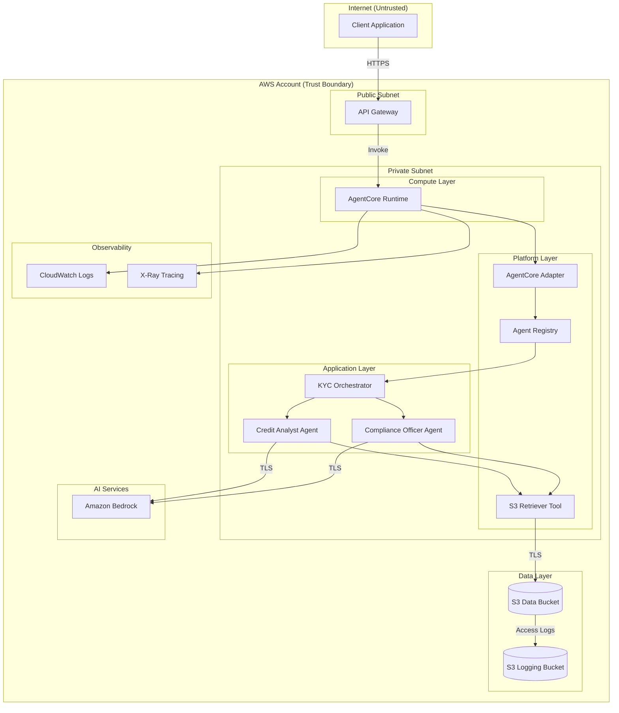

# Security Architecture

This document describes the security architecture of FSI Foundry, including data flows, security boundaries, and AWS service interactions.

## Security Overview

FSI Foundry implements defense-in-depth security across all deployment patterns with:

- **IAM least-privilege policies** - Scoped permissions for each component
- **Encryption in transit** - TLS enforcement for all data transfers
- **Encryption at rest** - S3 server-side encryption for stored data
- **Input validation** - Path traversal and injection prevention
- **Credential management** - AWS default credential chain (no hardcoded secrets)

## System Architecture with Security Boundaries



## Data Flow Security

### Inbound Request Flow

1. **Client → API Gateway**: HTTPS with TLS 1.2+
2. **API Gateway → AgentCore**: Secure invoke with IAM authentication
3. **AgentCore → Agents**: In-process function calls
4. **Agents → S3**: TLS-encrypted boto3 calls with IAM authentication
5. **Agents → Bedrock**: TLS-encrypted API calls with IAM authentication

### Data at Rest

| Component | Encryption | Key Management |
|-----------|------------|----------------|
| S3 Data Bucket | AES-256 (SSE-S3) | AWS Managed |
| S3 Logging Bucket | AES-256 (SSE-S3) | AWS Managed |
| CloudWatch Logs | AES-256 | AWS Managed |

### Data in Transit

| Connection | Protocol | Enforcement |
|------------|----------|-------------|
| Client → API Gateway | HTTPS/TLS 1.2+ | API Gateway |
| AgentCore → S3 | HTTPS | Bucket Policy |
| AgentCore → Bedrock | HTTPS | Service Default |

## IAM Security Model

### Principle of Least Privilege

Each component has scoped IAM permissions:

```
┌─────────────────────────────────────────────────────────────────┐
│                     IAM Role Hierarchy                          │
├─────────────────────────────────────────────────────────────────┤
│                                                                 │
│  ┌─────────────────────────────────────────────────────────┐   │
│  │ ava-{use_case}-{region}-role                  │   │
│  │                                                         │   │
│  │  ├── S3 Access (scoped to data bucket)                 │   │
│  │  │   └── s3:GetObject on specific bucket/*             │   │
│  │  │                                                     │   │
│  │  ├── Bedrock Access (scoped to region)                 │   │
│  │  │   └── bedrock:InvokeModel on region models          │   │
│  │  │                                                     │   │
│  │  ├── CloudWatch Logs (scoped to log groups)            │   │
│  │  │   └── logs:* on /aws/ava/*               │   │
│  │  │                                                     │   │
│  │  └── X-Ray (region-scoped condition)                   │   │
│  │      └── xray:* with aws:RequestedRegion condition     │   │
│  └─────────────────────────────────────────────────────────┘   │
│                                                                 │
└─────────────────────────────────────────────────────────────────┘
```

### Policy Scoping Details

| Permission | Resource Scope | Rationale |
|------------|---------------|-----------|
| S3 GetObject | `arn:aws:s3:::bucket-name/*` | Access only to designated data bucket |
| Bedrock InvokeModel | `arn:aws:bedrock:region:*:*` | Region-scoped model access |
| CloudWatch Logs | `/aws/ava/*` | Scoped log group pattern |
| X-Ray | `*` with Condition | Region-scoped via condition block |
| ECR GetAuthorizationToken | `*` | Required by AWS (documented) |

## Input Validation

### S3 Path Traversal Prevention

The S3 retriever tool validates all customer IDs to prevent path traversal attacks:

```python
def _validate_customer_id(customer_id: str) -> None:
    """Validate customer_id to prevent path traversal attacks."""
    if not customer_id:
        raise ValueError("customer_id cannot be empty")
    if ".." in customer_id or "/" in customer_id or "\\" in customer_id:
        raise ValueError("Invalid customer_id: path traversal not allowed")
    if not re.match(r'^[a-zA-Z0-9_-]+$', customer_id):
        raise ValueError("Invalid customer_id: only alphanumeric, underscore, hyphen allowed")
```

### Validation Rules

| Input | Validation | Rejection Criteria |
|-------|------------|-------------------|
| customer_id | Regex whitelist | `..`, `/`, `\`, special chars |
| data_type | Enum validation | Unknown data types |
| API requests | Pydantic models | Schema violations |

## Network Security

### AgentCore Network Isolation

AgentCore Runtime provides built-in network isolation with:
- Private execution environment within AWS VPC
- No direct internet access required
- Secure communication to AWS services via VPC endpoints
- IAM-based authentication for all service calls

## Credential Management

### AWS Default Credential Chain

FSI Foundry uses the AWS default credential chain for all AWS service access:

1. Environment variables (`AWS_ACCESS_KEY_ID`, `AWS_SECRET_ACCESS_KEY`)
2. Shared credentials file (`~/.aws/credentials`)
3. IAM role for AgentCore Runtime

**No hardcoded credentials** are stored in the codebase.

### Credential Resolution by Pattern

| Pattern | Credential Source |
|---------|------------------|
| AgentCore | AgentCore Runtime Role |
| Local Dev | AWS CLI profile or env vars |

## Logging and Monitoring

### Security-Relevant Logs

| Log Type | Location | Retention |
|----------|----------|-----------|
| Application Logs | CloudWatch `/aws/ava/*` | Configurable |
| S3 Access Logs | S3 Logging Bucket | Configurable |
| API Gateway Logs | CloudWatch | Configurable |
| X-Ray Traces | X-Ray Console | 30 days |

### Audit Trail

All S3 data access is logged to a dedicated logging bucket for audit purposes.

## Related Documentation

- [Threat Model](threat-model.md) - Threat analysis and mitigations
- [AWS Service Security](aws-service-security.md) - Service-specific security guidance
- [AI Security](ai-security.md) - GenAI-specific security considerations
