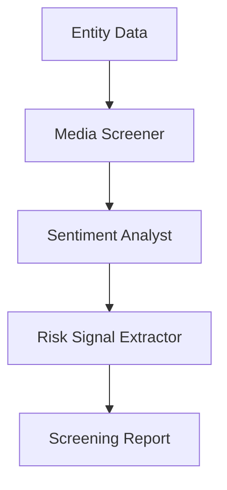

# Adverse Media Screening Use Case

## Overview

The Adverse Media Screening application provides comprehensive media screening for monitored entities through news monitoring, sentiment classification, and risk signal extraction.

## Architecture



## Agents

### Media Screener

Screens news sources and public records for adverse mentions of monitored entities.

### Sentiment Analyst

Classifies sentiment severity and tracks trends across media coverage.

### Risk Signal Extractor

Extracts actionable risk signals with confidence scores for compliance teams.

## Deployment

```bash
USE_CASE_ID=adverse_media FRAMEWORK=langchain_langgraph ./scripts/deploy/full/deploy_agentcore.sh
```

## Testing

```bash
./scripts/use_cases/adverse_media/test/test_agentcore.sh
```

## Sample Data

Located at `data/samples/adverse_media/`

| Entity ID | Name | Type |
|-----------|------|------|
| ENT001 | GlobalTrade Holdings Ltd | Corporate |

## API Reference

### Request

```json
{
  "entity_id": "ENT001",
  "screening_type": "full"
}
```

### Response

```json
{
  "entity_id": "ENT001",
  "screening_id": "uuid",
  "media_findings": {
    "articles_screened": 10,
    "adverse_mentions": 2,
    "sentiment": "negative"
  },
  "risk_signals": [
    {"signal_type": "sanctions", "severity": "high", "confidence": 0.8}
  ],
  "summary": "Executive summary..."
}
```

## Related Documentation

- [FSI Foundry Overview](../../../README.md)
- [Architecture Patterns](../../foundations/architecture/architecture_patterns.md)
- [Deployment Guide](../../foundations/deployment/deployment_patterns.md)
