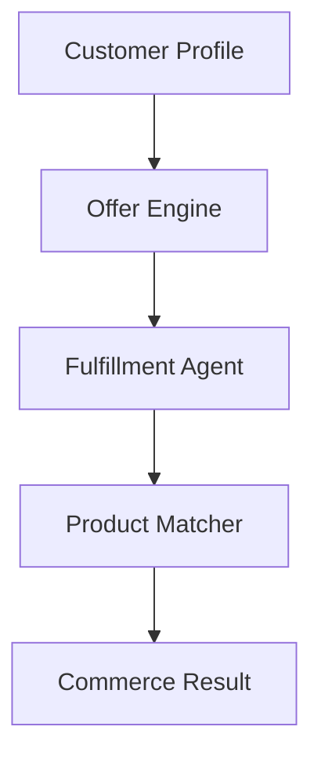

# Agentic Commerce Use Case

## Overview

The Agentic Commerce application provides AI-powered offer engines, fulfillment management, and product matching for banking products.

## Architecture



## Agents

### Offer Engine

Generates personalized product offers based on customer profile.

### Fulfillment Agent

Manages offer delivery, channel selection, and activation.

### Product Matcher

Matches customer needs to banking products with confidence scoring.

## Deployment

```bash
USE_CASE_ID=agentic_commerce FRAMEWORK=langchain_langgraph ./scripts/deploy/full/deploy_agentcore.sh
```

## Testing

```bash
./scripts/use_cases/agentic_commerce/test/test_agentcore.sh
```

## Sample Data

Located at `data/samples/agentic_commerce/`

| Entity ID | Description |
|-----------|-------------|
| OFFER001 | Premium retail customer with mortgage inquiry and investment interest |

## API Reference

### Request

```json
{
  "customer_id": "OFFER001",
  "commerce_type": "full"
}
```

## Related Documentation

- [FSI Foundry Overview](../../../README.md)
- [Architecture Patterns](../../foundations/architecture/architecture_patterns.md)
- [Deployment Guide](../../foundations/deployment/deployment_patterns.md)
