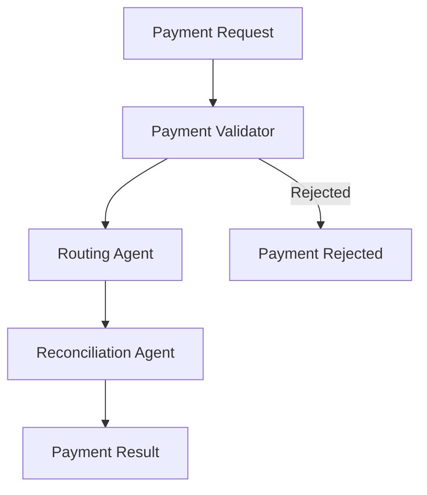

# Agentic Payments Use Case

## Overview

The Agentic Payments application automates payment workflows through validation, intelligent routing, and reconciliation. It combines compliance checking with optimal rail selection and cross-system matching.

## Architecture



## Agents

### Payment Validator

Validates payment requests against business rules and compliance requirements:
- Transaction amount limits and caps
- Sanctions screening (OFAC, EU, UN lists)
- AML red flags and fraud detection
- Account verification and authorization

### Routing Agent

Determines optimal payment rails and routing:
- Rail selection (Fedwire, ACH, RTP, SWIFT, SEPA)
- Cost vs speed optimization
- Settlement time estimation
- Currency and geographic considerations

### Reconciliation Agent

Matches and reconciles payments across systems:
- Cross-system payment matching
- Discrepancy detection and flagging
- Settlement confirmation
- Duplicate payment detection

## Deployment

```bash
USE_CASE_ID=agentic_payments FRAMEWORK=langchain_langgraph ./scripts/deploy/full/deploy_agentcore.sh
```

## Testing

```bash
./scripts/use_cases/agentic_payments/test/test_agentcore.sh
```

## Sample Data

Located at `data/samples/agentic_payments/`

| Payment ID | Type | Description |
|------------|------|-------------|
| PMT001 | Wire | High-value domestic wire transfer |

## API Reference

### Request

```json
{
  "payment_id": "PMT001",
  "payment_type": "wire",
  "additional_context": "Urgent payment for Q4 inventory"
}
```

### Response

```json
{
  "payment_id": "PMT001",
  "validation_result": {
    "status": "approved",
    "sanctions_clear": true,
    "risk_score": 15
  },
  "routing_decision": {
    "selected_rail": "fedwire",
    "estimated_settlement_time": "Same day",
    "routing_cost": 25.0
  },
  "reconciliation_status": "pending"
}
```

## Related Documentation

- [FSI Foundry Overview](../../../README.md)
- [Architecture Patterns](../../foundations/architecture/architecture_patterns.md)
- [Deployment Guide](../../foundations/deployment/deployment_patterns.md)
