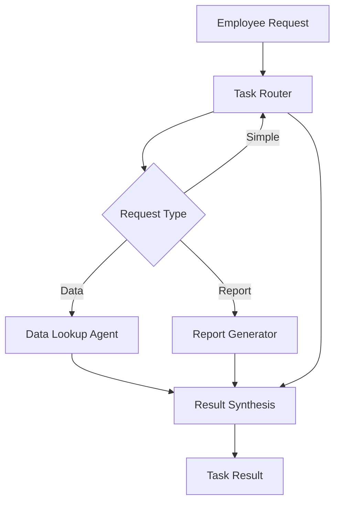

# AI Assistant Use Case

## Overview

The AI Assistant helps banking employees with task routing, data lookup from internal systems, and formatted report generation.

## Architecture



## Agents

### Task Router

Classifies incoming employee requests:
- Request type and urgency classification
- Routing decision with rationale
- Simple query handling

### Data Lookup Agent

Retrieves and summarizes data from banking systems:
- Multi-source data retrieval
- Trend and anomaly identification
- Data freshness indicators

### Report Generator

Creates formatted reports from raw data:
- Presentation-ready outputs
- Banking-specific formatting
- Compliance-aware reporting

## Deployment

```bash
USE_CASE_ID=ai_assistant FRAMEWORK=langchain_langgraph ./scripts/deploy/full/deploy_agentcore.sh
```

## Testing

```bash
./scripts/use_cases/ai_assistant/test/test_agentcore.sh
```

## Sample Data

Located at `data/samples/ai_assistant/`

| Employee ID | Role | Department |
|-------------|------|------------|
| EMP001 | Relationship Manager | Commercial Banking |

## API Reference

### Request

```json
{
  "employee_id": "EMP001",
  "task_type": "full"
}
```

### Response

```json
{
  "employee_id": "EMP001",
  "result": {
    "status": "completed",
    "priority": "medium",
    "actions_performed": ["Data retrieved", "Report generated"]
  },
  "recommendations": ["Review the generated output for accuracy"]
}
```

## Related Documentation

- [FSI Foundry Overview](../../../README.md)
- [Architecture Patterns](../../foundations/architecture/architecture_patterns.md)
- [Deployment Guide](../../foundations/deployment/deployment_patterns.md)
