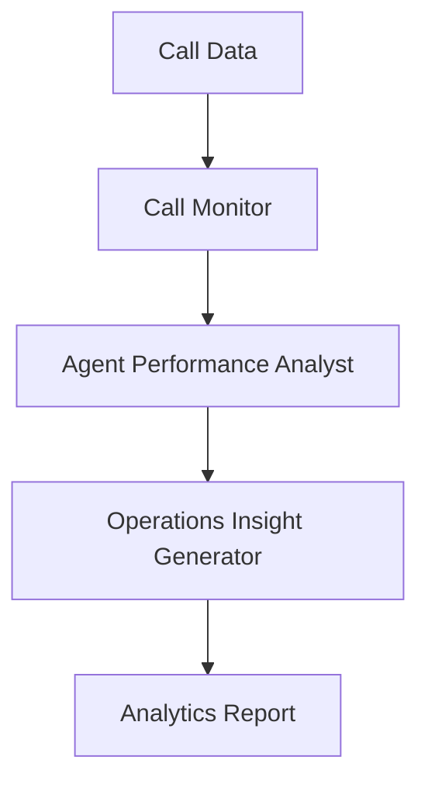

# Call Center Analytics Use Case

## Overview

The Call Center Analytics application provides call center performance optimization through call monitoring, agent performance analysis, and operational insights.

## Architecture



## Agents

### Call Monitor

Monitors call quality and compliance with script adherence evaluation, regulatory violation detection, and sentiment analysis.

### Agent Performance Analyst

Analyzes agent KPIs including handle time, first call resolution, satisfaction scores, and coaching recommendations.

### Operations Insight Generator

Generates operational insights on call volume patterns, peak hours, bottlenecks, and staffing recommendations.

## Deployment

```bash
USE_CASE_ID=call_center_analytics FRAMEWORK=langchain_langgraph ./scripts/deploy/full/deploy_agentcore.sh
```

## Testing

```bash
./scripts/use_cases/call_center_analytics/test/test_agentcore.sh
```

## Sample Data

Located at `data/samples/call_center_analytics/`

| Entity ID | Name | Description |
|-----------|------|-------------|
| CC001 | Northeast Financial Services Center | 150-agent center, 2500 daily calls |

## API Reference

### Request

```json
{
  "call_center_id": "CC001",
  "analysis_type": "full"
}
```

### Response

```json
{
  "call_center_id": "CC001",
  "analytics_id": "uuid",
  "call_monitoring": {
    "overall_quality": "good",
    "compliance_score": 0.92
  },
  "performance_metrics": {
    "average_handle_time": 285.0,
    "first_call_resolution_rate": 0.72
  },
  "operational_insights": {
    "call_volume_trend": "increasing",
    "peak_hours": ["10:00-11:00", "14:00-15:00"]
  },
  "summary": "Executive summary..."
}
```

## Related Documentation

- [FSI Foundry Overview](../../../README.md)
- [Architecture Patterns](../../foundations/architecture/architecture_patterns.md)
- [Deployment Guide](../../foundations/deployment/deployment_patterns.md)
