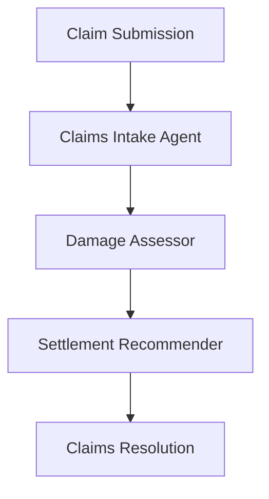

# Claims Management Use Case

## Overview

The Claims Management application assists insurance professionals through claims intake, damage assessment, and settlement recommendation.

## Architecture



## Agents

### Claims Intake Agent

Automates claims intake with documentation validation, claim classification, and completeness checks.

### Damage Assessor

Assesses damage severity, estimates costs, evaluates evidence quality, and identifies fraud indicators.

### Settlement Recommender

Generates policy-based settlement recommendations with confidence scoring and historical comparison.

## Deployment

```bash
USE_CASE_ID=claims_management FRAMEWORK=langchain_langgraph ./scripts/deploy/full/deploy_agentcore.sh
```

## Testing

```bash
./scripts/use_cases/claims_management/test/test_agentcore.sh
```

## Sample Data

Located at `data/samples/claims_management/`

| Claim ID | Type | Description |
|----------|------|-------------|
| CLAIM001 | Auto | Rear-end collision, comprehensive auto policy |

## API Reference

### Request

```json
{
  "claim_id": "CLAIM001",
  "assessment_type": "full"
}
```

### Response

```json
{
  "claim_id": "CLAIM001",
  "assessment_id": "uuid",
  "intake_summary": {
    "claim_type": "auto",
    "documentation_complete": false,
    "missing_documents": ["medical_report"]
  },
  "damage_assessment": {
    "severity": "moderate",
    "estimated_repair_cost": 12500.00
  },
  "settlement_recommendation": {
    "recommended_amount": 12000.00,
    "confidence_score": 0.82
  },
  "summary": "..."
}
```

## Related Documentation

- [FSI Foundry Overview](../../../README.md)
- [Architecture Patterns](../../foundations/architecture/architecture_patterns.md)
- [Deployment Guide](../../foundations/deployment/deployment_patterns.md)
