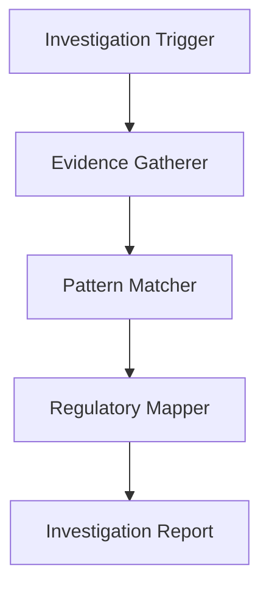

# Compliance Investigation Use Case

## Overview

The Compliance Investigation application automates regulatory investigations through evidence gathering, violation pattern matching, and regulatory requirement mapping.

## Architecture



## Agents

### Evidence Gatherer

Collects and organizes evidence from transaction records, communications, document repositories, and audit logs.

### Pattern Matcher

Identifies compliance violation patterns, detects anomalies, and assesses pattern confidence.

### Regulatory Mapper

Maps findings to regulatory requirements (AML, KYC, BSA, GDPR, SOX), classifies violation severity, and recommends remediation.

## Deployment

```bash
USE_CASE_ID=compliance_investigation FRAMEWORK=langchain_langgraph ./scripts/deploy/full/deploy_agentcore.sh
```

## Testing

```bash
./scripts/use_cases/compliance_investigation/test/test_agentcore.sh
```

## Sample Data

Located at `data/samples/compliance_investigation/`

| Case ID | Profile | Description |
|---------|---------|-------------|
| CASE001 | Corporation | AML/KYC compliance review with flagged transactions |

## API Reference

### Request

```json
{
  "entity_id": "CASE001",
  "investigation_type": "full"
}
```

### Response

```json
{
  "entity_id": "CASE001",
  "investigation_id": "uuid",
  "findings": {
    "status": "in_progress",
    "violations_found": 1
  },
  "regulatory_mappings": [
    {"regulation": "AML", "severity": "high"}
  ],
  "summary": "..."
}
```

## Related Documentation

- [FSI Foundry Overview](../../../README.md)
- [Architecture Patterns](../../foundations/architecture/architecture_patterns.md)
- [Deployment Guide](../../foundations/deployment/deployment_patterns.md)
