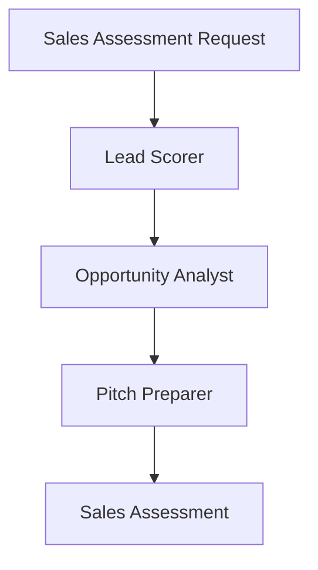

# Corporate Sales Use Case

## Overview

The Corporate Sales application assists banking sales professionals through lead scoring, opportunity analysis, and pitch preparation.

## Architecture



## Agents

### Lead Scorer

Scores and prioritizes corporate leads:
- Firmographic data analysis (industry, revenue, size)
- Behavioral signal evaluation
- Engagement history assessment
- Tier classification (HOT/WARM/COLD/UNQUALIFIED)

### Opportunity Analyst

Analyzes sales opportunities:
- Deal probability assessment
- Competitive landscape evaluation
- Client needs alignment

### Pitch Preparer

Generates customized pitch materials:
- Tailored value propositions
- Prioritized talking points
- Competitive differentiators

## Deployment

```bash
USE_CASE_ID=corporate_sales FRAMEWORK=langchain_langgraph ./scripts/deploy/full/deploy_agentcore.sh
```

## Testing

```bash
./scripts/use_cases/corporate_sales/test/test_agentcore.sh
```

## Sample Data

Located at `data/samples/corporate_sales/`

| Customer ID | Profile | Description |
|-------------|---------|-------------|
| CORP001 | Technology | Mid-size tech company, existing banking relationship |

## API Reference

### Request

```json
{
  "customer_id": "CORP001",
  "analysis_type": "full"
}
```

### Response

```json
{
  "customer_id": "CORP001",
  "lead_score": {
    "score": 85,
    "tier": "hot"
  },
  "opportunity": {
    "stage": "qualification",
    "confidence": 0.7
  },
  "recommendations": ["Tailored value propositions prepared"]
}
```

## Related Documentation

- [FSI Foundry Overview](../../../README.md)
- [Architecture Patterns](../../foundations/architecture/architecture_patterns.md)
- [Deployment Guide](../../foundations/deployment/deployment_patterns.md)
