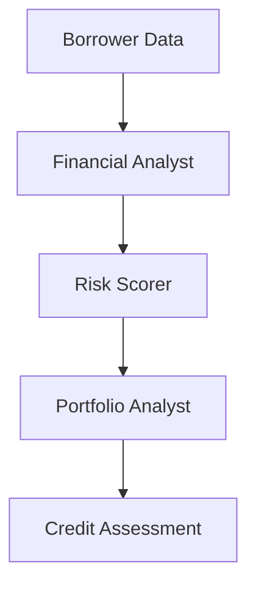

# Credit Risk Assessment Use Case

## Overview

The Credit Risk Assessment application evaluates borrower creditworthiness through financial analysis, risk scoring, and portfolio impact assessment.

## Architecture



## Agents

### Financial Analyst

Analyzes financial statements, computes ratios, and evaluates cash flow sustainability.

### Risk Scorer

Computes credit risk scores, estimates PD/LGD, and assigns credit ratings.

### Portfolio Analyst

Evaluates portfolio concentration, diversification, and risk-adjusted returns.

## Deployment

```bash
USE_CASE_ID=credit_risk FRAMEWORK=langchain_langgraph ./scripts/deploy/full/deploy_agentcore.sh
```

## Testing

```bash
./scripts/use_cases/credit_risk/test/test_agentcore.sh
```

## Sample Data

Located at `data/samples/credit_risk/`

| Borrower ID | Profile | Description |
|-------------|---------|-------------|
| BORROW001 | Manufacturing | Acme Manufacturing Corp with $50M revenue, requesting $20M term loan |

## API Reference

### Request

```json
{
  "customer_id": "BORROW001",
  "assessment_type": "full"
}
```

### Response

```json
{
  "customer_id": "BORROW001",
  "assessment_id": "uuid",
  "credit_risk_score": {
    "score": 35,
    "level": "low",
    "rating": "A",
    "probability_of_default": 0.01
  },
  "portfolio_impact": {
    "concentration_change": 0.02,
    "diversification_score": 0.7
  },
  "summary": "Executive summary..."
}
```

## Related Documentation

- [FSI Foundry Overview](../../../README.md)
- [Architecture Patterns](../../foundations/architecture/architecture_patterns.md)
- [Deployment Guide](../../foundations/deployment/deployment_patterns.md)
