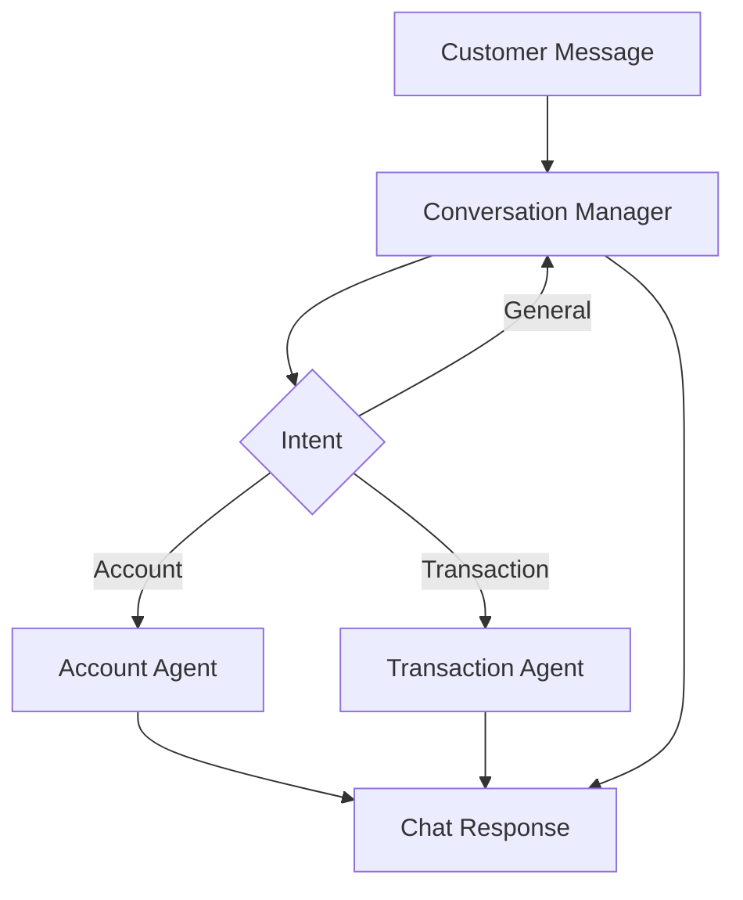

# Customer Chatbot Use Case

## Overview

The Customer Chatbot provides conversational banking support through multi-turn conversation management, account operations, and transaction processing.

## Architecture



## Agents

### Conversation Manager

Manages multi-turn conversations:
- Context tracking across turns
- Intent classification and routing
- General inquiry handling

### Account Agent

Handles account-related operations:
- Balance inquiries
- Account statement generation
- Profile updates

### Transaction Agent

Processes transaction-related requests:
- Fund transfers with validation
- Bill payment processing
- Transaction history lookups

## Deployment

```bash
USE_CASE_ID=customer_chatbot FRAMEWORK=langchain_langgraph ./scripts/deploy/full/deploy_agentcore.sh
```

## Testing

```bash
./scripts/use_cases/customer_chatbot/test/test_agentcore.sh
```

## Sample Data

Located at `data/samples/customer_chatbot/`

| Customer ID | Account Type | Description |
|-------------|--------------|-------------|
| CUST001 | Premium Checking | Multi-account customer |

## API Reference

### Request

```json
{
  "customer_id": "CUST001",
  "intent_type": "full"
}
```

### Response

```json
{
  "customer_id": "CUST001",
  "response_message": "Here is your account summary...",
  "actions_taken": [{"action_type": "balance_check"}],
  "recommendations": ["Review account security settings"]
}
```

## Related Documentation

- [FSI Foundry Overview](../../../README.md)
- [Architecture Patterns](../../foundations/architecture/architecture_patterns.md)
- [Deployment Guide](../../foundations/deployment/deployment_patterns.md)
