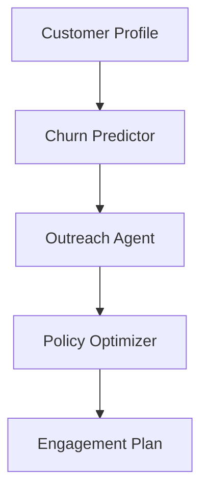

# Customer Engagement Use Case

## Overview

The Customer Engagement application improves insurance customer retention through churn prediction, personalized outreach, and policy optimization.

## Architecture



## Agents

### Churn Predictor

Predicts customer churn risk by analyzing:
- Behavioral patterns and engagement metrics
- Policy history and claims frequency
- Payment regularity and delinquency

### Outreach Agent

Generates personalized retention outreach strategies:
- Communication preference analysis
- Optimal channel selection
- Targeted messaging and timing

### Policy Optimizer

Recommends policy adjustments:
- Coverage adequacy analysis
- Bundling opportunities
- Premium optimization and estimated savings

## Deployment

```bash
USE_CASE_ID=customer_engagement FRAMEWORK=langchain_langgraph ./scripts/deploy/full/deploy_agentcore.sh
```

## Testing

```bash
./scripts/use_cases/customer_engagement/test/test_agentcore.sh
```

## Sample Data

Located at `data/samples/customer_engagement/`

| Customer ID | Profile | Description |
|-------------|---------|-------------|
| POLICY001 | Active Customer | Auto + home, 5yr tenure |

## API Reference

### Request

```json
{
  "customer_id": "POLICY001",
  "assessment_type": "full"
}
```

### Response

```json
{
  "customer_id": "POLICY001",
  "churn_prediction": {
    "risk_level": "moderate",
    "churn_probability": 0.45
  },
  "outreach_plan": {
    "recommended_channel": "email",
    "messaging_theme": "loyalty appreciation"
  },
  "policy_recommendations": {
    "recommended_actions": ["bundle", "discount"],
    "estimated_savings": 350.00
  }
}
```

## Related Documentation

- [FSI Foundry Overview](../../../README.md)
- [Architecture Patterns](../../foundations/architecture/architecture_patterns.md)
- [Deployment Guide](../../foundations/deployment/deployment_patterns.md)
