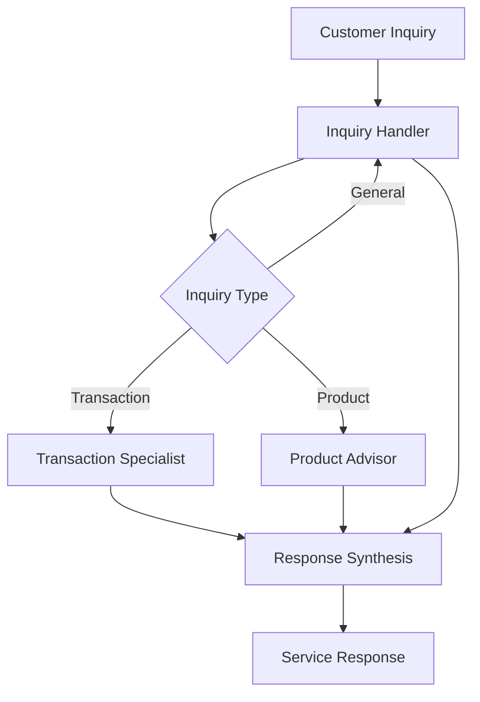

# Customer Service Use Case

## Overview

The Customer Service application provides comprehensive banking support through inquiry handling, transaction investigation, and product advisory.

## Architecture



## Agents

### Inquiry Handler

Classifies and routes customer inquiries:
- Inquiry type and urgency classification
- Routing to appropriate specialists
- FAQ-style question handling

### Transaction Specialist

Investigates transaction disputes and payment issues:
- Transaction dispute investigation
- Refund eligibility assessment
- Payment issue resolution

### Product Advisor

Analyzes customer profiles and recommends products:
- Customer profile and needs analysis
- Banking product recommendations
- Product feature comparison

## Deployment

```bash
USE_CASE_ID=customer_service FRAMEWORK=langchain_langgraph ./scripts/deploy/full/deploy_agentcore.sh
```

## Testing

```bash
./scripts/use_cases/customer_service/test/test_agentcore.sh
```

## Sample Data

Located at `data/samples/customer_service/`

| Customer ID | Profile | Description |
|-------------|---------|-------------|
| CUST001 | Premium Checking | Established customer with multiple products |

## API Reference

### Request

```json
{
  "customer_id": "CUST001",
  "inquiry_type": "full"
}
```

### Response

```json
{
  "customer_id": "CUST001",
  "resolution": {
    "status": "resolved",
    "priority": "medium",
    "actions_taken": ["..."],
    "follow_up_required": false
  },
  "recommendations": ["..."],
  "summary": "..."
}
```

## Related Documentation

- [FSI Foundry Overview](../../../README.md)
- [Architecture Patterns](../../foundations/architecture/architecture_patterns.md)
- [Deployment Guide](../../foundations/deployment/deployment_patterns.md)
