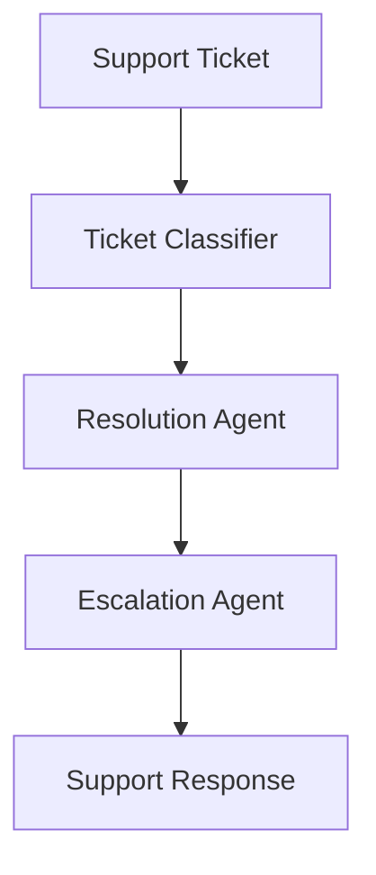

# Customer Support Use Case

## Overview

The Customer Support application provides intelligent ticket routing, resolution suggestions, and escalation management.

## Architecture



## Agents

### Ticket Classifier

Classifies support tickets:
- Category assignment (billing, technical, account, general)
- Urgency assessment
- Required expertise identification

### Resolution Agent

Suggests resolutions based on historical data:
- Historical case matching
- Resolution confidence scoring
- Step-by-step resolution instructions

### Escalation Agent

Determines escalation needs:
- Escalation necessity evaluation
- Team routing recommendations
- Priority override assessment

## Deployment

```bash
USE_CASE_ID=customer_support FRAMEWORK=langchain_langgraph ./scripts/deploy/full/deploy_agentcore.sh
```

## Testing

```bash
./scripts/use_cases/customer_support/test/test_agentcore.sh
```

## Sample Data

Located at `data/samples/customer_support/`

| Customer ID | Profile | Description |
|-------------|---------|-------------|
| CUST001 | Premium Checking | Active customer with recent tickets |

## API Reference

### Request

```json
{
  "customer_id": "CUST001",
  "ticket_type": "full"
}
```

### Response

```json
{
  "customer_id": "CUST001",
  "classification": {
    "category": "billing",
    "urgency": "medium"
  },
  "resolution": {
    "suggested_resolution": "...",
    "confidence": 0.85
  },
  "escalation": {
    "status": "not_needed"
  }
}
```

## Related Documentation

- [FSI Foundry Overview](../../../README.md)
- [Architecture Patterns](../../foundations/architecture/architecture_patterns.md)
- [Deployment Guide](../../foundations/deployment/deployment_patterns.md)
