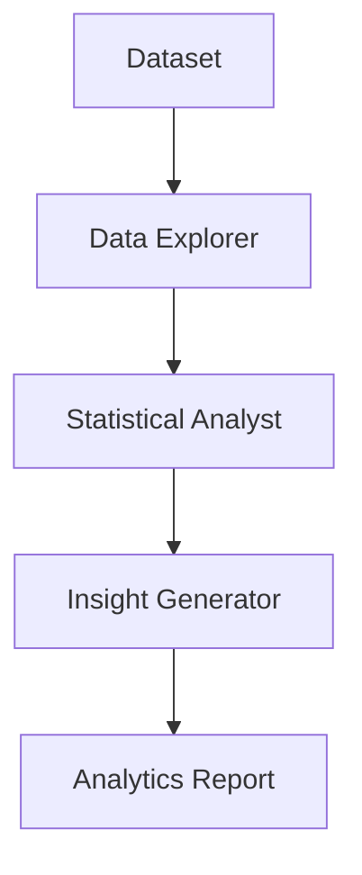

# Data Analytics Use Case

## Overview

The Data Analytics application provides capital markets data analysis through data exploration, statistical analysis, and actionable insight generation.

## Architecture



## Agents

### Data Explorer

Explores datasets, profiles data quality, and identifies patterns and anomalies.

### Statistical Analyst

Performs hypothesis testing, regression modeling, and significance evaluation.

### Insight Generator

Generates actionable insights, narrative summaries, and visualization recommendations.

## Deployment

```bash
USE_CASE_ID=data_analytics FRAMEWORK=langchain_langgraph ./scripts/deploy/full/deploy_agentcore.sh
```

## Testing

```bash
./scripts/use_cases/data_analytics/test/test_agentcore.sh
```

## Sample Data

Located at `data/samples/data_analytics/`

| Entity | Description |
|--------|-------------|
| ASSET001 | US Equity Sector Performance Dataset — Technology sector, daily data 2020-2024 |

## API Reference

### Request

```json
{
  "entity_id": "ASSET001",
  "assessment_type": "full"
}
```

### Response

```json
{
  "entity_id": "ASSET001",
  "analytics_id": "uuid",
  "analytics_detail": {
    "data_quality": "high",
    "insight_confidence": "high",
    "patterns_identified": ["..."],
    "statistical_findings": ["..."]
  },
  "recommendations": ["..."],
  "summary": "Executive summary..."
}
```

## Related Documentation

- [FSI Foundry Overview](../../../README.md)
- [Architecture Patterns](../../foundations/architecture/architecture_patterns.md)
- [Deployment Guide](../../foundations/deployment/deployment_patterns.md)
