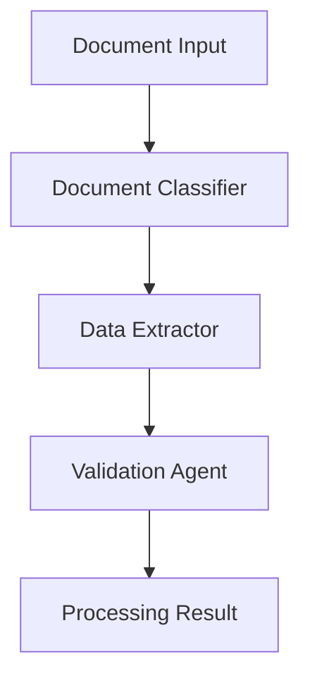

# Document Processing Use Case

## Overview

The Document Processing application automates document classification, structured data extraction, and compliance validation for financial services.

## Architecture



## Agents

### Document Classifier

Classifies documents by type, jurisdiction, and regulatory relevance.

### Data Extractor

Extracts structured data including entities, amounts, and dates from unstructured documents.

### Validation Agent

Validates extracted data against regulatory rules and flags compliance issues.

## Deployment

```bash
USE_CASE_ID=document_processing FRAMEWORK=langchain_langgraph ./scripts/deploy/full/deploy_agentcore.sh
```

## Testing

```bash
./scripts/use_cases/document_processing/test/test_agentcore.sh
```

## Sample Data

Located at `data/samples/document_processing/`

| Document ID | Type | Description |
|-------------|------|-------------|
| DOC001 | Loan Application | Commercial loan application for Acme Corp |

## API Reference

### Request

```json
{
  "document_id": "DOC001",
  "processing_type": "full"
}
```

### Response

```json
{
  "document_id": "DOC001",
  "processing_id": "uuid",
  "classification": {"type": "loan_application", "jurisdiction": "US"},
  "extracted_data": {"entity": "Acme Corp", "amount": 5000000},
  "validation_result": {"status": "valid", "issues": []},
  "summary": "..."
}
```

## Related Documentation

- [FSI Foundry Overview](../../../README.md)
- [Architecture Patterns](../../foundations/architecture/architecture_patterns.md)
- [Deployment Guide](../../foundations/deployment/deployment_patterns.md)
