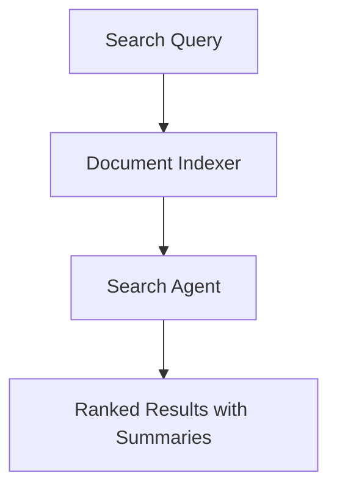

# Document Search Use Case

## Overview

The Document Search application enables intelligent retrieval of banking documents through indexing, semantic search, and result synthesis.

## Architecture



## Agents

### Document Indexer

Indexes and categorizes banking documents:
- Document metadata extraction
- Content categorization and classification
- Searchable catalog maintenance

### Search Agent

Performs semantic search across the document corpus:
- Query understanding and intent extraction
- Relevance-based result ranking
- Contextual snippet generation

## Deployment

```bash
USE_CASE_ID=document_search FRAMEWORK=langchain_langgraph ./scripts/deploy/full/deploy_agentcore.sh
```

## Testing

```bash
./scripts/use_cases/document_search/test/test_agentcore.sh
```

## Sample Data

Located at `data/samples/document_search/`

| Document ID | Type | Description |
|-------------|------|-------------|
| DOC001 | Policy | Anti-Money Laundering Policy |

## API Reference

### Request

```json
{
  "query": "anti-money laundering requirements",
  "document_type": "policy"
}
```

### Response

```json
{
  "query": "anti-money laundering requirements",
  "results": [
    {
      "document_id": "DOC001",
      "title": "Anti-Money Laundering Policy",
      "relevance": "high"
    }
  ],
  "summary": "Found 1 highly relevant policy document."
}
```

## Related Documentation

- [FSI Foundry Overview](../../../README.md)
- [Architecture Patterns](../../foundations/architecture/architecture_patterns.md)
- [Deployment Guide](../../foundations/deployment/deployment_patterns.md)
