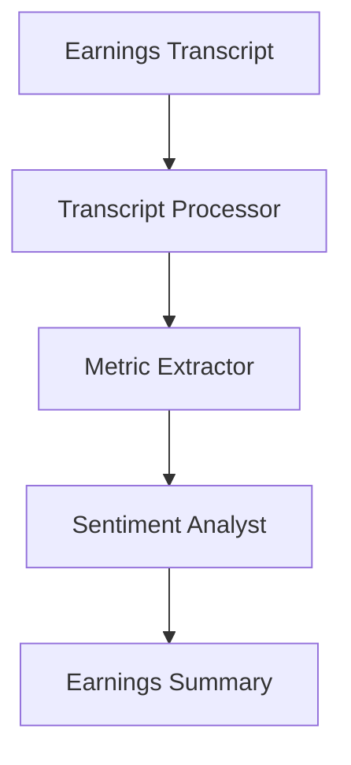

# Earnings Summarization Use Case

## Overview

The Earnings Summarization application analyzes earnings calls through transcript processing, financial metric extraction, and management sentiment analysis.

## Architecture



## Agents

### Transcript Processor

Structures and organizes earnings call transcripts for analysis.

### Metric Extractor

Extracts financial metrics, guidance changes, and forward-looking statements.

### Sentiment Analyst

Analyzes management tone and confidence levels throughout the call.

## Deployment

```bash
USE_CASE_ID=earnings_summarization FRAMEWORK=langchain_langgraph ./scripts/deploy/full/deploy_agentcore.sh
```

## Testing

```bash
./scripts/use_cases/earnings_summarization/test/test_agentcore.sh
```

## Sample Data

Located at `data/samples/earnings_summarization/`

| Entity ID | Company | Quarter |
|-----------|---------|---------|
| EARN001 | TechGrowth Inc | Q4 2024 |

## API Reference

### Request

```json
{
  "entity_id": "EARN001",
  "summarization_type": "full"
}
```

## Related Documentation

- [FSI Foundry Overview](../../../README.md)
- [Architecture Patterns](../../foundations/architecture/architecture_patterns.md)
- [Deployment Guide](../../foundations/deployment/deployment_patterns.md)
