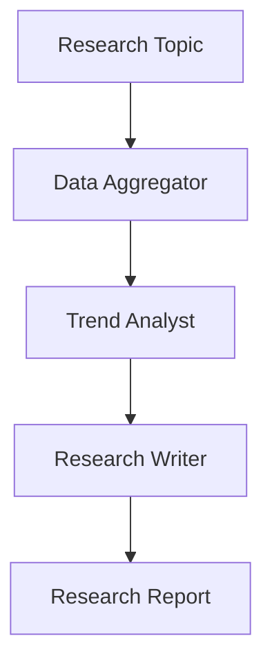

# Economic Research Use Case

## Overview

The Economic Research application coordinates multi-source data aggregation, trend analysis, and structured research report generation.

## Architecture



## Agents

### Data Aggregator

Collects and normalizes economic data from multiple sources.

### Trend Analyst

Analyzes indicator trends, correlations, and generates forecasts.

### Research Writer

Produces structured reports with investment implications.

## Deployment

```bash
USE_CASE_ID=economic_research FRAMEWORK=langchain_langgraph ./scripts/deploy/full/deploy_agentcore.sh
```

## Testing

```bash
./scripts/use_cases/economic_research/test/test_agentcore.sh
```

## Sample Data

Located at `data/samples/economic_research/`

| Entity ID | Topic | Region |
|-----------|-------|--------|
| ECON001 | US Economic Outlook Q2 2026 | United States |

## API Reference

### Request

```json
{
  "entity_id": "ECON001",
  "research_type": "full"
}
```

## Related Documentation

- [FSI Foundry Overview](../../../README.md)
- [Architecture Patterns](../../foundations/architecture/architecture_patterns.md)
- [Deployment Guide](../../foundations/deployment/deployment_patterns.md)
