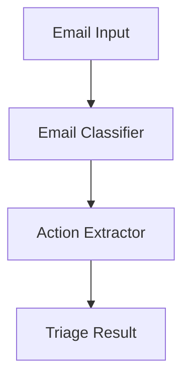

# Email Triage Use Case

## Overview

The Email Triage application automates email processing for capital markets trading desks through classification, action extraction, and prioritized triage.

## Architecture



## Agents

### Email Classifier

Classifies emails by category, urgency, sender importance, and topic relevance for trading desk workflows.

### Action Extractor

Extracts action items, deadlines, key financial information, and suggests response priorities.

## Deployment

```bash
USE_CASE_ID=email_triage FRAMEWORK=langchain_langgraph ./scripts/deploy/full/deploy_agentcore.sh
```

## Testing

```bash
./scripts/use_cases/email_triage/test/test_agentcore.sh
```

## Sample Data

Located at `data/samples/email_triage/`

| Entity ID | Profile | Description |
|-----------|---------|-------------|
| EMAIL001 | Trade Request | Urgent rebalance request from portfolio manager |

## API Reference

### Request

```json
{
  "entity_id": "EMAIL001",
  "triage_type": "full"
}
```

### Response

```json
{
  "entity_id": "EMAIL001",
  "classification": {
    "category": "trade_instruction",
    "urgency": "high"
  },
  "recommendations": ["Response recommended"],
  "summary": "..."
}
```

## Related Documentation

- [FSI Foundry Overview](../../../README.md)
- [Architecture Patterns](../../foundations/architecture/architecture_patterns.md)
- [Deployment Guide](../../foundations/deployment/deployment_patterns.md)
