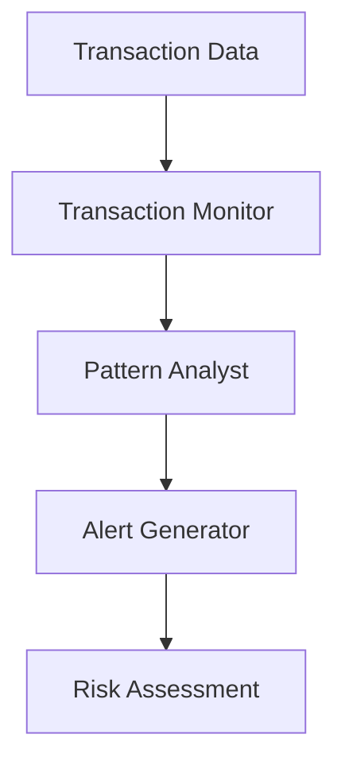

# Fraud Detection Use Case

## Overview

The Fraud Detection application identifies suspicious activities through real-time transaction monitoring, historical pattern analysis, and prioritized alert generation.

## Architecture



## Agents

### Transaction Monitor

Real-time transaction surveillance:
- Velocity anomaly detection
- Geographic inconsistency identification
- Structuring attempt recognition
- Round-tripping pattern detection

### Pattern Analyst

Historical pattern analysis:
- Fraud typology identification
- Behavioral deviation detection
- Emerging scheme recognition
- Cross-account correlation

### Alert Generator

Alert generation and prioritization:
- Evidence compilation
- Investigation recommendations
- Escalation path assessment

## Deployment

```bash
USE_CASE_ID=fraud_detection FRAMEWORK=langchain_langgraph ./scripts/deploy/full/deploy_agentcore.sh
```

## Testing

```bash
./scripts/use_cases/fraud_detection/test/test_agentcore.sh
```

## Sample Data

Located at `data/samples/fraud_detection/`

| Account ID | Risk Profile | Description |
|------------|-------------|-------------|
| ACCT001 | Medium | Business checking with structuring patterns and velocity anomalies |

## API Reference

### Request

```json
{
  "customer_id": "ACCT001",
  "monitoring_type": "full"
}
```

### Response

```json
{
  "customer_id": "ACCT001",
  "monitoring_id": "uuid",
  "risk_assessment": {
    "score": 75,
    "level": "high",
    "factors": ["Structuring pattern detected"]
  },
  "alerts": [
    {
      "alert_id": "ALT-xxx",
      "severity": "critical",
      "description": "Potential structuring activity"
    }
  ],
  "summary": "High-risk account requiring investigation"
}
```

## Related Documentation

- [FSI Foundry Overview](../../../README.md)
- [Architecture Patterns](../../foundations/architecture/architecture_patterns.md)
- [Deployment Guide](../../foundations/deployment/deployment_patterns.md)
