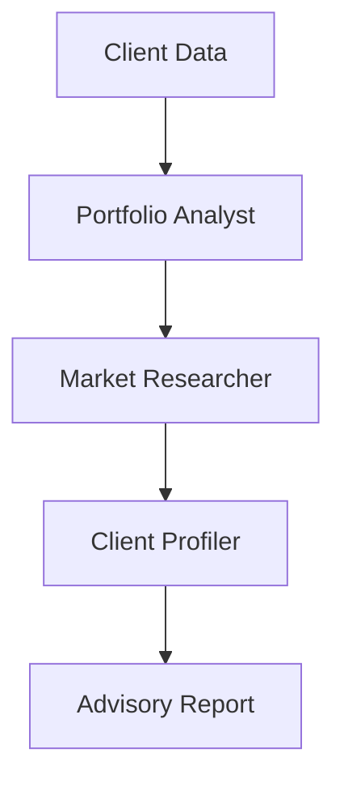

# Investment Advisory Use Case

## Overview

The Investment Advisory application provides wealth management support through portfolio analysis, market research, and client profiling.

## Architecture



## Agents

### Portfolio Analyst

Assesses portfolio composition, performance, risk, and rebalancing needs.

### Market Researcher

Analyzes market conditions, trends, opportunities, and risk factors.

### Client Profiler

Evaluates risk tolerance, goals, suitability, and strategy alignment.

## Deployment

```bash
USE_CASE_ID=investment_advisory FRAMEWORK=langchain_langgraph ./scripts/deploy/full/deploy_agentcore.sh
```

## Testing

```bash
./scripts/use_cases/investment_advisory/test/test_agentcore.sh
```

## Sample Data

Located at `data/samples/investment_advisory/`

| Client ID | Risk Profile | Description |
|-----------|-------------|-------------|
| CLIENT001 | Moderate | $750K portfolio, 15-year horizon, retirement focus |

## API Reference

### Request

```json
{
  "client_id": "CLIENT001",
  "advisory_type": "full"
}
```

## Related Documentation

- [FSI Foundry Overview](../../../README.md)
- [Architecture Patterns](../../foundations/architecture/architecture_patterns.md)
- [Deployment Guide](../../foundations/deployment/deployment_patterns.md)
