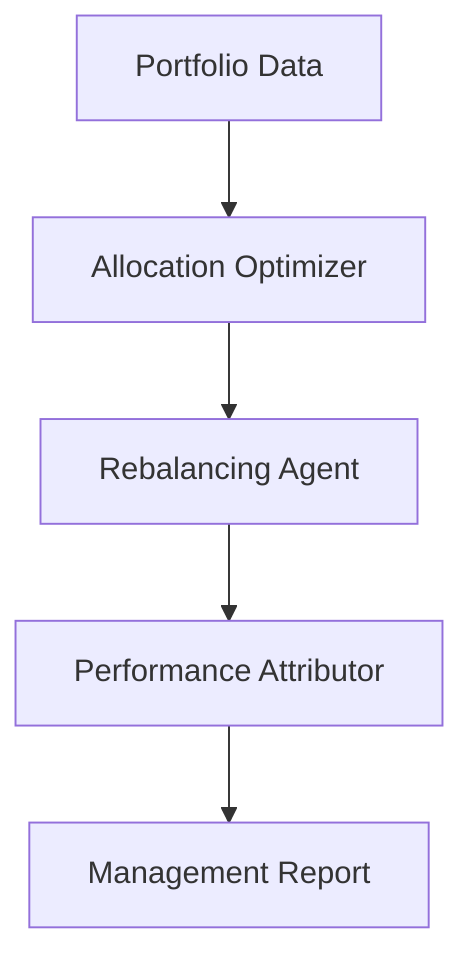

# Investment Management Use Case

## Overview

The Investment Management application provides portfolio optimization through asset allocation, rebalancing analysis, and performance attribution.

## Architecture



## Agents

### Allocation Optimizer

Optimizes asset allocation based on investment objectives, risk constraints, and market outlook.

### Rebalancing Agent

Identifies rebalancing needs, computes drift from targets, and generates trade lists.

### Performance Attributor

Decomposes portfolio returns across factors, sectors, and time periods.

## Deployment

```bash
USE_CASE_ID=investment_management FRAMEWORK=langchain_langgraph ./scripts/deploy/full/deploy_agentcore.sh
```

## Testing

```bash
./scripts/use_cases/investment_management/test/test_agentcore.sh
```

## Sample Data

Located at `data/samples/investment_management/`

| Entity | Description |
|--------|-------------|
| PORT001 | Global Balanced Growth Fund — multi-asset diversified portfolio |

## API Reference

### Request

```json
{
  "entity_id": "PORT001",
  "assessment_type": "full"
}
```

### Response

```json
{
  "entity_id": "PORT001",
  "management_id": "uuid",
  "portfolio_analysis": {
    "risk_profile": "moderate",
    "rebalance_urgency": "medium",
    "drift_pct": 5.2,
    "trade_recommendations": ["Reduce SPY by 5.2%", "Increase AGG by 2.9%"]
  },
  "summary": "Portfolio shows moderate drift requiring rebalancing..."
}
```

## Related Documentation

- [FSI Foundry Overview](../../../README.md)
- [Architecture Patterns](../../foundations/architecture/architecture_patterns.md)
- [Deployment Guide](../../foundations/deployment/deployment_patterns.md)
