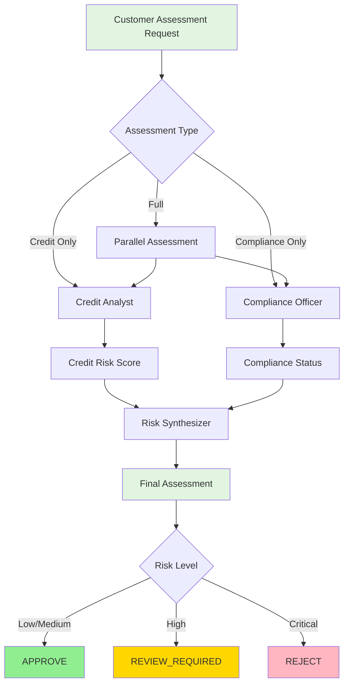
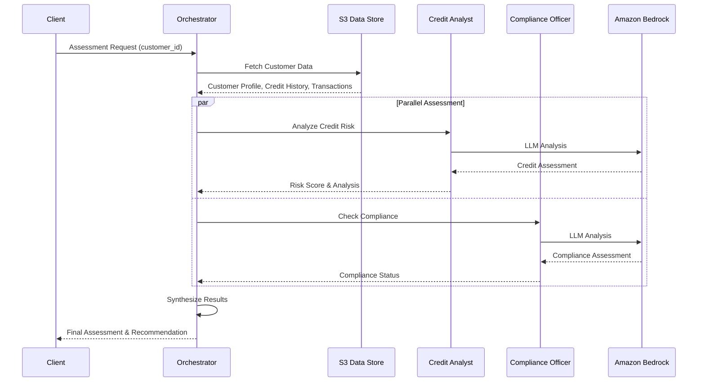

# KYC Risk Assessment Use Case

## Overview

The KYC (Know Your Customer) Risk Assessment application provides comprehensive customer risk evaluation for corporate banking onboarding. It combines credit risk analysis with regulatory compliance checks to deliver actionable risk assessments.

## Business Value

This application enables financial institutions to:
- **Accelerate Onboarding** - Automated risk assessment reduces manual review time
- **Improve Accuracy** - AI-powered analysis identifies risks human reviewers might miss
- **Ensure Compliance** - Systematic KYC/AML checks meet regulatory requirements
- **Scale Operations** - Handle increased customer volumes without proportional staff growth

## Architecture

### Agent Workflow



### Data Flow



## Agents

### Credit Analyst

**Implementation:** `applications/fsi_foundry/use_cases/kyc_banking/src/langchain_langgraph/agents/credit_analyst.py`

The Credit Analyst agent evaluates financial health and creditworthiness by analyzing:

- **Financial Statements** - Balance sheet, income statement, cash flow analysis
- **Debt Assessment** - Debt-to-equity ratios, leverage analysis
- **Payment History** - Historical payment patterns and delinquencies
- **Liquidity Metrics** - Current ratio, quick ratio, working capital
- **Credit Risk Scoring** - Quantitative risk score (0-100)

**Output:** Risk score, risk level (LOW/MEDIUM/HIGH/CRITICAL), detailed analysis

**Model:** `us.anthropic.claude-sonnet-4-20250514-v1:0` (configurable)

### Compliance Officer

**Implementation:** `applications/fsi_foundry/use_cases/kyc_banking/src/langchain_langgraph/agents/compliance_officer.py`

The Compliance Officer agent performs regulatory compliance assessments:

- **KYC Verification** - Identity verification, business registration checks
- **AML Screening** - Anti-Money Laundering risk indicators
- **Sanctions Screening** - OFAC, UN, EU sanctions list checks
- **PEP Checks** - Politically Exposed Persons screening
- **Beneficial Ownership** - Ultimate beneficial owner identification
- **Compliance Status** - COMPLIANT/NON_COMPLIANT/REVIEW_REQUIRED

**Output:** Compliance status, risk flags, regulatory concerns

**Model:** `us.anthropic.claude-sonnet-4-20250514-v1:0` (configurable)

## Orchestrator

**Implementation:** `applications/fsi_foundry/use_cases/kyc_banking/src/langchain_langgraph/orchestrator.py`

The KYC Orchestrator coordinates specialist agents using a LangGraph-based state machine workflow:

### Workflow Stages

1. **Router** - Determines assessment path based on request type
2. **Parallel Assessment** - Executes Credit Analyst and Compliance Officer concurrently
3. **Synthesis** - Combines findings into comprehensive risk assessment
4. **Recommendation** - Generates final decision (APPROVE/REVIEW_REQUIRED/REJECT)

### Assessment Types

| Type | Description | Agents Invoked |
|------|-------------|----------------|
| `full` | Complete assessment with credit and compliance | Credit Analyst + Compliance Officer |
| `credit_only` | Credit risk analysis only | Credit Analyst |
| `compliance_only` | Compliance check only | Compliance Officer |

### State Management

The orchestrator maintains state throughout the workflow:

```python
class KYCState(TypedDict):
    customer_id: str
    assessment_type: str
    credit_assessment: Optional[Dict]
    compliance_assessment: Optional[Dict]
    final_assessment: Optional[Dict]
```

## Configuration

### KYC-Specific Settings

Configuration is managed in `applications/fsi_foundry/use_cases/kyc_banking/src/langchain_langgraph/config.py`:

| Setting | Default | Description |
|---------|---------|-------------|
| `data_prefix` | `samples/kyc_banking` | S3 path prefix for customer data |
| `credit_analyst_model` | `us.anthropic.claude-sonnet-4-20250514-v1:0` | Model for credit analysis |
| `compliance_officer_model` | `us.anthropic.claude-sonnet-4-20250514-v1:0` | Model for compliance checks |
| `risk_threshold_high` | `75` | Score threshold for HIGH risk level |
| `risk_threshold_critical` | `90` | Score threshold for CRITICAL risk level |

### Environment Variables

Settings can be overridden via environment variables:

```bash
export AWS_REGION=us-east-1
export S3_BUCKET_NAME=my-financial-data
export BEDROCK_MODEL_ID=us.anthropic.claude-sonnet-4-20250514-v1:0
export APP_ENV=production
```

## Deployment

The KYC application deploys to AgentCore Runtime for scalable, serverless execution.

### Quick Start

```bash
# Interactive deployment (recommended for first-time users)
./applications/fsi_foundry/scripts/main/deploy.sh

# Or deploy directly to AgentCore
./applications/fsi_foundry/scripts/deploy/full/deploy_agentcore.sh
```

### Deployment

Deploy to AgentCore Runtime for production-ready, scalable deployments:

```bash
./applications/fsi_foundry/scripts/deploy/full/deploy_agentcore.sh
```

[Learn more about AgentCore deployment →](../../foundations/architecture/architecture_patterns.md)

## Testing

Test your deployment with sample customer data:

```bash
# Test AgentCore deployment
./applications/fsi_foundry/scripts/use_cases/kyc_banking/test/test_agentcore.sh
```

## Cleanup

Remove deployed resources:

```bash
# Cleanup AgentCore deployment
./applications/fsi_foundry/scripts/use_cases/kyc_banking/cleanup/cleanup_agentcore.sh
```

## Directory Structure

```
applications/fsi_foundry/use_cases/kyc_banking/
├── src/
│   └── langchain_langgraph/
│       ├── agents/
│       │   ├── __init__.py
│       │   ├── credit_analyst.py      # Credit risk analysis
│       │   └── compliance_officer.py  # Compliance checks
│       ├── __init__.py
│       ├── config.py                  # KYC configuration
│       ├── models.py                  # Data models
│       └── orchestrator.py            # LangGraph workflow
├── scripts/
│   ├── deploy/
│   │   ├── full/                      # Full deployments (infra + app)
│   │   └── app/                       # App-only deployments
│   ├── test/                          # Test scripts
│   └── cleanup/                       # Cleanup scripts
└── README.md
```

## Sample Data

Sample customer data for testing is located at `applications/fsi_foundry/data/samples/kyc_banking/`

### Test Customers

| Customer ID | Profile | Risk Level | Use Case |
|-------------|---------|------------|----------|
| `CUST001` | Established manufacturing company | LOW | Standard approval scenario |
| `CUST002` | Tech startup with higher debt | MEDIUM | Enhanced monitoring scenario |
| `CUST003` | Import/export with PEP exposure | HIGH | Review required scenario |

### Data Structure

Each customer has four data files in S3:

```
applications/fsi_foundry/data/samples/kyc_banking/
├── CUST001/
│   ├── customer_profile.json      # Company info, industry, location
│   ├── credit_history.json        # Credit scores, payment history
│   ├── transaction_history.json   # Transaction patterns
│   └── compliance_records.json    # KYC/AML/sanctions data
├── CUST002/
│   └── ...
└── CUST003/
    └── ...
```

## API Reference

### Request Format

```json
{
  "customer_id": "CUST001",
  "assessment_type": "full"
}
```

### Response Format

```json
{
  "customer_id": "CUST001",
  "assessment_type": "full",
  "overall_risk_score": 25,
  "overall_risk_level": "LOW",
  "recommendation": "APPROVE",
  "credit_assessment": {
    "risk_score": 30,
    "risk_level": "LOW",
    "analysis": "Strong financial position with consistent revenue..."
  },
  "compliance_assessment": {
    "status": "COMPLIANT",
    "risk_flags": [],
    "analysis": "All KYC and AML checks passed..."
  },
  "synthesis": "Based on comprehensive analysis..."
}
```

## Risk Scoring

### Risk Levels

| Level | Score Range | Recommendation | Action Required |
|-------|-------------|----------------|-----------------|
| **LOW** | 0-49 | APPROVE | Standard onboarding process |
| **MEDIUM** | 50-74 | APPROVE | Enhanced monitoring recommended |
| **HIGH** | 75-89 | REVIEW_REQUIRED | Additional due diligence needed |
| **CRITICAL** | 90-100 | REJECT | Escalation to senior management |

### Compliance Statuses

| Status | Description | Impact |
|--------|-------------|--------|
| **COMPLIANT** | All regulatory checks passed | Proceed with onboarding |
| **NON_COMPLIANT** | Critical checks failed | Reject application |
| **REVIEW_REQUIRED** | Edge cases requiring manual review | Human review needed |

## Related Documentation

- [FSI Foundry Overview](../../../README.md)
- [Platform Architecture](../../foundations/README.md)
- [Deployment Patterns](../../foundations/architecture/architecture_patterns.md)
- [Adding New Applications](../../foundations/development/adding_applications.md)
