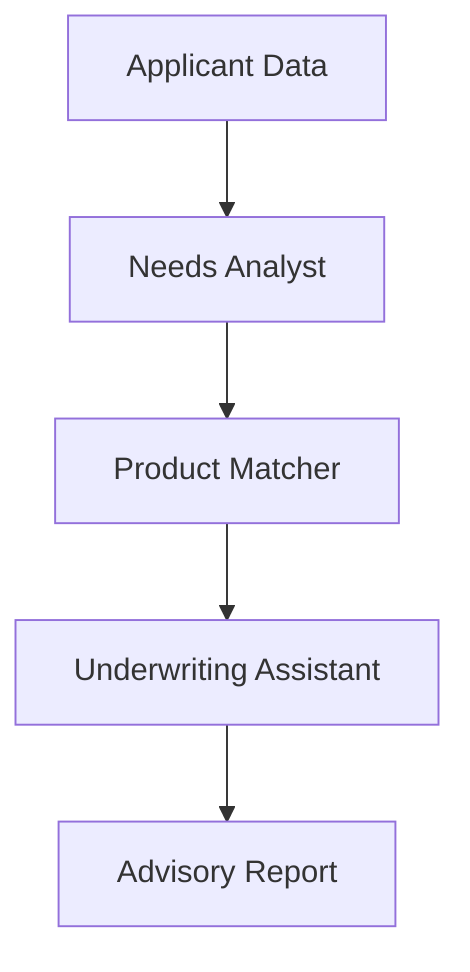

# Life Insurance Agent Use Case

## Overview

The Life Insurance Agent application evaluates applicants through needs analysis, product matching, and underwriting risk assessment.

## Architecture



## Agents

### Needs Analyst

Analyzes life insurance needs based on life stage, dependents, income replacement, and coverage gaps.

### Product Matcher

Matches needs to products (term, whole life, universal) with coverage and premium recommendations.

### Underwriting Assistant

Assesses health history, lifestyle risks, and family medical history for risk classification.

## Deployment

```bash
USE_CASE_ID=life_insurance_agent FRAMEWORK=langchain_langgraph ./scripts/deploy/full/deploy_agentcore.sh
```

## Testing

```bash
./scripts/use_cases/life_insurance_agent/test/test_agentcore.sh
```

## Sample Data

Located at `data/samples/life_insurance_agent/`

| Applicant ID | Profile | Description |
|-------------|---------|-------------|
| APP001 | Family Building | 35yo, spouse + 2 children, $120K income |

## API Reference

### Request

```json
{
  "applicant_id": "APP001",
  "analysis_type": "full"
}
```

### Response

```json
{
  "applicant_id": "APP001",
  "assessment_id": "uuid",
  "needs_analysis": {
    "life_stage": "family_building",
    "recommended_coverage": 1775000,
    "coverage_gap": 1535000
  },
  "product_recommendations": {
    "primary_product": "term",
    "coverage_amount": 1500000,
    "estimated_premium": 85.0
  },
  "underwriting_assessment": {
    "risk_category": "preferred",
    "confidence_score": 0.85
  },
  "summary": "..."
}
```

## Related Documentation

- [FSI Foundry Overview](../../../README.md)
- [Architecture Patterns](../../foundations/architecture/architecture_patterns.md)
- [Deployment Guide](../../foundations/deployment/deployment_patterns.md)
