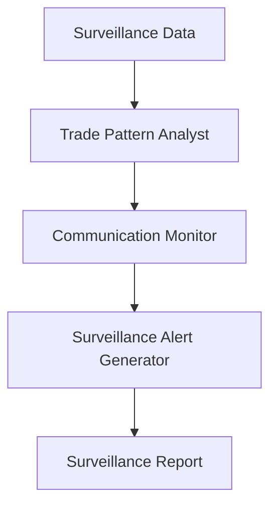

# Market Surveillance Use Case

## Overview

The Market Surveillance application provides trade pattern analysis, communication monitoring, and surveillance alert generation for capital markets compliance.

## Architecture



## Agents

### Trade Pattern Analyst

Detects insider trading, wash trading, spoofing, and layering patterns.

### Communication Monitor

Screens trader communications for compliance violations.

### Surveillance Alert Generator

Creates actionable alerts with severity classification and escalation paths.

## Deployment

```bash
USE_CASE_ID=market_surveillance FRAMEWORK=langchain_langgraph ./scripts/deploy/full/deploy_agentcore.sh
```

## Testing

```bash
./scripts/use_cases/market_surveillance/test/test_agentcore.sh
```

## Sample Data

Located at `data/samples/market_surveillance/`

| Entity ID | Description |
|-----------|-------------|
| SURV001 | Trader with pre-announcement trades and external broker communications |

## API Reference

### Request

```json
{
  "customer_id": "SURV001",
  "surveillance_type": "full"
}
```

## Related Documentation

- [FSI Foundry Overview](../../../README.md)
- [Architecture Patterns](../../foundations/architecture/architecture_patterns.md)
- [Deployment Guide](../../foundations/deployment/deployment_patterns.md)
