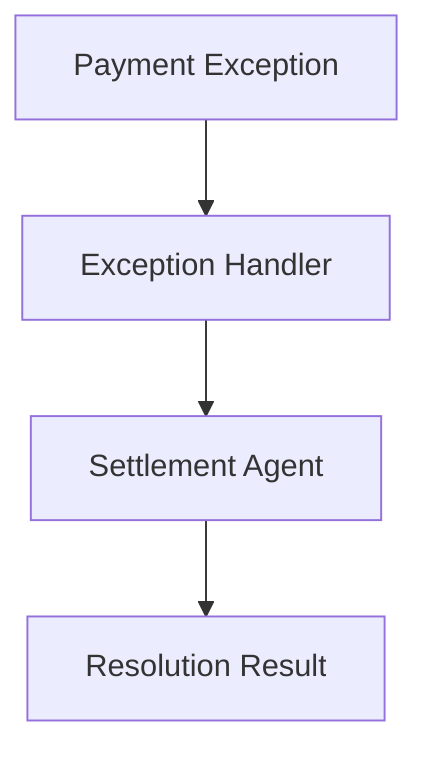

# Payment Operations Use Case

## Overview

The Payment Operations application handles payment exception resolution and settlement operations for banking.

## Architecture



## Agents

### Exception Handler

Analyzes payment exceptions:
- Exception severity determination
- Root cause analysis
- Resolution recommendations

### Settlement Agent

Manages settlement operations:
- Settlement readiness verification
- Amount reconciliation
- Timeline tracking

## Deployment

```bash
USE_CASE_ID=payment_operations FRAMEWORK=langchain_langgraph ./scripts/deploy/full/deploy_agentcore.sh
```

## Testing

```bash
./scripts/use_cases/payment_operations/test/test_agentcore.sh
```

## Sample Data

Located at `data/samples/payment_operations/`

| Payment ID | Type | Description |
|------------|------|-------------|
| PAY001 | Wire | Wire transfer with address mismatch exception |

## API Reference

### Request

```json
{
  "customer_id": "PAY001",
  "operation_type": "full"
}
```

### Response

```json
{
  "customer_id": "PAY001",
  "exception_analysis": {
    "severity": "medium",
    "root_cause": "address_mismatch",
    "recommended_action": "manual_review"
  },
  "settlement_status": {
    "readiness": "pending_resolution",
    "estimated_completion": "2024-01-16T10:00:00Z"
  }
}
```

## Related Documentation

- [FSI Foundry Overview](../../../README.md)
- [Architecture Patterns](../../foundations/architecture/architecture_patterns.md)
- [Deployment Guide](../../foundations/deployment/deployment_patterns.md)
