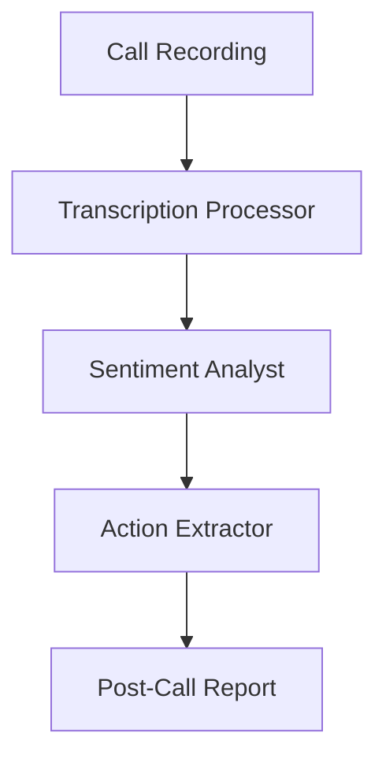

# Post Call Analytics Use Case

## Overview

The Post Call Analytics application automates call analysis through transcription processing, sentiment analysis, and action item extraction.

## Architecture



## Agents

### Transcription Processor

Performs speaker diarization, topic identification, and transcript generation.

### Sentiment Analyst

Tracks customer and agent sentiment, satisfaction scoring, and emotional shift detection.

### Action Extractor

Extracts action items, commitment tracking, and follow-up prioritization.

## Deployment

```bash
USE_CASE_ID=post_call_analytics FRAMEWORK=langchain_langgraph ./scripts/deploy/full/deploy_agentcore.sh
```

## Testing

```bash
./scripts/use_cases/post_call_analytics/test/test_agentcore.sh
```

## Sample Data

Located at `data/samples/post_call_analytics/`

| Entity ID | Description |
|-----------|-------------|
| CALL001 | Retail banking fraud dispute call |

## API Reference

### Request

```json
{
  "call_id": "CALL001",
  "analysis_type": "full"
}
```

### Response

```json
{
  "call_id": "CALL001",
  "transcription": {
    "speaker_count": 2,
    "key_topics": ["fraud dispute", "card replacement"]
  },
  "sentiment": {
    "overall_sentiment": "positive",
    "satisfaction_score": 0.85
  },
  "action_items": [
    {"description": "Process dispute for $247.50 and $89.99", "priority": "high"}
  ],
  "summary": "..."
}
```

## Related Documentation

- [FSI Foundry Overview](../../../README.md)
- [Architecture Patterns](../../foundations/architecture/architecture_patterns.md)
- [Deployment Guide](../../foundations/deployment/deployment_patterns.md)
