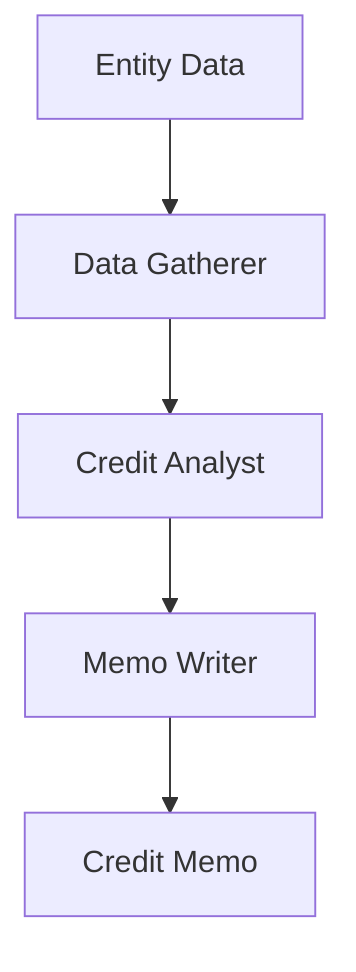

# Research Credit Memo Use Case

## Overview

The Research Credit Memo application generates credit research memos through data gathering, credit analysis, and professionally formatted memo writing.

## Architecture



## Agents

### Data Gatherer

Gathers financial data from annual reports, SEC filings, market data, and peer information.

### Credit Analyst

Performs financial ratio computation, peer comparison, and credit risk assessment.

### Memo Writer

Generates professionally formatted credit memos with executive summaries and structured analysis.

## Deployment

```bash
USE_CASE_ID=research_credit_memo FRAMEWORK=langchain_langgraph ./scripts/deploy/full/deploy_agentcore.sh
```

## Testing

```bash
./scripts/use_cases/research_credit_memo/test/test_agentcore.sh
```

## Sample Data

Located at `data/samples/research_credit_memo/`

| Entity ID | Company | Sector | Rating |
|-----------|---------|--------|--------|
| ENTITY001 | Acme Industrial Corp | Industrials | BBB |

## API Reference

### Request

```json
{
  "entity_id": "ENTITY001",
  "analysis_type": "full"
}
```

### Response

```json
{
  "entity_id": "ENTITY001",
  "memo_id": "uuid",
  "credit_analysis": {
    "rating": "BBB",
    "confidence_score": 0.85,
    "key_ratios": ["Debt/EBITDA: 4.05x", "Interest Coverage: 4.94x"]
  },
  "recommendations": ["Maintain BBB rating", "Monitor leverage trajectory"],
  "summary": "Acme Industrial Corp maintains investment-grade credit profile..."
}
```

## Related Documentation

- [FSI Foundry Overview](../../../README.md)
- [Architecture Patterns](../../foundations/architecture/architecture_patterns.md)
- [Deployment Guide](../../foundations/deployment/deployment_patterns.md)
