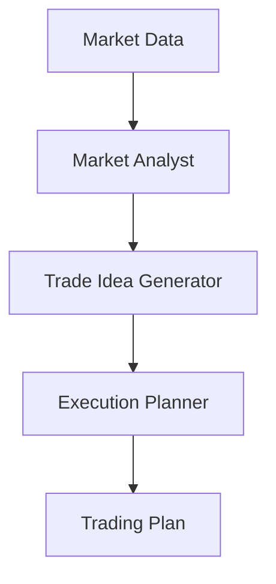

# Trading Assistant Use Case

## Overview

The Trading Assistant application provides comprehensive trading intelligence for equity trading desks through market analysis, trade idea generation, and execution planning.

## Architecture



## Agents

### Market Analyst

Analyzes price action, volume, liquidity, and market regime.

### Trade Idea Generator

Generates trade ideas with risk-reward profiles.

### Execution Planner

Plans execution strategy, timing, and venue selection.

## Deployment

```bash
USE_CASE_ID=trading_assistant FRAMEWORK=langchain_langgraph ./scripts/deploy/full/deploy_agentcore.sh
```

## Testing

```bash
./scripts/use_cases/trading_assistant/test/test_agentcore.sh
```

## Sample Data

Located at `data/samples/trading_assistant/`

| Entity ID | Description |
|-----------|-------------|
| TRADE001 | Equity trading desk analysis request |

## API Reference

### Request

```json
{
  "entity_id": "TRADE001",
  "analysis_type": "full"
}
```

## Related Documentation

- [FSI Foundry Overview](../../../README.md)
- [Architecture Patterns](../../foundations/architecture/architecture_patterns.md)
- [Deployment Guide](../../foundations/deployment/deployment_patterns.md)
