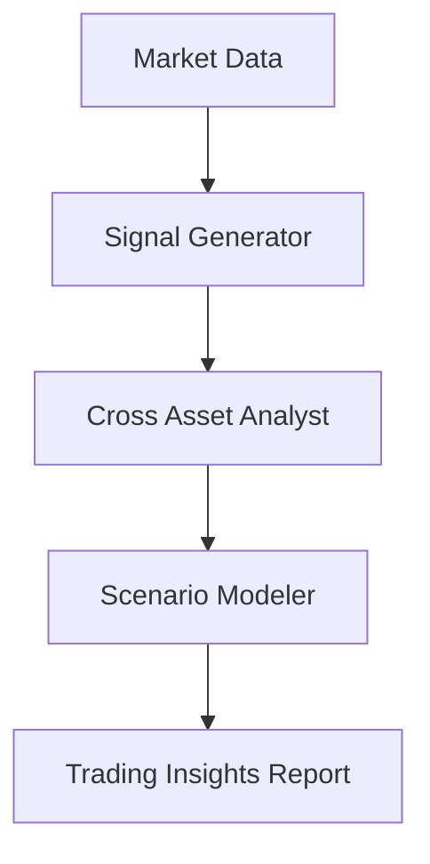

# Trading Insights Use Case

## Overview

The Trading Insights application assists capital markets professionals through signal generation, cross-asset analysis, and scenario modeling.

## Architecture



## Agents

### Signal Generator

Generates trading signals from technical and fundamental indicators with strength classification.

### Cross Asset Analyst

Analyzes cross-asset correlations, identifies relative value opportunities, and detects regime changes.

### Scenario Modeler

Models market scenarios (base, bull, bear, tail risk) with probability-weighted outcomes and hedging evaluation.

## Deployment

```bash
USE_CASE_ID=trading_insights FRAMEWORK=langchain_langgraph ./scripts/deploy/full/deploy_agentcore.sh
```

## Testing

```bash
./scripts/use_cases/trading_insights/test/test_agentcore.sh
```

## Sample Data

Located at `data/samples/trading_insights/`

| Entity ID | Profile | Description |
|-----------|---------|-------------|
| TRADE001 | Global Macro | Multi-asset macro relative value fund |

## API Reference

### Request

```json
{
  "entity_id": "TRADE001",
  "assessment_type": "full"
}
```

### Response

```json
{
  "entity_id": "TRADE001",
  "insights_id": "uuid",
  "insights_detail": {
    "signal_strength": "buy",
    "signals_identified": ["RSI oversold on US 10Y"],
    "cross_asset_opportunities": ["Equity-bond decorrelation trade"],
    "scenario_outcomes": ["Base case: +2.3% portfolio return"]
  },
  "recommendations": ["Increase duration exposure"],
  "summary": "..."
}
```

## Related Documentation

- [FSI Foundry Overview](../../../README.md)
- [Architecture Patterns](../../foundations/architecture/architecture_patterns.md)
- [Deployment Guide](../../foundations/deployment/deployment_patterns.md)
