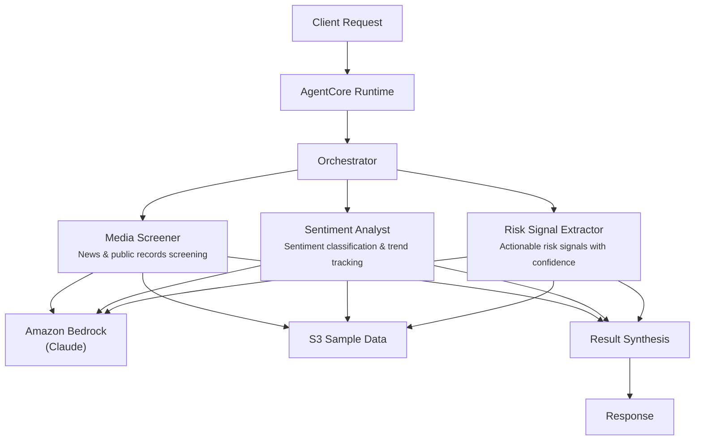

# Adverse Media Screening

## Overview

The Adverse Media Screening use case provides comprehensive media monitoring for financial institution entities by coordinating news source screening, sentiment classification, and risk signal extraction. It identifies adverse mentions across news wires, regulatory filings, court records, sanctions lists, and social media, producing structured screening reports with severity-rated risk signals for compliance teams and risk managers.

## Business Value

- **Continuous monitoring** -- automated screening across multiple media source categories replaces manual news tracking
- **Sentiment quantification** -- five-level sentiment classification (very negative through very positive) provides objective risk measurement
- **Actionable risk signals** -- extracted signals include type, severity, confidence, and entity linkage for immediate compliance action
- **Source credibility assessment** -- agents evaluate the reliability and reach of media sources alongside content analysis
- **Escalation support** -- high-severity signals are flagged with recommended actions and regulatory reporting needs

## Architecture



### Directory Structure

```
use_cases/adverse_media/
├── README.md
└── src/
    └── strands/
        ├── __init__.py
        ├── config.py          # AdverseMediaSettings
        ├── models.py          # Pydantic request/response models
        ├── orchestrator.py    # AdverseMediaOrchestrator + run_adverse_media()
        └── agents/
            ├── __init__.py
            ├── media_screener.py
            ├── sentiment_analyst.py
            └── risk_signal_extractor.py
```

## Agentic Design

The orchestrator uses a **parallel fan-out** pattern. In `full` mode, all three agents execute concurrently via `asyncio.gather`. Individual modes (`media_screening`, `sentiment_analysis`, `risk_extraction`) invoke a single agent. The orchestrator synthesizes results through a structured prompt that produces JSON with media findings, sentiment levels, risk signals, and recommended actions.

## Agents

| Agent | Role | Data Used | Output |
|-------|------|-----------|--------|
| **Media Screener** | Screens news sources, media outlets, and public records for adverse mentions; catalogs findings with source metadata and relevance scores | Entity profile and flagged articles via `s3_retriever_tool` | Articles screened count, adverse mentions, categories of adverse media, key findings with sources |
| **Sentiment Analyst** | Classifies sentiment severity from very negative to very positive; assesses impact magnitude, tracks trends, evaluates source credibility | Entity profile via `s3_retriever_tool` | Overall sentiment level, sentiment breakdown by category, trend analysis, impact assessment |
| **Risk Signal Extractor** | Extracts actionable risk signals categorized by type (legal, regulatory, reputational, financial); identifies corroborating evidence and entity linkage | Entity profile via `s3_retriever_tool` | Risk signals with type, severity, confidence (0-1), description, source references, entity linkage |

## Data and Tools

- **Tool:** `s3_retriever_tool` -- retrieves entity profiles and flagged media articles from S3
- **S3 data prefix:** `samples/adverse_media/`
- **Model:** Claude Sonnet (via Amazon Bedrock), temperature 0.1, max 8192 tokens
- **Config thresholds:** `sentiment_negativity_threshold=0.7`, `risk_signal_confidence_target=0.8`, `max_screening_time_seconds=60`

## Request / Response

**Request** -- `ScreeningRequest`:

| Field | Type | Description |
|-------|------|-------------|
| `entity_id` | `str` | Entity to screen (e.g., `ENT001`) |
| `screening_type` | `ScreeningType` | `full`, `media_screening`, `sentiment_analysis`, `risk_extraction` |
| `additional_context` | `str \| None` | Optional context (e.g., "Focus on sanctions-related coverage") |

**Response** -- `ScreeningResponse`:

| Field | Type | Description |
|-------|------|-------------|
| `entity_id` | `str` | Entity identifier |
| `screening_id` | `str` | Unique screening UUID |
| `timestamp` | `datetime` | Screening timestamp |
| `media_findings` | `MediaFindings \| None` | Articles screened, adverse mentions, sentiment, categories, key findings, sources |
| `risk_signals` | `list[RiskSignal]` | Signal type, severity, confidence, description, source references, entity linkage |
| `summary` | `str` | Executive summary |
| `raw_analysis` | `dict` | Raw agent output |

## Quick Start

```bash
# Deploy to AgentCore
USE_CASE_ID=adverse_media ./scripts/deploy/full/deploy_agentcore.sh

# Test the deployment
./scripts/use_cases/adverse_media/test/test_agentcore.sh
```

## Sample Data

Located at `data/samples/adverse_media/`

| Entity ID | Name | Type | Description |
|-----------|------|------|-------------|
| ENT001 | GlobalTrade Holdings Ltd | Corporate | Active monitoring since 2023-06 -- flagged articles from Financial Times (sanctions evasion investigation), Reuters (regulatory probe), and Bloomberg (positive earnings report) |

## Related Documentation

- [FSI Foundry Overview](../../../README.md)
- [Architecture Patterns](../../docs/foundations/architecture/architecture_patterns.md)
- [Deployment Guide](../../docs/foundations/deployment/deployment_patterns.md)
- [Implementation Details](../../docs/use_cases/adverse_media/implementation.md)
