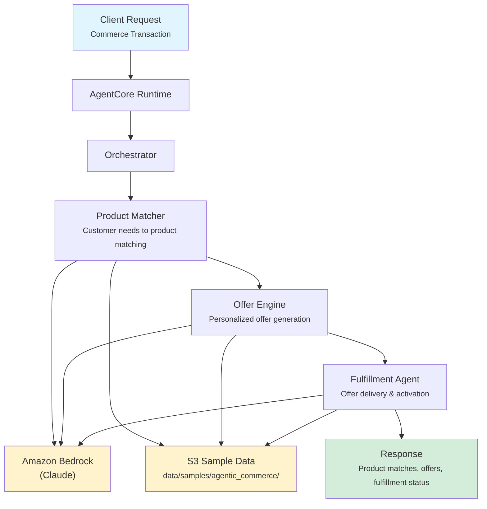

# Agentic Commerce

AI-powered commerce platform for banking that matches customers to products, generates personalized offers, and manages fulfillment workflows to drive product adoption and revenue growth.

## Overview

The Agentic Commerce application analyzes customer profiles to match banking products with confidence scoring, generates personalized offers ranked by relevance and likelihood of acceptance, and orchestrates fulfillment through optimal channels (digital, branch, phone). The orchestrator synthesizes all outputs into a commerce recommendation: PROCEED, HOLD, or REVISE.

## Business Value

- **Increase Product Adoption** -- AI-powered product matching surfaces the right offers to the right customers at the right time
- **Higher Conversion Rates** -- Personalization scoring ensures offers resonate with customer needs and preferences
- **Streamlined Fulfillment** -- Automated channel selection and blocker detection accelerate offer-to-activation
- **Cross-Sell Revenue** -- Systematic identification of cross-sell and upsell opportunities across the product portfolio
- **Regulatory Compliance** -- Fulfillment agent verifies regulatory requirements are met before product activation

## Architecture



### Directory Structure

```
use_cases/agentic_commerce/
├── README.md
└── src/
    ├── __init__.py                              # Framework router
    ├── strands/
    │   ├── __init__.py
    │   ├── config.py                            # Commerce settings
    │   ├── models.py                            # CommerceRequest / CommerceResponse
    │   ├── orchestrator.py                      # CommerceOrchestrator
    │   └── agents/
    │       ├── product_matcher.py               # ProductMatcher agent
    │       ├── offer_engine.py                  # OfferEngine agent
    │       └── fulfillment_agent.py             # FulfillmentAgent agent
    └── langchain_langgraph/                     # LangGraph implementation (same structure)
```

## Agentic Design

The `CommerceOrchestrator` extends `StrandsOrchestrator` and implements a **parallel fan-out** pattern:

1. **Commerce Type Routing** -- `full` runs all three agents in parallel; `offer_only`, `fulfillment_only`, and `matching_only` each route to a single agent.
2. **Parallel Execution** -- For full commerce assessments, all three agents run concurrently via `asyncio.gather()`.
3. **Synthesis** -- A supervisor LLM call combines product matches, offers, and fulfillment readiness into a final recommendation (PROCEED/HOLD/REVISE) with key findings and next steps.

## Agents

### Product Matcher

| Field | Detail |
|-------|--------|
| **Class** | `ProductMatcher(StrandsAgent)` |
| **Role** | Matches customer needs to available banking products with confidence scoring |
| **Data** | Customer profile via `s3_retriever_tool` |
| **Produces** | Matched products list, confidence scores per product, product recommendations with rationale |

### Offer Engine

| Field | Detail |
|-------|--------|
| **Class** | `OfferEngine(StrandsAgent)` |
| **Role** | Generates personalized product offers based on customer profile, segment, and behavior |
| **Data** | Customer profile via `s3_retriever_tool` |
| **Produces** | Offer status (GENERATED/APPROVED/REJECTED/PENDING_REVIEW), personalized offers list, personalization score (0.0-1.0), notes |

### Fulfillment Agent

| Field | Detail |
|-------|--------|
| **Class** | `FulfillmentAgent(StrandsAgent)` |
| **Role** | Manages offer delivery, channel selection, and product activation workflows |
| **Data** | Customer profile via `s3_retriever_tool` |
| **Produces** | Fulfillment status (READY/IN_PROGRESS/COMPLETED/BLOCKED), channel (digital/branch/phone), steps completed, blockers |

## Data and Tools

- **Tool:** `s3_retriever_tool` -- Retrieves customer data from S3 by customer ID
- **S3 Path:** `data/samples/agentic_commerce/{customer_id}/`
- **Data Files:** `profile.json` (customer segment, products, preferences, eligibility)

## Request / Response

### Request (`CommerceRequest`)

```python
class CommerceRequest(BaseModel):
    customer_id: str                               # e.g. "OFFER001"
    commerce_type: CommerceType = "full"            # full | offer_only | fulfillment_only | matching_only
    additional_context: str | None = None
```

### Response (`CommerceResponse`)

```python
class CommerceResponse(BaseModel):
    customer_id: str
    commerce_id: str                               # UUID
    timestamp: datetime
    offer_result: OfferResult | None               # status, offers, personalization_score, notes
    fulfillment_result: FulfillmentResult | None   # status, channel, steps_completed, blockers
    match_result: MatchResult | None               # matched_products, confidence_scores, recommendations
    summary: str                                   # Commerce recommendation with PROCEED/HOLD/REVISE
    raw_analysis: dict
```

## Quick Start

```bash
# Deploy to AgentCore
USE_CASE_ID=agentic_commerce ./scripts/deploy/full/deploy_agentcore.sh

# Test
./scripts/use_cases/agentic_commerce/test/test_agentcore.sh
```

## Sample Data

| Customer ID | Profile | Description |
|-------------|---------|-------------|
| `OFFER001` | Premium Retail | Premium retail customer with mortgage inquiry and investment interest |

## Related Documentation

- [Platform Overview](../../docs/foundations/README.md)
- [Architecture Patterns](../../docs/foundations/architecture/architecture_patterns.md)
- [Deployment Guide](../../docs/foundations/deployment/deployment_patterns.md)
