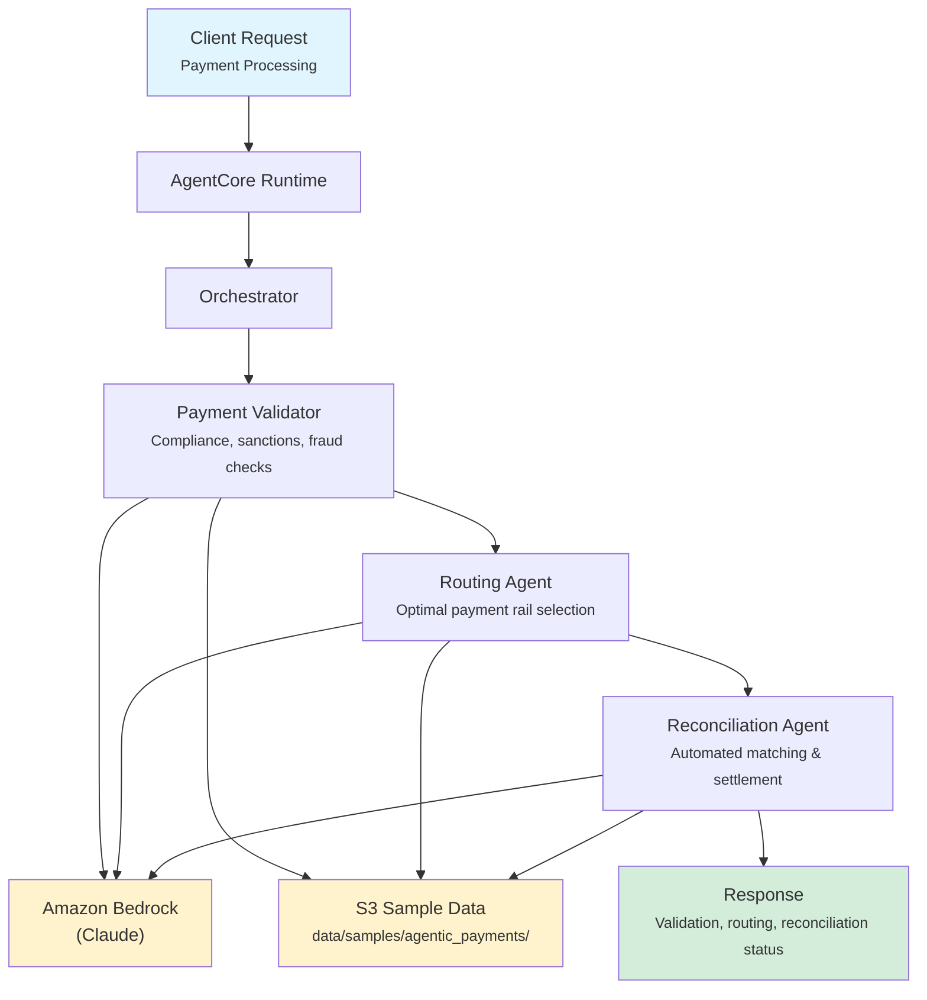

# Agentic Payments

AI-powered payment processing that validates, routes, and reconciles financial transactions end-to-end using coordinated specialist agents.

## Overview

The Agentic Payments application automates payment workflows by validating transactions against compliance and fraud rules, selecting optimal payment rails based on cost and speed, and reconciling payments across systems. It produces a unified decision: EXECUTE, REJECT, or ESCALATE.

## Business Value

- **Reduce Payment Failures** -- Pre-validation catches compliance violations and fraud signals before execution
- **Optimize Costs** -- Intelligent rail selection balances speed, cost, and reliability for each transaction
- **Accelerate Settlement** -- Automated reconciliation detects discrepancies and confirms settlement faster
- **Strengthen Compliance** -- Systematic sanctions screening (OFAC, EU, UN) and AML checks on every payment
- **Improve Straight-Through Processing** -- End-to-end automation reduces manual intervention

## Architecture



### Directory Structure

```
use_cases/agentic_payments/
├── README.md
└── src/
    ├── __init__.py                            # Framework router
    ├── strands/
    │   ├── __init__.py
    │   ├── config.py                          # Payment settings
    │   ├── models.py                          # PaymentRequest / PaymentResponse
    │   ├── orchestrator.py                    # AgenticPaymentsOrchestrator
    │   └── agents/
    │       ├── payment_validator.py           # PaymentValidator agent
    │       ├── routing_agent.py               # RoutingAgent agent
    │       └── reconciliation_agent.py        # ReconciliationAgent agent
    └── langchain_langgraph/                   # LangGraph implementation (same structure)
```

## Agentic Design

The `AgenticPaymentsOrchestrator` extends `StrandsOrchestrator` and implements a **parallel + conditional sequential** pattern:

1. **Parallel Validation and Routing** -- The Payment Validator and Routing Agent always run concurrently via `asyncio.gather()`.
2. **Conditional Reconciliation** -- For payment types requiring settlement tracking (wire, ACH, international), the Reconciliation Agent runs as a follow-up step.
3. **Synthesis** -- A supervisor LLM call combines all agent outputs into a final recommendation (EXECUTE/REJECT/ESCALATE) with routing details and reconciliation status.

## Agents

### Payment Validator

| Field | Detail |
|-------|--------|
| **Class** | `PaymentValidator(StrandsAgent)` |
| **Role** | Validates payments against business rules, sanctions lists, and fraud indicators |
| **Data** | Payment profile via `s3_retriever_tool` |
| **Produces** | Validation status (APPROVED/REJECTED/REQUIRES_REVIEW), rules checked, violations, sanctions clearance, risk score (0-100) |

### Routing Agent

| Field | Detail |
|-------|--------|
| **Class** | `RoutingAgent(StrandsAgent)` |
| **Role** | Determines optimal payment rail based on cost, speed, and transaction requirements |
| **Data** | Payment profile via `s3_retriever_tool` |
| **Produces** | Selected rail (Fedwire/ACH/RTP/SWIFT/SEPA), alternative rails, estimated settlement time, routing cost, rationale |

### Reconciliation Agent

| Field | Detail |
|-------|--------|
| **Class** | `ReconciliationAgent(StrandsAgent)` |
| **Role** | Matches and reconciles payments across source and destination systems |
| **Data** | Payment profile via `s3_retriever_tool` |
| **Produces** | Reconciliation status (MATCHED/UNMATCHED/DISCREPANCY/PENDING), matched records, discrepancies, exception flags |

## Data and Tools

- **Tool:** `s3_retriever_tool` -- Retrieves payment data from S3 by payment ID
- **S3 Path:** `data/samples/agentic_payments/{payment_id}/`
- **Data Files:** `profile.json` (payment details, amounts, parties, type)

## Request / Response

### Request (`PaymentRequest`)

```python
class PaymentRequest(BaseModel):
    payment_id: str                            # e.g. "PMT001"
    payment_type: PaymentType                  # wire | ach | real_time | international | domestic
    additional_context: str | None = None
```

### Response (`PaymentResponse`)

```python
class PaymentResponse(BaseModel):
    payment_id: str
    transaction_id: str                        # UUID
    timestamp: datetime
    validation_result: ValidationResult | None # status, rules_checked, violations, sanctions_clear, risk_score
    routing_decision: RoutingDecision | None   # selected_rail, alternatives, settlement_time, cost, rationale
    reconciliation_status: ReconciliationStatus | None  # matched | unmatched | discrepancy | pending
    summary: str                               # Executive summary with EXECUTE/REJECT/ESCALATE
    raw_analysis: dict
```

## Quick Start

```bash
# Deploy to AgentCore
USE_CASE_ID=agentic_payments ./scripts/deploy/full/deploy_agentcore.sh

# Test
./scripts/use_cases/agentic_payments/test/test_agentcore.sh
```

## Sample Data

| Payment ID | Type | Description |
|------------|------|-------------|
| `PMT001` | Wire | High-value domestic wire transfer ($125,000) |

## Related Documentation

- [Platform Overview](../../docs/foundations/README.md)
- [Architecture Patterns](../../docs/foundations/architecture/architecture_patterns.md)
- [Deployment Guide](../../docs/foundations/deployment/deployment_patterns.md)
