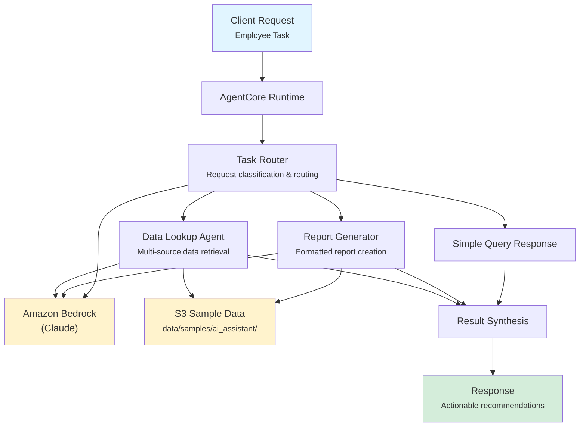

# AI Assistant

AI-powered employee productivity assistant for banking operations, providing task routing, data retrieval from internal systems, and formatted report generation to accelerate day-to-day banking workflows.

## Overview

The AI Assistant helps banking employees by classifying incoming requests, retrieving data from multiple internal sources, and generating presentation-ready reports. It routes tasks to the right specialist capability, surfaces key metrics and trends, and produces compliance-aware outputs formatted for banking decision-makers.

## Business Value

- **Accelerate Decision-Making** -- Employees get data and reports in minutes instead of hours of manual research
- **Reduce Manual Data Gathering** -- Automated multi-source data retrieval eliminates repetitive lookup tasks
- **Consistent Reporting** -- Standardized report formats with banking-specific compliance standards
- **Intelligent Routing** -- Task classification ensures requests reach the right capability without manual triage
- **Productivity Gains** -- Free up relationship managers and analysts to focus on high-value client interactions

## Architecture



### Directory Structure

```
use_cases/ai_assistant/
├── README.md
└── src/
    ├── __init__.py                              # Framework router
    ├── strands/
    │   ├── __init__.py
    │   ├── config.py                            # Assistant settings
    │   ├── models.py                            # AssistantRequest / AssistantResponse
    │   ├── orchestrator.py                      # AiAssistantOrchestrator
    │   └── agents/
    │       ├── task_router.py                   # TaskRouter agent
    │       ├── data_lookup_agent.py             # DataLookupAgent agent
    │       └── report_generator.py              # ReportGenerator agent
    └── langchain_langgraph/                     # LangGraph implementation (same structure)
```

## Agentic Design

The `AiAssistantOrchestrator` extends `StrandsOrchestrator` and implements a **routing + parallel** pattern:

1. **Task Routing** -- The `task_type` field determines which agents are invoked: `full` runs all three in parallel; `data_lookup` and `report_generation` route to a single agent; `document_summary` runs the Task Router and Data Lookup Agent in parallel; `task_automation` runs the Task Router and Report Generator in parallel.
2. **Parallel Execution** -- For full and composite task types, selected agents run concurrently via `asyncio.gather()`.
3. **Synthesis** -- A supervisor LLM call combines agent outputs into a task completion summary with key findings, recommendations, and follow-up items.

## Agents

### Task Router

| Field | Detail |
|-------|--------|
| **Class** | `TaskRouter(StrandsAgent)` |
| **Role** | Classifies employee requests by type and urgency, routes to specialists |
| **Data** | Employee profile via `s3_retriever_tool` |
| **Produces** | Task classification (DATA_LOOKUP/REPORT_GENERATION/DOCUMENT_SUMMARY/TASK_AUTOMATION/FULL), priority, routing decision, initial assessment |

### Data Lookup Agent

| Field | Detail |
|-------|--------|
| **Class** | `DataLookupAgent(StrandsAgent)` |
| **Role** | Retrieves and summarizes data from internal banking systems |
| **Data** | Employee profile, relevant data via `s3_retriever_tool` |
| **Produces** | Data sources consulted, key findings and metrics, data freshness indicators, contextual summary |

### Report Generator

| Field | Detail |
|-------|--------|
| **Class** | `ReportGenerator(StrandsAgent)` |
| **Role** | Generates formatted, presentation-ready reports from raw data |
| **Data** | Employee profile, relevant data via `s3_retriever_tool` |
| **Produces** | Executive summary, detailed findings, key metrics, recommendations, compliance notes |

## Data and Tools

- **Tool:** `s3_retriever_tool` -- Retrieves employee and operational data from S3 by employee ID
- **S3 Path:** `data/samples/ai_assistant/{employee_id}/`
- **Data Files:** `profile.json` (role, department, access level, recent activity)

## Request / Response

### Request (`AssistantRequest`)

```python
class AssistantRequest(BaseModel):
    employee_id: str                               # e.g. "EMP001"
    task_type: TaskType = "full"                   # full | data_lookup | report_generation | document_summary | task_automation
    additional_context: str | None = None
```

### Response (`AssistantResponse`)

```python
class AssistantResponse(BaseModel):
    employee_id: str
    task_id: str                                   # UUID
    timestamp: datetime
    result: TaskResult | None                      # status, priority, output_data, actions_performed, follow_up_items
    recommendations: list[str]                     # Productivity recommendations
    summary: str                                   # Executive summary
    raw_analysis: dict
```

**Task Statuses:** `completed`, `in_progress`, `failed`

## Quick Start

```bash
# Deploy to AgentCore
USE_CASE_ID=ai_assistant ./scripts/deploy/full/deploy_agentcore.sh

# Test
./scripts/use_cases/ai_assistant/test/test_agentcore.sh
```

## Sample Data

| Employee ID | Role | Department |
|-------------|------|------------|
| `EMP001` | Relationship Manager | Commercial Banking |

## Related Documentation

- [Platform Overview](../../docs/foundations/README.md)
- [Architecture Patterns](../../docs/foundations/architecture/architecture_patterns.md)
- [Deployment Guide](../../docs/foundations/deployment/deployment_patterns.md)
