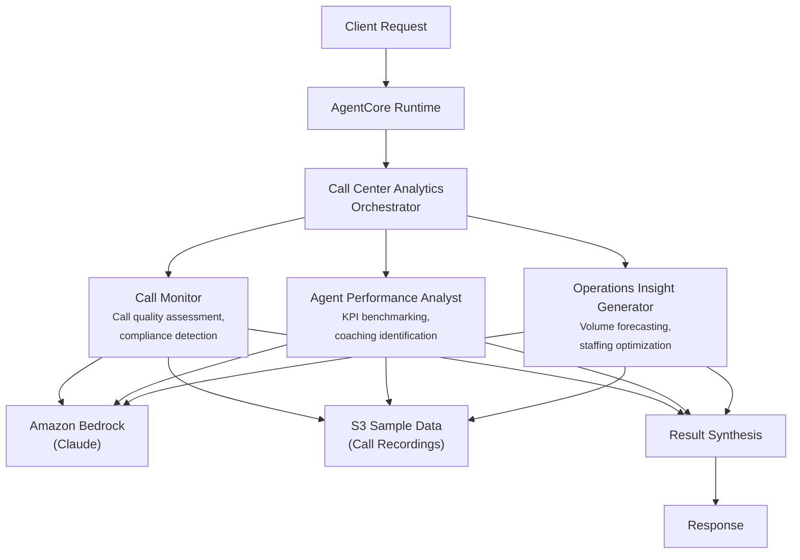

# Call Center Analytics

AI-powered call center performance optimization system that monitors call quality, benchmarks agent performance, and generates operational insights for financial services contact centers.

## Overview

The Call Center Analytics use case coordinates three specialist agents to provide comprehensive contact center intelligence. It evaluates call quality and compliance adherence, benchmarks agent KPIs with coaching recommendations, and identifies operational bottlenecks with staffing optimization guidance -- giving operations managers a complete view of center health with actionable improvement plans.

## Business Value

- **Quality assurance at scale** -- Automated call quality scoring and compliance monitoring across all interactions
- **Targeted coaching** -- Data-driven agent performance benchmarking identifies specific coaching opportunities
- **Staffing optimization** -- Volume pattern analysis and forecasting enable proactive capacity planning
- **Compliance risk reduction** -- Real-time regulatory violation detection prevents costly penalties
- **Operational efficiency** -- Bottleneck identification and process improvement recommendations reduce handle times

## Architecture



### Directory Structure

```
use_cases/call_center_analytics/
├── README.md
└── src/
    ├── __init__.py                              # Framework router + registry
    ├── strands/
    │   ├── __init__.py
    │   ├── config.py
    │   ├── models.py                            # AnalyticsRequest / AnalyticsResponse
    │   ├── orchestrator.py                      # CallCenterAnalyticsOrchestrator
    │   └── agents/
    │       ├── __init__.py
    │       ├── call_monitor.py
    │       ├── agent_performance_analyst.py
    │       └── operations_insight_generator.py
    └── langchain_langgraph/
        ├── __init__.py
        ├── config.py
        ├── models.py
        ├── orchestrator.py
        └── agents/
            ├── __init__.py
            ├── call_monitor.py
            ├── agent_performance_analyst.py
            └── operations_insight_generator.py
```

## Agentic Design

The `CallCenterAnalyticsOrchestrator` extends `StrandsOrchestrator` and uses a **parallel fan-out / synthesize** pattern:

1. **Fan-out** -- For `full` analysis, all three agents run in parallel via `asyncio.gather` (async) or `run_parallel` (sync), each retrieving call center data from S3.
2. **Targeted modes** -- `call_monitoring_only`, `performance_only`, and `operations_only` run individual agents for focused analysis.
3. **Synthesis** -- Agent results are combined using `build_structured_synthesis_prompt` with a schema covering call monitoring (quality, sentiment, compliance), performance metrics (AHT, FCR, CSAT, coaching priority), and operational insights (trends, peaks, bottlenecks, staffing). The orchestrator LLM produces the final structured report.

## Agents

### Call Monitor
- **Role**: Monitors call quality and compliance across interactions
- **Data**: Call center profile and recordings from S3 (`data_type='profile'`)
- **Produces**: Overall quality rating (excellent/good/fair/poor), average sentiment, compliance score (0-1), quality issues, compliance violations
- **Tool**: `s3_retriever_tool`

### Agent Performance Analyst
- **Role**: Analyzes agent performance metrics and identifies coaching opportunities
- **Data**: Call center performance data from S3
- **Produces**: Average handle time, first call resolution rate, CSAT score, coaching priority (low/medium/high/critical), top performers, coaching opportunities, KPI summary
- **Tool**: `s3_retriever_tool`

### Operations Insight Generator
- **Role**: Generates operational optimization insights including volume forecasting and staffing recommendations
- **Data**: Call center operational data from S3
- **Produces**: Call volume trends, peak hours, bottlenecks, staffing recommendations, process improvements, forecast summary
- **Tool**: `s3_retriever_tool`

## Data & Tools

| Resource | Description |
|----------|-------------|
| `s3_retriever_tool` | Retrieves call center profiles, call data, and metrics from S3 |
| S3 path | `data/samples/call_center_analytics/{call_center_id}/profile.json` |

## Request / Response

**`AnalyticsRequest`**
| Field | Type | Description |
|-------|------|-------------|
| `call_center_id` | `str` | Call center identifier (e.g., `CC001`) |
| `analysis_type` | `AnalysisType` | `full`, `call_monitoring_only`, `performance_only`, `operations_only` |
| `additional_context` | `str \| None` | Optional context |

**`AnalyticsResponse`**
| Field | Type | Description |
|-------|------|-------------|
| `call_center_id` | `str` | Call center identifier |
| `analytics_id` | `str` | Unique analytics session UUID |
| `timestamp` | `datetime` | Analysis timestamp |
| `call_monitoring` | `CallMonitoringResult \| None` | Quality, sentiment, compliance score, violations |
| `performance_metrics` | `PerformanceMetrics \| None` | AHT, FCR, CSAT, coaching priority, top performers |
| `operational_insights` | `OperationalInsights \| None` | Volume trends, peak hours, bottlenecks, staffing recs |
| `summary` | `str` | Executive summary |
| `raw_analysis` | `dict` | Raw output from each agent |

**Example Request:**
```json
{
  "call_center_id": "CC001",
  "analysis_type": "full"
}
```

**Example Response:**
```json
{
  "call_center_id": "CC001",
  "analytics_id": "uuid",
  "timestamp": "2026-03-25T00:00:00Z",
  "call_monitoring": {
    "overall_quality": "good",
    "average_sentiment": "positive",
    "compliance_score": 0.92,
    "calls_reviewed": 50,
    "quality_issues": ["Inconsistent greeting scripts"],
    "compliance_violations": []
  },
  "performance_metrics": {
    "average_handle_time": 285.0,
    "first_call_resolution_rate": 0.72,
    "customer_satisfaction_score": 4.1,
    "coaching_priority": "medium",
    "top_performers": ["Agent_012", "Agent_045"],
    "coaching_opportunities": ["Reduce hold times during transfers"]
  },
  "operational_insights": {
    "call_volume_trend": "increasing 5% week-over-week",
    "peak_hours": ["10:00-11:00", "14:00-15:00"],
    "bottlenecks": ["dispute resolution queue"],
    "staffing_recommendations": ["Add 2 agents during peak hours"]
  },
  "summary": "Center performing well overall with opportunity to improve FCR and reduce peak-hour bottlenecks."
}
```

## Quick Start

```bash
USE_CASE_ID=call_center_analytics FRAMEWORK=strands AWS_REGION=us-east-1 \
  ./applications/fsi_foundry/scripts/deploy/full/deploy_agentcore.sh
```

## Sample Data

| Entity ID | Name | Description |
|-----------|------|-------------|
| CC001 | Northeast Financial Services Center | 150-agent center in Boston, 2500 daily calls |

## Related Documentation

- [Platform Overview](../../docs/foundations/README.md)
- [Architecture Patterns](../../docs/foundations/architecture/architecture_patterns.md)
- [Deployment Guide](../../docs/foundations/deployment/deployment_patterns.md)
- [Implementation Details](../../docs/use_cases/call_center_analytics/implementation.md)
