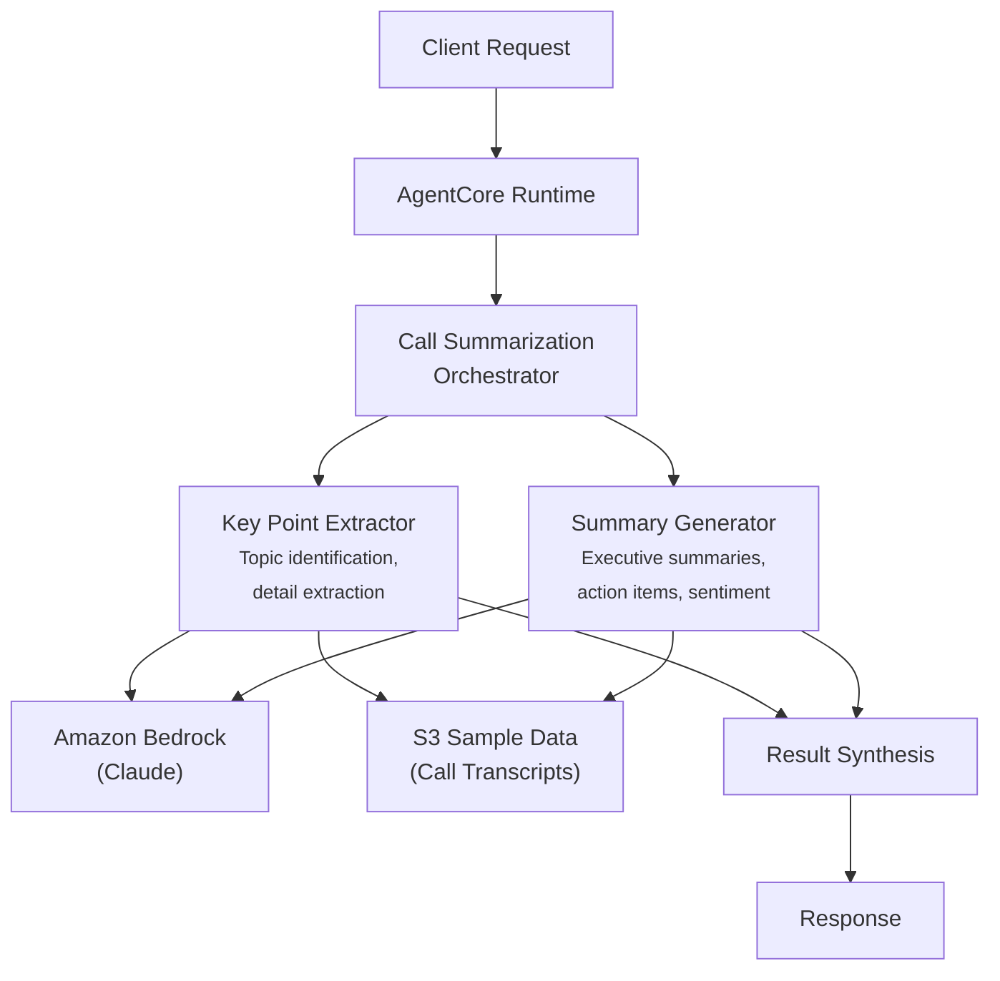

# Call Summarization

AI-powered call summarization system that extracts key points and generates executive summaries from banking customer service call transcripts.

## Overview

The Call Summarization use case coordinates two specialist agents to transform raw call transcripts into structured, actionable summaries. It identifies key discussion topics with confidence scoring, determines call outcomes, and produces executive summaries with action items and customer sentiment -- enabling managers and agents to quickly understand call content without reviewing full transcripts.

## Business Value

- **Time savings** -- Automated summarization eliminates manual transcript review for supervisors and quality teams
- **Structured output** -- Key points extracted with topic labels, detail, and confidence scores for consistent documentation
- **Action tracking** -- Follow-up tasks automatically identified and listed for accountability
- **Sentiment awareness** -- Customer sentiment assessment flags interactions needing attention
- **Multi-audience support** -- Summaries tailored for executive, manager, agent, or detailed audiences

## Architecture



### Directory Structure

```
use_cases/call_summarization/
├── README.md
└── src/
    ├── __init__.py                              # Framework router + registry
    ├── strands/
    │   ├── __init__.py
    │   ├── config.py
    │   ├── models.py                            # SummarizationRequest / SummarizationResponse
    │   ├── orchestrator.py                      # CallSummarizationOrchestrator
    │   └── agents/
    │       ├── __init__.py
    │       ├── key_point_extractor.py
    │       └── summary_generator.py
    └── langchain_langgraph/
        ├── __init__.py
        ├── config.py
        ├── models.py
        ├── orchestrator.py
        └── agents/
            ├── __init__.py
            ├── key_point_extractor.py
            └── summary_generator.py
```

## Agentic Design

The `CallSummarizationOrchestrator` extends `StrandsOrchestrator` and uses a **parallel fan-out / synthesize** pattern with two agents:

1. **Fan-out** -- For `full` summarization, both agents run in parallel via `asyncio.gather` (async) or `run_parallel` (sync), each retrieving call data from S3.
2. **Targeted modes** -- `key_points_only` runs the extractor alone; `summary_only` runs the generator alone.
3. **Synthesis** -- Agent results are combined using `build_structured_synthesis_prompt` with a schema covering key points (topic, detail, confidence), call outcome, topics discussed, executive summary, action items, and customer sentiment. The orchestrator LLM produces the final comprehensive summary.

## Agents

### Key Point Extractor
- **Role**: Identifies discussion topics, extracts detailed key points with confidence scoring, and determines call outcome
- **Data**: Call transcript from S3 (`data_type='profile'`)
- **Produces**: Key points list (each with topic, detail, confidence 0-1), call outcome (resolved/escalated/follow_up/unresolved), topics discussed
- **Tool**: `s3_retriever_tool`

### Summary Generator
- **Role**: Creates executive summaries with action items and customer sentiment assessment
- **Data**: Call transcript from S3
- **Produces**: Executive summary, action items list, customer sentiment (positive/neutral/negative), audience level
- **Tool**: `s3_retriever_tool`

## Data & Tools

| Resource | Description |
|----------|-------------|
| `s3_retriever_tool` | Retrieves call transcripts and metadata from S3 |
| S3 path | `data/samples/call_summarization/{call_id}/profile.json` |

## Request / Response

**`SummarizationRequest`**
| Field | Type | Description |
|-------|------|-------------|
| `call_id` | `str` | Call identifier (e.g., `CALL001`) |
| `summarization_type` | `SummarizationType` | `full`, `key_points_only`, `summary_only` |
| `additional_context` | `str \| None` | Optional context |

**`SummarizationResponse`**
| Field | Type | Description |
|-------|------|-------------|
| `call_id` | `str` | Call identifier |
| `summarization_id` | `str` | Unique summarization UUID |
| `timestamp` | `datetime` | Summarization timestamp |
| `key_points` | `KeyPointsResult \| None` | Key points with confidence, call outcome, topics |
| `summary` | `SummaryResult \| None` | Executive summary, action items, sentiment |
| `overall_summary` | `str` | Comprehensive combined summary |
| `raw_analysis` | `dict` | Raw output from each agent |

**Example Request:**
```json
{
  "call_id": "CALL001",
  "summarization_type": "full"
}
```

**Example Response:**
```json
{
  "call_id": "CALL001",
  "summarization_id": "uuid",
  "timestamp": "2026-03-25T00:00:00Z",
  "key_points": {
    "key_points": [
      {"topic": "Mortgage Status", "detail": "Application in underwriting review, expected 5-7 business days", "confidence": 0.92},
      {"topic": "Documentation", "detail": "Additional pay stubs requested for verification", "confidence": 0.88}
    ],
    "call_outcome": "resolved",
    "topics_discussed": ["mortgage application", "documentation requirements", "timeline"]
  },
  "summary": {
    "executive_summary": "Customer called regarding mortgage application status. Application is in underwriting. Additional documentation requested.",
    "action_items": ["Submit last 2 pay stubs by Friday", "Follow up if no update in 7 business days"],
    "customer_sentiment": "neutral"
  },
  "overall_summary": "Routine mortgage inquiry resolved with clear next steps for the customer."
}
```

## Quick Start

```bash
USE_CASE_ID=call_summarization FRAMEWORK=strands AWS_REGION=us-east-1 \
  ./applications/fsi_foundry/scripts/deploy/full/deploy_agentcore.sh
```

## Sample Data

| Call ID | Type | Description |
|---------|------|-------------|
| CALL001 | Mortgage Inquiry | Inbound call about mortgage application status |

## Related Documentation

- [Platform Overview](../../docs/foundations/README.md)
- [Architecture Patterns](../../docs/foundations/architecture/architecture_patterns.md)
- [Deployment Guide](../../docs/foundations/deployment/deployment_patterns.md)
