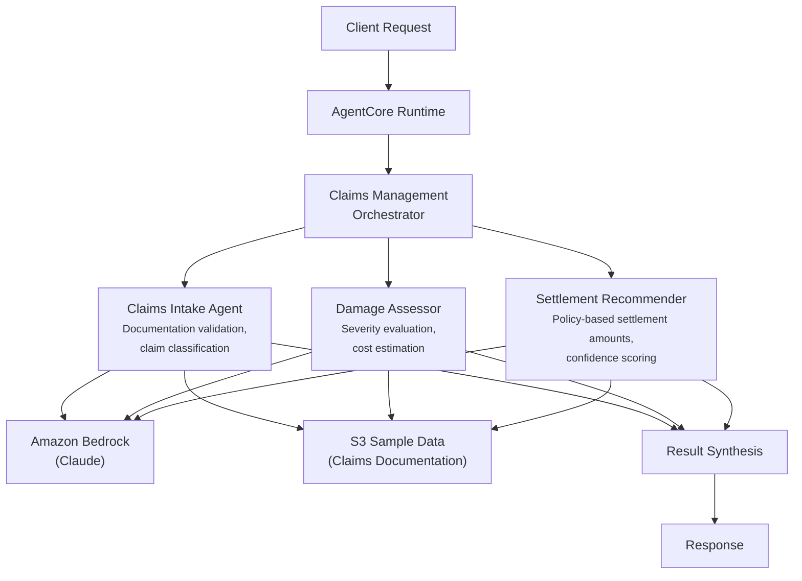

# Claims Management

AI-powered claims processing system that automates intake validation, damage assessment, and settlement recommendations for insurance companies.

## Overview

The Claims Management use case coordinates three specialist agents to streamline end-to-end insurance claims processing. It validates documentation completeness, assesses damage severity with cost estimates, and generates policy-based settlement recommendations with confidence scoring -- enabling claims adjusters to process claims faster while maintaining fairness and compliance.

## Business Value

- **Faster claims resolution** -- Parallel processing of intake, assessment, and settlement reduces cycle time from days to minutes
- **Consistent adjudication** -- Standardized severity classification and policy-based settlement calculations across all claim types
- **Fraud detection** -- Automated fraud indicator identification during damage assessment
- **Reduced leakage** -- Confidence-scored settlements with historical comparison reduce over/under-payment
- **Compliance assurance** -- Structured audit trail with full raw analysis for regulatory documentation

## Architecture



### Directory Structure

```
use_cases/claims_management/
├── README.md
└── src/
    ├── __init__.py                              # Framework router + registry
    ├── strands/
    │   ├── __init__.py
    │   ├── config.py
    │   ├── models.py                            # ClaimRequest / ClaimResponse
    │   ├── orchestrator.py                      # ClaimsManagementOrchestrator
    │   └── agents/
    │       ├── __init__.py
    │       ├── claims_intake_agent.py
    │       ├── damage_assessor.py
    │       └── settlement_recommender.py
    └── langchain_langgraph/
        ├── __init__.py
        ├── config.py
        ├── models.py
        ├── orchestrator.py
        └── agents/
            ├── __init__.py
            ├── claims_intake_agent.py
            ├── damage_assessor.py
            └── settlement_recommender.py
```

## Agentic Design

The `ClaimsManagementOrchestrator` extends `StrandsOrchestrator` and uses a **parallel fan-out / synthesize** pattern:

1. **Fan-out** -- For `full` assessments, all three agents run in parallel via `asyncio.gather` (async) or `run_parallel` (sync), each retrieving claim data from S3.
2. **Targeted modes** -- `claims_intake_only`, `damage_assessment_only`, and `settlement_only` run individual agents for focused analysis.
3. **Synthesis** -- Agent results are combined using `build_structured_synthesis_prompt` with a comprehensive response schema covering claim type, status, severity, costs, settlement amount, and justification. The orchestrator LLM produces the final structured summary.

## Agents

### Claims Intake Agent
- **Role**: Validates claim documentation, classifies claim type, checks completeness, and extracts key details
- **Data**: Claim profile from S3 (`data_type='profile'`)
- **Produces**: Claim type classification (auto/property/liability/health/life), documentation completeness status, missing documents list, key detail extraction
- **Tool**: `s3_retriever_tool`

### Damage Assessor
- **Role**: Evaluates damage severity and estimates repair/replacement costs with evidence quality analysis
- **Data**: Claim documentation from S3
- **Produces**: Severity classification (low/moderate/high/catastrophic), repair and replacement cost estimates, evidence quality evaluation, fraud indicator flags
- **Tool**: `s3_retriever_tool`

### Settlement Recommender
- **Role**: Calculates policy-based settlement amounts with confidence scoring and historical comparison
- **Data**: Claim and policy data from S3
- **Produces**: Recommended settlement amount, confidence score (0-1), coverage applicability assessment, justification points, comparable settlement references
- **Tool**: `s3_retriever_tool`

## Data & Tools

| Resource | Description |
|----------|-------------|
| `s3_retriever_tool` | Retrieves claim profiles and documentation from S3 |
| S3 path | `data/samples/claims_management/{claim_id}/profile.json` |

## Request / Response

**`ClaimRequest`**
| Field | Type | Description |
|-------|------|-------------|
| `claim_id` | `str` | Claim identifier (e.g., `CLAIM001`) |
| `assessment_type` | `AssessmentType` | `full`, `claims_intake_only`, `damage_assessment_only`, `settlement_only` |
| `additional_context` | `str \| None` | Optional context |

**`ClaimResponse`**
| Field | Type | Description |
|-------|------|-------------|
| `claim_id` | `str` | Claim identifier |
| `assessment_id` | `str` | Unique assessment UUID |
| `timestamp` | `datetime` | Assessment timestamp |
| `intake_summary` | `IntakeSummary \| None` | Claim type, status, documentation completeness, missing docs |
| `damage_assessment` | `DamageAssessment \| None` | Severity, repair/replacement costs, findings |
| `settlement_recommendation` | `SettlementRecommendation \| None` | Amount, confidence score, justification |
| `summary` | `str` | Executive summary |
| `raw_analysis` | `dict` | Raw output from each agent |

**Example Request:**
```json
{
  "claim_id": "CLAIM001",
  "assessment_type": "full"
}
```

**Example Response:**
```json
{
  "claim_id": "CLAIM001",
  "assessment_id": "uuid",
  "timestamp": "2026-03-25T00:00:00Z",
  "intake_summary": {
    "claim_type": "auto",
    "status": "under_review",
    "documentation_complete": "false",
    "missing_documents": ["medical_report"],
    "key_details": {},
    "notes": ["Police report included"]
  },
  "damage_assessment": {
    "severity": "moderate",
    "estimated_repair_cost": 12500.00,
    "estimated_replacement_cost": 0.0,
    "evidence_quality": "adequate",
    "findings": ["Rear bumper and trunk damage"]
  },
  "settlement_recommendation": {
    "recommended_amount": 12000.00,
    "confidence_score": 0.82,
    "policy_coverage_applicable": true,
    "justification": ["Within policy limits", "Consistent with comparable claims"]
  },
  "summary": "Moderate auto claim with adequate documentation. Settlement recommended pending medical report."
}
```

## Quick Start

```bash
USE_CASE_ID=claims_management FRAMEWORK=strands AWS_REGION=us-east-1 \
  ./applications/fsi_foundry/scripts/deploy/full/deploy_agentcore.sh
```

## Sample Data

| Claim ID | Type | Description |
|----------|------|-------------|
| CLAIM001 | Auto | Rear-end collision, comprehensive auto policy |
| CLAIM002 | Auto | Multi-vehicle incident |
| CLAIM003 | Auto | Additional claim scenario |

## Related Documentation

- [Platform Overview](../../docs/foundations/README.md)
- [Architecture Patterns](../../docs/foundations/architecture/architecture_patterns.md)
- [Deployment Guide](../../docs/foundations/deployment/deployment_patterns.md)
- [Implementation Details](../../docs/use_cases/claims_management/implementation.md)
