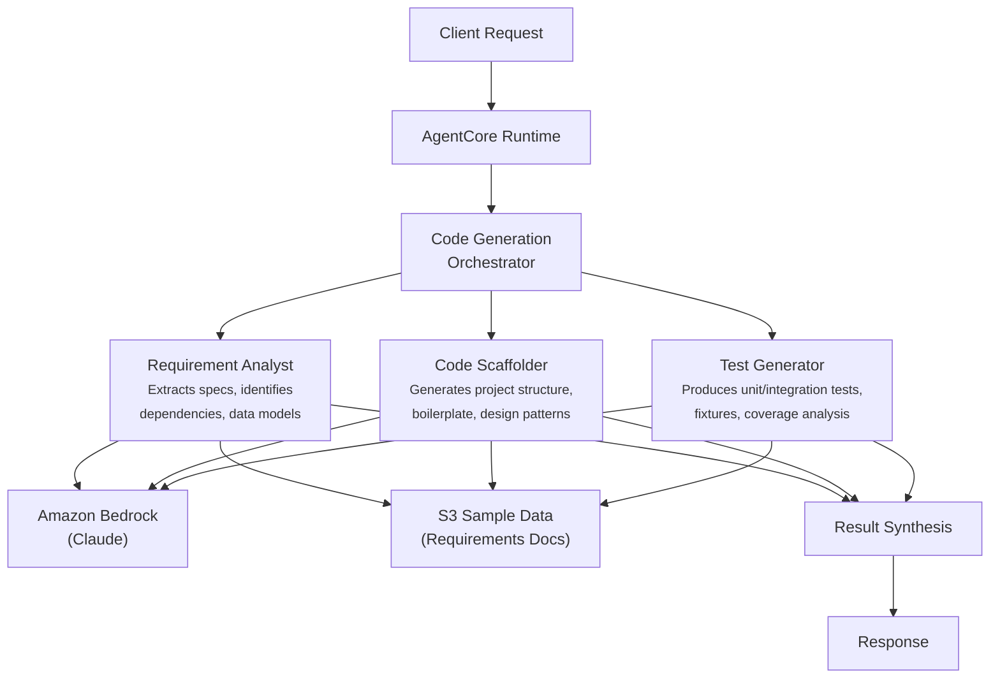

# Code Generation

AI-powered code generation system that analyzes requirements, scaffolds project structures, and generates tests for financial services software development.

## Overview

The Code Generation use case coordinates three specialist agents to accelerate software development. It extracts functional and non-functional specifications from requirements documents, generates project scaffolding with appropriate design patterns and configuration, and produces unit and integration tests with coverage analysis -- providing development teams with a comprehensive code generation pipeline.

## Business Value

- **Accelerated development** -- Automated scaffolding and test generation reduce boilerplate coding time significantly
- **Requirements traceability** -- Structured extraction of specs, dependencies, and data models ensures nothing is missed
- **Quality built-in** -- Generated tests with coverage targets and fixture management establish quality from the start
- **Pattern consistency** -- Design pattern application and project structure generation enforce team standards
- **PCI-DSS awareness** -- Financial services compliance requirements factored into generated code and tests

## Architecture



### Directory Structure

```
use_cases/code_generation/
├── README.md
└── src/
    ├── __init__.py                              # Framework router + registry
    ├── strands/
    │   ├── __init__.py
    │   ├── config.py
    │   ├── models.py                            # GenerationRequest / GenerationResponse
    │   ├── orchestrator.py                      # CodeGenerationOrchestrator
    │   └── agents/
    │       ├── __init__.py
    │       ├── requirement_analyst.py
    │       ├── code_scaffolder.py
    │       └── test_generator.py
    └── langchain_langgraph/
        ├── __init__.py
        ├── config.py
        ├── models.py
        ├── orchestrator.py
        └── agents/
            ├── __init__.py
            ├── requirement_analyst.py
            ├── code_scaffolder.py
            └── test_generator.py
```

## Agentic Design

The `CodeGenerationOrchestrator` extends `StrandsOrchestrator` and uses a **parallel fan-out / synthesize** pattern:

1. **Fan-out** -- For `full` scope, all three agents run in parallel via `asyncio.gather` (async) or `run_parallel` (sync), each retrieving project data from S3.
2. **Targeted modes** -- `requirements_only`, `scaffolding_only`, and `testing_only` run individual agents for focused work.
3. **Synthesis** -- Agent results are combined using `build_structured_synthesis_prompt` with a schema covering requirement analysis (functional/non-functional requirements, dependencies, data models), scaffolded code (files generated, structure, design patterns, quality), and test generation (unit/integration tests, coverage estimate, frameworks). The orchestrator LLM produces a quality assessment with recommendations.

## Agents

### Requirement Analyst
- **Role**: Analyzes requirements documents to extract functional and non-functional specifications, identify dependencies, and generate technical specs
- **Data**: Project profile and requirements from S3 (`data_type='profile'`)
- **Produces**: Functional requirements, non-functional requirements, dependencies, technical specifications, data models, API contracts, risks
- **Tool**: `s3_retriever_tool`

### Code Scaffolder
- **Role**: Generates project structure, boilerplate code, applies design patterns, and produces configuration files
- **Data**: Project profile from S3
- **Produces**: Files generated count, project structure, design patterns applied, code quality rating (low/medium/high/production_ready), boilerplate components, configuration files
- **Tool**: `s3_retriever_tool`

### Test Generator
- **Role**: Produces unit and integration tests with fixtures, coverage analysis, and test documentation
- **Data**: Project profile from S3
- **Produces**: Unit tests generated, integration tests generated, test coverage estimate (0-100%), test frameworks used, test fixtures created, manual testing notes
- **Tool**: `s3_retriever_tool`

## Data & Tools

| Resource | Description |
|----------|-------------|
| `s3_retriever_tool` | Retrieves project profiles, requirements documents, and specifications from S3 |
| S3 path | `data/samples/code_generation/{project_id}/profile.json` |

## Request / Response

**`GenerationRequest`**
| Field | Type | Description |
|-------|------|-------------|
| `project_id` | `str` | Project identifier (e.g., `PROJ001`) |
| `generation_scope` | `GenerationScope` | `full`, `requirements_only`, `scaffolding_only`, `testing_only` |
| `additional_context` | `str \| None` | Optional context |

**`GenerationResponse`**
| Field | Type | Description |
|-------|------|-------------|
| `project_id` | `str` | Project identifier |
| `generation_id` | `str` | Unique generation UUID |
| `timestamp` | `datetime` | Generation timestamp |
| `requirement_analysis` | `RequirementAnalysisResult \| None` | Functional/non-functional reqs, dependencies, data models |
| `scaffolded_code` | `ScaffoldedCodeResult \| None` | Files generated, structure, design patterns, quality |
| `test_output` | `TestGenerationResult \| None` | Tests generated, coverage estimate, frameworks |
| `summary` | `str` | Executive summary |
| `raw_analysis` | `dict` | Raw output from each agent |

**Example Request:**
```json
{
  "project_id": "PROJ001",
  "generation_scope": "full"
}
```

**Example Response:**
```json
{
  "project_id": "PROJ001",
  "generation_id": "uuid",
  "timestamp": "2026-03-25T00:00:00Z",
  "requirement_analysis": {
    "functional_requirements": ["Payment processing API", "Transaction validation", "Audit logging"],
    "non_functional_requirements": ["PCI-DSS compliance", "99.9% uptime", "<200ms latency"],
    "dependencies": ["FastAPI", "SQLAlchemy", "Pydantic", "Redis"],
    "data_models": ["Transaction", "PaymentMethod", "AuditLog", "Merchant"]
  },
  "scaffolded_code": {
    "files_generated": 12,
    "project_structure": ["src/api/", "src/models/", "src/services/", "src/config/"],
    "design_patterns_applied": ["Repository pattern", "Service layer", "Dependency injection"],
    "code_quality": "high"
  },
  "test_output": {
    "unit_tests_generated": 24,
    "integration_tests_generated": 8,
    "test_coverage_estimate": 87.5,
    "test_frameworks_used": ["pytest", "httpx"]
  },
  "summary": "Payment Gateway API scaffolded with 12 files, 32 tests, and 87.5% coverage estimate."
}
```

## Quick Start

```bash
USE_CASE_ID=code_generation FRAMEWORK=strands AWS_REGION=us-east-1 \
  ./applications/fsi_foundry/scripts/deploy/full/deploy_agentcore.sh
```

## Sample Data

| Project ID | Profile | Description |
|-----------|---------|-------------|
| PROJ001 | Payment Gateway API | FastAPI Python project with 4 modules, PCI-DSS compliance |

## Related Documentation

- [Platform Overview](../../docs/foundations/README.md)
- [Architecture Patterns](../../docs/foundations/architecture/architecture_patterns.md)
- [Deployment Guide](../../docs/foundations/deployment/deployment_patterns.md)
