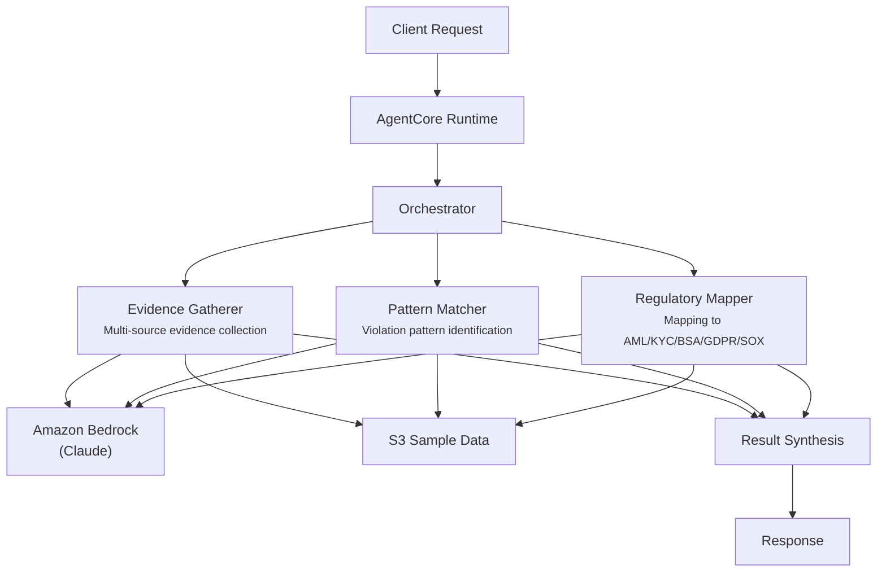

# Compliance Investigation

## Overview

The Compliance Investigation use case automates regulatory investigations by coordinating evidence collection, violation pattern detection, and regulatory requirement mapping. It processes transaction records, communications, and audit logs to identify AML, KYC, BSA, GDPR, and SOX violations, producing structured investigation reports with severity classifications and remediation recommendations.

## Business Value

- **Accelerated investigations** -- parallel evidence gathering, pattern matching, and regulatory mapping reduce investigation timelines from weeks to minutes
- **Comprehensive coverage** -- agents systematically cross-reference transaction records, communications, audit logs, and public records
- **Regulatory precision** -- automated mapping to specific regulatory requirements (AML, BSA, KYC, GDPR, SOX) with violation severity classification
- **Evidence integrity** -- structured evidence cataloging with metadata, completeness assessment, and gap identification
- **Remediation guidance** -- actionable recommendations aligned with regulatory expectations and enforcement precedents

## Architecture



### Directory Structure

```
use_cases/compliance_investigation/
├── README.md
└── src/
    └── strands/
        ├── __init__.py
        ├── config.py          # ComplianceInvestigationSettings
        ├── models.py          # Pydantic request/response models
        ├── orchestrator.py    # ComplianceInvestigationOrchestrator + run_compliance_investigation()
        └── agents/
            ├── __init__.py
            ├── evidence_gatherer.py
            ├── pattern_matcher.py
            └── regulatory_mapper.py
```

## Agentic Design

The orchestrator uses a **parallel fan-out** pattern. In `full` mode, all three agents execute concurrently via `asyncio.gather`. Individual modes (`evidence_collection`, `pattern_analysis`, `regulatory_mapping`) invoke a single agent. The orchestrator synthesizes findings into a structured investigation report with evidence, patterns, regulatory mappings, and recommended actions.

## Agents

| Agent | Role | Data Used | Output |
|-------|------|-----------|--------|
| **Evidence Gatherer** | Collects and catalogs evidence from transaction records, communications, audit logs, and third-party sources with chain-of-custody metadata | Entity profile via `s3_retriever_tool` | Evidence items with source/relevance, completeness assessment, identified gaps, priority evidence |
| **Pattern Matcher** | Identifies compliance violation patterns including structuring, smurfing, timing anomalies, geographic risk, and behavioral deviations | Entity profile via `s3_retriever_tool` | Patterns with confidence scores, anomalies, risk indicators, pattern classification |
| **Regulatory Mapper** | Maps findings to regulatory frameworks (AML, KYC, BSA, GDPR, SOX, FATF), classifies violation severity, identifies applicable penalties | Entity profile via `s3_retriever_tool` | Regulatory mappings, violation severity, applicable penalties, remediation recommendations |

## Data and Tools

- **Tool:** `s3_retriever_tool` -- retrieves entity profiles, transaction records, and communications from S3
- **S3 data prefix:** `samples/compliance_investigation/`
- **Model:** Claude Sonnet (via Amazon Bedrock), temperature 0.1, max 8192 tokens
- **Config thresholds:** `violation_confidence_threshold=0.75`, `evidence_completeness_target=0.85`, `max_investigation_time_seconds=60`

## Request / Response

**Request** -- `InvestigationRequest`:

| Field | Type | Description |
|-------|------|-------------|
| `entity_id` | `str` | Entity under investigation (e.g., `CASE001`) |
| `investigation_type` | `InvestigationType` | `full`, `evidence_collection`, `pattern_analysis`, `regulatory_mapping` |
| `additional_context` | `str \| None` | Optional context |

**Response** -- `InvestigationResponse`:

| Field | Type | Description |
|-------|------|-------------|
| `entity_id` | `str` | Entity identifier |
| `investigation_id` | `str` | Unique investigation UUID |
| `timestamp` | `datetime` | Investigation timestamp |
| `findings` | `InvestigationFindings \| None` | Status, violations count, evidence items, patterns, risk indicators, recommendations |
| `regulatory_mappings` | `list[RegulatoryMapping]` | Regulation, requirement, violation type, severity, evidence references |
| `summary` | `str` | Executive summary |
| `raw_analysis` | `dict` | Raw agent output |

## Quick Start

```bash
# Deploy to AgentCore
USE_CASE_ID=compliance_investigation ./scripts/deploy/full/deploy_agentcore.sh

# Test the deployment
./scripts/use_cases/compliance_investigation/test/test_agentcore.sh
```

## Sample Data

Located at `data/samples/compliance_investigation/`

| Case ID | Entity | Description |
|---------|--------|-------------|
| CASE001 | GlobalTrade Financial Services | AML/KYC compliance review -- flagged $150K wire transfer (unusual pattern) and $75K cash deposit (suspected structuring), data from transaction records, communications, and audit logs |

## Related Documentation

- [FSI Foundry Overview](../../../README.md)
- [Architecture Patterns](../../docs/foundations/architecture/architecture_patterns.md)
- [Deployment Guide](../../docs/foundations/deployment/deployment_patterns.md)
- [Implementation Details](../../docs/use_cases/compliance_investigation/implementation.md)
