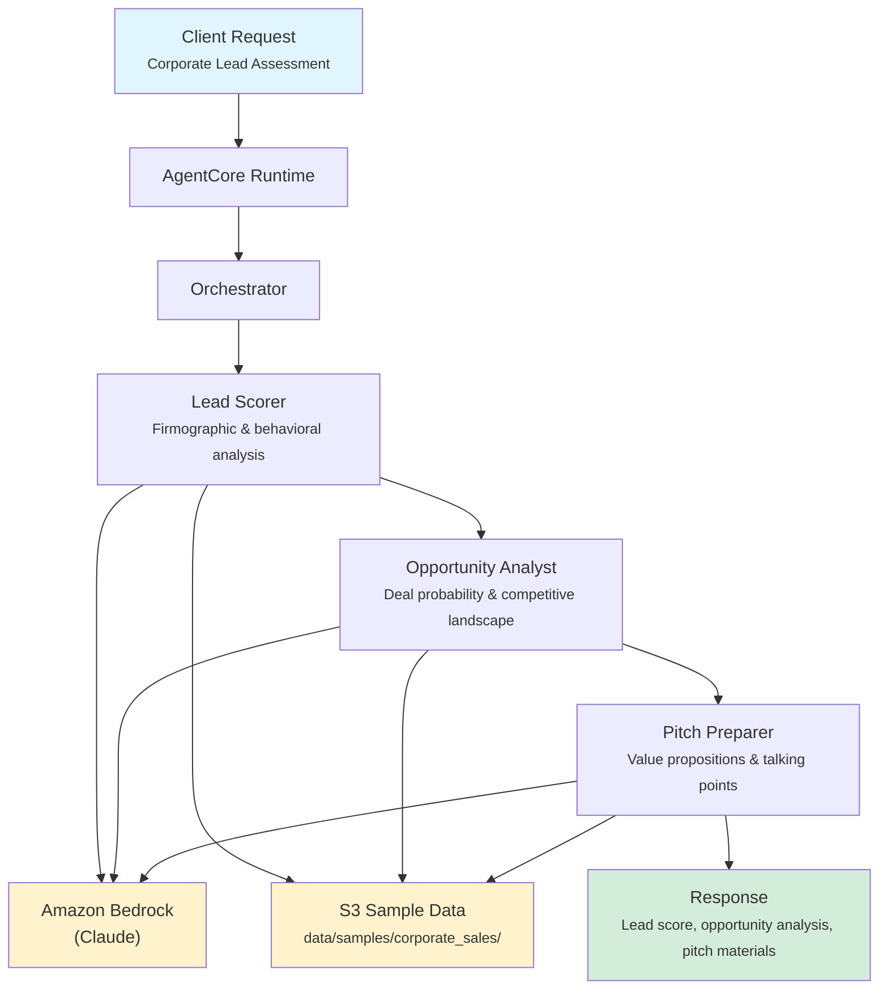

# Corporate Sales

AI-powered corporate sales intelligence for banking, providing lead scoring, opportunity analysis, and customized pitch preparation to help relationship managers close deals faster.

## Overview

The Corporate Sales application evaluates corporate banking prospects through three coordinated agents that score leads based on firmographic and behavioral data, assess deal probability and competitive positioning, and generate tailored pitch materials with value propositions. The orchestrator synthesizes these into a unified sales assessment with actionable next steps.

## Business Value

- **Prioritize High-Value Leads** -- Data-driven lead scoring replaces subjective prioritization with quantified tier rankings
- **Improve Win Rates** -- Opportunity analysis identifies key drivers, risks, and optimal engagement timing
- **Accelerate Pitch Prep** -- Auto-generated value propositions and talking points reduce preparation time
- **Competitive Advantage** -- AI-powered competitive landscape evaluation surfaces differentiation opportunities
- **Consistent Sales Process** -- Standardized assessment methodology across the entire sales team

## Architecture



### Directory Structure

```
use_cases/corporate_sales/
├── README.md
└── src/
    ├── __init__.py                              # Framework router
    ├── strands/
    │   ├── __init__.py
    │   ├── config.py                            # Sales settings
    │   ├── models.py                            # SalesRequest / SalesResponse
    │   ├── orchestrator.py                      # CorporateSalesOrchestrator
    │   └── agents/
    │       ├── lead_scorer.py                   # LeadScorer agent
    │       ├── opportunity_analyst.py           # OpportunityAnalyst agent
    │       └── pitch_preparer.py                # PitchPreparer agent
    └── langchain_langgraph/                     # LangGraph implementation (same structure)
```

## Agentic Design

The `CorporateSalesOrchestrator` extends `StrandsOrchestrator` and implements a **routing + parallel** pattern:

1. **Analysis Type Routing** -- The `analysis_type` field determines which agents are invoked: `full` runs all three in parallel; `lead_scoring`, `opportunity_analysis`, and `pitch_preparation` each route to a single specialist.
2. **Parallel Execution** -- For full assessments, all three agents run concurrently via `asyncio.gather()`.
3. **Synthesis** -- A supervisor LLM call combines agent outputs into a lead priority and tier classification, opportunity stage and deal confidence, key pitch points, and recommended next steps with timeline.

## Agents

### Lead Scorer

| Field | Detail |
|-------|--------|
| **Class** | `LeadScorer(StrandsAgent)` |
| **Role** | Scores and prioritizes corporate leads based on firmographic and behavioral data |
| **Data** | Prospect profile via `s3_retriever_tool` |
| **Produces** | Lead score (0-100), tier (HOT/WARM/COLD/UNQUALIFIED), scoring factors, engagement recommendations |

### Opportunity Analyst

| Field | Detail |
|-------|--------|
| **Class** | `OpportunityAnalyst(StrandsAgent)` |
| **Role** | Analyzes sales opportunities, assesses deal probability, evaluates competitive landscape |
| **Data** | Prospect profile via `s3_retriever_tool` |
| **Produces** | Opportunity stage (PROSPECTING through CLOSED_WON/CLOSED_LOST), deal confidence (0.0-1.0), estimated value, key drivers, risks, next steps |

### Pitch Preparer

| Field | Detail |
|-------|--------|
| **Class** | `PitchPreparer(StrandsAgent)` |
| **Role** | Generates customized pitch materials, value propositions, and talking points |
| **Data** | Prospect profile via `s3_retriever_tool` |
| **Produces** | Key value propositions, prioritized talking points, competitive differentiators, recommended products/services, ROI projections |

## Data and Tools

- **Tool:** `s3_retriever_tool` -- Retrieves prospect data from S3 by customer ID
- **S3 Path:** `data/samples/corporate_sales/{customer_id}/`
- **Data Files:** `profile.json` (company info, industry, revenue, existing relationships, engagement history)

## Request / Response

### Request (`SalesRequest`)

```python
class SalesRequest(BaseModel):
    customer_id: str                               # e.g. "CORP001"
    analysis_type: AnalysisType = "full"           # full | lead_scoring | opportunity_analysis | pitch_preparation
    additional_context: str | None = None
```

### Response (`SalesResponse`)

```python
class SalesResponse(BaseModel):
    customer_id: str
    assessment_id: str                             # UUID
    timestamp: datetime
    lead_score: LeadScore | None                   # score, tier, factors, recommendations
    opportunity: OpportunityDetail | None           # stage, confidence, estimated_value, key_drivers, risks, next_steps
    recommendations: list[str]                     # Pitch and engagement recommendations
    summary: str                                   # Executive summary
    raw_analysis: dict
```

**Lead Tiers:** `hot`, `warm`, `cold`, `unqualified`
**Opportunity Stages:** `prospecting`, `qualification`, `proposal`, `negotiation`, `closed_won`, `closed_lost`

## Quick Start

```bash
# Deploy to AgentCore
USE_CASE_ID=corporate_sales ./scripts/deploy/full/deploy_agentcore.sh

# Test
./scripts/use_cases/corporate_sales/test/test_agentcore.sh
```

## Sample Data

| Customer ID | Profile | Description |
|-------------|---------|-------------|
| `CORP001` | Technology | Mid-size tech company with existing banking relationship |

## Related Documentation

- [Platform Overview](../../docs/foundations/README.md)
- [Architecture Patterns](../../docs/foundations/architecture/architecture_patterns.md)
- [Deployment Guide](../../docs/foundations/deployment/deployment_patterns.md)
