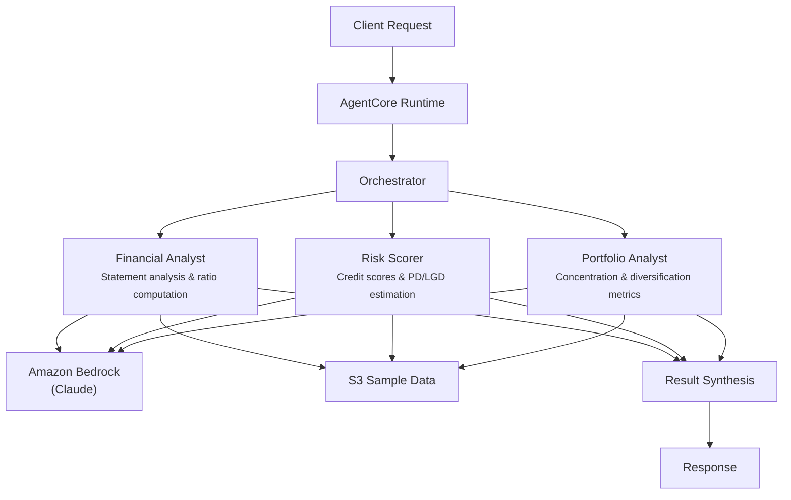

# Credit Risk Assessment

## Overview

The Credit Risk Assessment use case evaluates borrower creditworthiness through coordinated financial statement analysis, quantitative risk scoring, and portfolio impact assessment. It produces credit ratings, probability-of-default estimates, and portfolio concentration analysis to support lending decisions by credit committees.

## Business Value

- **Comprehensive credit views** -- three specialist agents cover financial health, risk quantification, and portfolio impact in a single request
- **Faster underwriting** -- parallel agent execution compresses multi-day manual analysis into minutes
- **Consistent methodology** -- standardized risk scoring with PD/LGD estimation and credit rating assignment (AAA through D)
- **Portfolio awareness** -- every borrower assessment includes concentration risk and diversification impact analysis
- **Decision-ready output** -- structured response with credit rating, score, and actionable recommendations for credit committees

## Architecture



### Directory Structure

```
use_cases/credit_risk/
├── README.md
└── src/
    └── strands/
        ├── __init__.py
        ├── config.py          # CreditRiskSettings
        ├── models.py          # Pydantic request/response models
        ├── orchestrator.py    # CreditRiskOrchestrator + run_credit_risk()
        └── agents/
            ├── __init__.py
            ├── financial_analyst.py
            ├── risk_scorer.py
            └── portfolio_analyst.py
```

## Agentic Design

The orchestrator uses a **parallel fan-out** pattern. In `full` mode, all three agents execute concurrently via `asyncio.gather`. Individual modes (`financial_analysis`, `risk_scoring`, `portfolio_analysis`) invoke a single agent. The orchestrator synthesizes combined findings into a structured JSON credit assessment with scoring, rating, and portfolio impact.

## Agents

| Agent | Role | Data Used | Output |
|-------|------|-----------|--------|
| **Financial Analyst** | Analyzes income statements, balance sheets, and cash flows; computes debt-to-equity, current ratio, interest coverage ratios | Borrower profile via `s3_retriever_tool` | Revenue/profitability trends, key ratios with benchmarks, cash flow adequacy, financial health summary |
| **Risk Scorer** | Computes credit risk scores, estimates probability of default (PD) and loss given default (LGD), assigns credit ratings | Borrower profile via `s3_retriever_tool` | Risk score (0-100), risk level, credit rating (AAA-D), PD/LGD estimates, risk factors and mitigants |
| **Portfolio Analyst** | Evaluates portfolio concentration by sector/geography/counterparty, calculates diversification metrics and risk-adjusted returns | Borrower profile via `s3_retriever_tool` | Concentration change, diversification score (0-1), sector exposure, risk-adjusted return, portfolio notes |

## Data and Tools

- **Tool:** `s3_retriever_tool` -- retrieves borrower profiles and financial data from S3
- **S3 data prefix:** `samples/credit_risk/`
- **Model:** Claude Sonnet (via Amazon Bedrock), temperature 0.1, max 8192 tokens
- **Config thresholds:** `risk_threshold_high=75`, `risk_threshold_critical=90`, `max_portfolio_concentration=0.25`

## Request / Response

**Request** -- `AssessmentRequest`:

| Field | Type | Description |
|-------|------|-------------|
| `customer_id` | `str` | Borrower identifier (e.g., `BORROW001`) |
| `assessment_type` | `AssessmentType` | `full`, `financial_analysis`, `risk_scoring`, `portfolio_analysis` |
| `additional_context` | `str \| None` | Optional context |

**Response** -- `AssessmentResponse`:

| Field | Type | Description |
|-------|------|-------------|
| `customer_id` | `str` | Borrower identifier |
| `assessment_id` | `str` | Unique assessment UUID |
| `timestamp` | `datetime` | Assessment timestamp |
| `credit_risk_score` | `CreditRiskScore \| None` | Score (0-100), level, rating (AAA-D), PD, LGD, factors, recommendations |
| `portfolio_impact` | `PortfolioImpact \| None` | Concentration change, diversification score, sector exposure, risk-adjusted return |
| `summary` | `str` | Executive summary |
| `raw_analysis` | `dict` | Raw agent output |

## Quick Start

```bash
# Deploy to AgentCore
USE_CASE_ID=credit_risk ./scripts/deploy/full/deploy_agentcore.sh

# Test the deployment
./scripts/use_cases/credit_risk/test/test_agentcore.sh
```

## Sample Data

Located at `data/samples/credit_risk/`

| Borrower ID | Industry | Description |
|-------------|----------|-------------|
| BORROW001 | Manufacturing | Acme Manufacturing Corp -- $50M revenue, D/E 1.29, current ratio 1.85, interest coverage 4.2x, requesting $20M term loan for expansion with $33M in collateral (real estate + equipment) |

## Related Documentation

- [FSI Foundry Overview](../../../README.md)
- [Architecture Patterns](../../docs/foundations/architecture/architecture_patterns.md)
- [Deployment Guide](../../docs/foundations/deployment/deployment_patterns.md)
- [Implementation Details](../../docs/use_cases/credit_risk/implementation.md)
